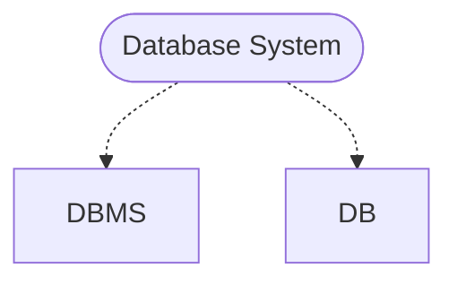
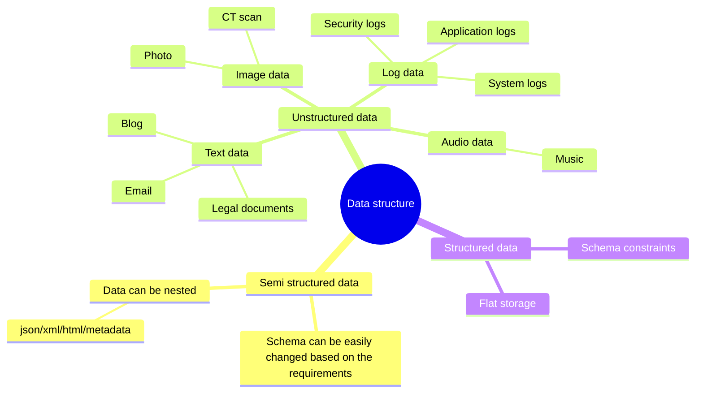
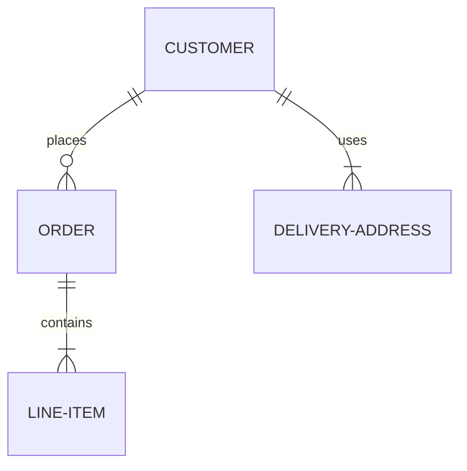

- [Class Notes](#class-notes)
  - [Resources](#resources)
  - [Database\_1 (`20/08/2023`)](#database_1-20082023)
    - [什么是数据库?](#什么是数据库)
      - [数据库组成](#数据库组成)
      - [什么是数据?](#什么是数据)
        - [例子: 车的数据](#例子-车的数据)
      - [三种数据结构](#三种数据结构)
      - [怎么存数据?](#怎么存数据)
      - [Database vs File system](#database-vs-file-system)
    - [Database Feature](#database-feature)
      - [例子: 简单实体关系图](#例子-简单实体关系图)
      - [Primary Key主键](#primary-key主键)
      - [Foreign Key 外键](#foreign-key-外键)
      - [关系型数据库 vs 非关系型数据库](#关系型数据库-vs-非关系型数据库)
        - [ACID性质](#acid性质)
    - [安装mysql和DBeaver](#安装mysql和dbeaver)
      - [mysql-mac](#mysql-mac)
      - [mysql-windows](#mysql-windows)
    - [数据库语言](#数据库语言)
      - [Data Definition Language(DDL)](#data-definition-languageddl)
      - [Data Manipulation Language(DML)](#data-manipulation-languagedml)

# Class Notes

## Resources
[mysql](https://dev.mysql.com/downloads/installer/)<br>
[DBeaver](https://dbeaver.io/download/)<br>
[cars.sql](./cars.sql)<br>
[cars.csv](./cars.csv)<br>

## Database_1 (`20/08/2023`)
<p align='center'></p>

### 什么是数据库?
- *储存`数据`的`仓库`*
- 可以检索数据
- 不同权限用户可以看不同的数据



<p align='center'></p>

#### 数据库组成
<p align='center'></p>

#### 什么是数据?
> 对客观事物, 事件进行记录并且可以被鉴别的符号
- 性质
- 状态
- 相互关系

##### 例子: 车的数据
`brand, model, model year, color, door, manufacturer, cost, color, engine, Automatic vs Manual`

要避免人为拼写错误

#### 三种数据结构


#### 怎么存数据?
| 结构化存储 | 非结构化存储 |
| :---: | :---: |
| ***key*** | ***QR code*** |
| ***以表格形式存储*** | ***文件、图像、音频、视频等*** |

#### Database vs File system
| Database | File system |
| :---: | :---: |
| ***存储同一类数据*** | ***存储不同类型的数据*** |

### Database Feature
- attribute
- entity
- value

#### 例子: 简单实体关系图


#### Primary Key主键
- Unique
- NOT NULL

#### Foreign Key 外键
- 可以是null
- 一对多
- 其他表的主键

#### 关系型数据库 vs 非关系型数据库
| Relational DB | Non-Relational DB |
| :---: | :---: |
| ***保证数据一致性, 查询方便, 写入I/O较差, 无法处理复杂模型*** | ***用文档形式存储 (xml,json), 先有数据再考虑schema, 灵活性高. ACID不如关系型数据库*** |

`bank transaction一般是选用relational DB`
> realtional DB有很好的schema constrints和transaction management能更好保证data consistency.

##### ACID性质
- Atomicity: 要么执行成功要么恢复原状
- Consisency: 数据库完整性不被破坏 (符合预设规则)integrity constriant
- Isolaion: 一件一件做和一起做是一样的
- Durability: 失败的改动不影响原数据 (可以rollback)

### 安装mysql和DBeaver
#### mysql-mac
```shell
brew install mysql
brew services list
brew services start mysql
```

#### mysql-windows
[mysql](https://dev.mysql.com/downloads/installer/)<br>
[DBeaver](https://dbeaver.io/download/)

### 数据库语言
#### Data Definition Language(DDL)
- Define schemas
- Define Integrity Constraints

#### Data Manipulation Language(DML)
- Query
- CRUD

```sql
-- 创建table
CREATE TABLE lab2.Cars (
    `cid` INT AUTO_INCREMENT,          -- Car ID
    `款式` VARCHAR(255),
    `品牌` VARCHAR(255),
    `颜色` VARCHAR(255),
    `类型` VARCHAR(255),
    `价格` INT,
    `生产年份` INT,
    `是否卖出` VARCHAR(255),
    PRIMARY KEY (`cid`)
);

-- 删除table
DROP TABLE lab2.Cars;

-- 修改table名(使用F2也行)
ALTER TABLE lab2.Cars RENAME TO Cars3

-- 添加一个Column
ALTER TABLE Cars ADD COLUMN `工厂` VARCHAR(255)

-- 删除一个column
ALTER TABLE Cars DROP COLUMN `工厂`

-- 插入数据
INSERT INTO Cars(`款式`,`品牌`, `颜色`, `类型`, `价格`, `生产年份`, `是否卖出`)
VALUES ('Camaro','雪佛兰','红色','肌肉车',60000,2016,'1'),
     ('Camaro','雪佛兰','黄色','肌肉车',65000,2018,'1'),
     ('911','保驰捷','红色','跑车',20000,2017,''),
     ('Escape','福特','蓝色','SUV',60000,2020,'0'),
     ('M3','特斯拉','红色','轿车',250000,2018,''),
     ('Carrera','Porsche','红色','sport car',240000,2013,''),
     ('Camaro','雪佛兰','红色','肌肉车',60000,2016,'1'),
     ('Camaro','雪佛兰','黄色','肌肉车',65000,2018,''),
     ('Panamera','保驰捷','黑色','跑车',200000,2017,'0'),
     ('Mustang','福特','蓝色','肌肉车',60000,2020,''),
     ('Model S','特斯拉','黑色','轿车',180000,2018,'1'),
     ('Civic','Toyota','white','sedan',25000,2016,'0'),
     ('Camaro','雪佛兰','红色','肌肉车',60000,2016,'0'),
     ('Challenger','雪佛兰','Orange','肌肉车',70000,2018,''),
     ('911','保驰捷','红色','跑车',200000,2017,'1'),
     ('Escape','福特','蓝色','SUV',60000,2020,''),
     ('Model 3','特斯拉','红色','轿车',250000,2018,'1'),
     ('Camaro','雪佛兰','红色','肌肉车',60000,2016,'1'),
     ('120i','BMW','白色','hatchpack',40000,2012,'');
```
