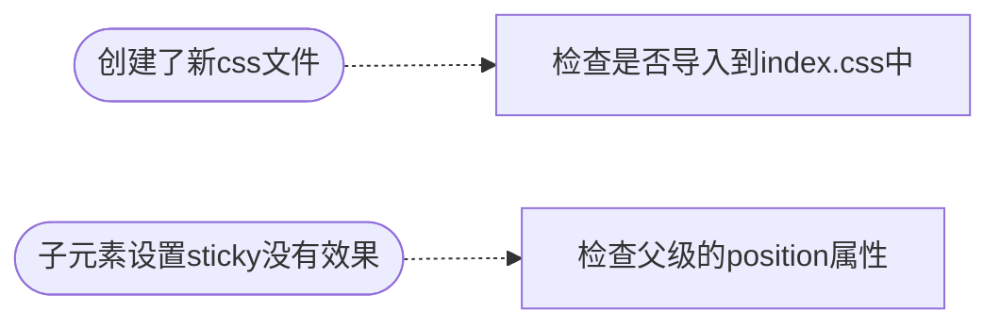

- [Class Notes](#class-notes)
  - [Resources](#resources)
  - [Frontend\_2 (`27/08/2023`)](#frontend_2-27082023)
    - [项目一些debug](#项目一些debug)
    - [使用JavaScript代替hardcode](#使用javascript代替hardcode)
      - [如何从后端拿数据 (axios)?](#如何从后端拿数据-axios)
        - [配置.env.development](#配置envdevelopment)
        - [database.js](#databasejs)
        - [utiles.js](#utilesjs)
      - [前端导入后端数据(DOM \& array methods)](#前端导入后端数据dom--array-methods)
        - [index.js](#indexjs)
    - [HTML代码](#html代码)
      - [index.html](#indexhtml)
    - [CSS代码](#css代码)
      - [index.css](#indexcss)
      - [main.css](#maincss)
      - [main\_left\_side.css](#main_left_sidecss)
      - [main\_left.css](#main_leftcss)
      - [main-middle.css](#main-middlecss)
      - [main\_middle\_highline.css](#main_middle_highlinecss)
      - [main\_middle\_post.css](#main_middle_postcss)
    - [gitignore更新](#gitignore更新)

# Class Notes

## Resources
[Class code](http://github.com/jessieyu1/top-soical-fe/tree/main)<br>
[path-browserify](http://www.npmjs.com/package/path-browserify)<br>
[Vite Env](http://vitejs.dev/guide/env-and-mode.html)<br>
[Static Asset Handling](http://vitejs.dev/guide/assets.html)

## Frontend_2 (`27/08/2023`)
<p align='center'></p>

### 项目一些debug


### 使用JavaScript代替hardcode
> 将资源都写在HTML代码中, 这样做不能很好应对项目的变化. 可以使用js的DOM方法和axios方法来实现

#### 如何从后端拿数据 (axios)?
##### 配置.env.development
```shell
VITE_DB_PATH="localhost:8000";
```

##### database.js
```js
// third party import
import axios from "axios";

//file import
import { getPath } from "./utiles";

async function getProfile() {
    const path = getPath("profile");
    const response = await getInfo(path);
    console.log(response);
    return response.data;
}

async function getHighline() {
    const path = getPath("highline");
    const response = await getInfo(path);
    console.log(response);
    return response.data;
}

async function getInfo(path) {
    try {
        return await axios.get(path);
    } catch (error) {
        console.error(error);
    }
}

export const highline = await getHighline();
export const profile = await getProfile();
```

##### utiles.js
```js
import path from "path-browserify";


export function getPath(...info) {
    const dbPath = import.meta.env.VITE_DB_PATH;
    const fullPath =  getHttpHeader() + path.join(dbPath, ...info)
    return fullPath;
}

export function getWebSiteRunningMode() {
  return import.meta.env.MODE;
}

export function getHttpHeader() {
  if (getWebSiteRunningMode() === "development") {
    return "http://";
  }
  return "https://";
}
```

#### 前端导入后端数据(DOM & array methods)
##### index.js
```js
import "./index.css";

import { highline, profile } from "@/js/database"; // 导入后端数据


const middle = document.querySelector(".main-middle")
const middle_highline = middle.querySelector(".highline")
const middle_highline_description = middle_highline.querySelectorAll(".description")
const middle_highline_description_img = middle_highline.querySelectorAll(".description img")
const middle_highline_description_p = middle_highline.querySelectorAll(".description p")

middle_highline_description_p.forEach((ele, i) => {
    ele.textContent = highline.description[i] // 修改多个textContent
})

// background image
middle_highline_description.forEach((ele, i) => {
    ele.style.backgroundImage = `url("./images/highline/highline_${i+1}.jpeg")` // 修改多个backgroundImage
})
//profile
middle_highline_description_img.forEach((ele, i) => {
    ele.src = `./images/profile/profile_${i + 1}.png` // 修改多个src (注意不要用url())
})

//middle form
const middle_form = middle.querySelector("form")
const middle_form_input_text = middle_form.querySelector('#create-post')
//name
middle_form_input_text.placeholder = `What's on your mind, ${profile.name}`
```

### HTML代码
#### index.html
```html
<!doctype html>
<html lang="en">
    <head>
        <meta charset="UTF-8" />
        <link rel="icon" type="image/svg+xml" href="/vite.svg" />
        <meta name="viewport" content="width=device-width, initial-scale=1.0" />
        <title>Top Social</title>
        <link rel="stylesheet" href="https://unicons.iconscout.com/release/v4.0.0/css/line.css" />
    </head>
    <body>
        <!-- NAV BAR  -->
        <nav>
            <div class="container">
                <!-- LOGO -->
                <div class="logo">TOPSOCIAL</div>
                <!-- SEARCH BAR -->
                <div class="search-bar">
                    <i class="uil uil-search"></i>
                    <input type="search" name="navbar-search" id="navbar-search" placeholder="Search for Creators" />
                </div>
                <!-- BUTTON -->
                <div class="create">
                    <label for="create-post" class="btn btn-primary"> Create </label>
                    <!-- profile photo -->
                    <div class="profile-photo">
                        
                    </div>
                </div>
            </div>
        </nav>
        <!-- MAIN -->
        <main>
            <div class="container">
                <!-- MAIN left -->
                <div class="main-left">
                    <!-- Profile MAIN left -->
                    <a href="/" class="profile">
                        <div class="profile-photo">
                            
                        </div>
                        <div class="profile-description">
                            <h2>Jess Ye</h2>
                            <p>Jess Ye</p>
                        </div>
                    </a>
                    <!--Side bar MAIN left -->
                    <div class="sidebar">
                        <a class="menu-item">
                            <span>
                                <i class="uil uil-house-user"></i>
                            </span>
                            <h2>Home</h2>
                        </a>
                        <a class="menu-item">
                            <span>
                                <i class="uil uil-compass"></i>
                            </span>
                            <h2>Explore</h2>
                        </a>
                        <a class="menu-item">
                            <span>
                                <i class="uil uil-bell"></i>
                            </span>
                            <h2>Notifications</h2>
                        </a>

                        <a class="menu-item">
                            <span>
                                <i class="uil uil-envelope"></i>
                            </span>
                            <h2>Messages</h2>
                        </a>
                        <a class="menu-item">
                            <span>
                                <i class="uil uil-bookmark"></i>
                            </span>
                            <h2>Bookmarks</h2>
                        </a>

                        <a class="menu-item">
                            <span>
                                <i class="uil uil-chart-line"></i>
                            </span>
                            <h2>Analytics</h2>
                        </a>
                        <a class="menu-item">
                            <span>
                                <i class="uil uil-palette"></i>
                            </span>
                            <h2>Theme</h2>
                        </a>

                        <a class="menu-item">
                            <span>
                                <i class="uil uil-setting"></i>
                            </span>
                            <h2>Settings</h2>
                        </a>
                    </div>
                    <!--creat post MAIN left -->
                    <label for="create-post" class="btn btn-primary"> Create Post </label>
                </div>
                <!-- MAIN middle-->
                <div class="main-middle">
                    <!--MAIN middle highline -->
                    <div class="highline">
                        <div class="description">
                            <div class="profile-photo">
                                
                            </div>
                            <p></p>
                        </div>

                        <div class="description">
                            <div class="profile-photo">
                                
                            </div>
                            <p></p>
                        </div>
                        <div class="description">
                            <div class="profile-photo">
                                
                            </div>
                            <p></p>
                        </div>
                        <div class="description">
                            <div class="profile-photo">
                                
                            </div>
                            <p></p>
                        </div>
                        <div class="description">
                            <div class="profile-photo">
                                
                            </div>
                            <p></p>
                        </div>
                        <div class="description">
                            <div class="profile-photo">
                                
                            </div>
                            <p></p>
                        </div>
                    </div>
                    <!--MAIN middle post form -->
                    <form class="create-post">
                        <div class="profile-photo">
                            
                        </div>
                        <input type="text" id="create-post" />
                        <input type="submit" value="Post" class="btn btn-primary" />
                    </form>
                    <!--MAIN middle card -->
                    <div class="card"></div>
                    <!-- MAIN right-->
                </div>
            </div>
        </main>
        <script type="module" src="/index.js"></script>
    </body>
</html>
```

### CSS代码
#### index.css
```css
@import "normalize.css";

/* --- Fonts --- */
@import url('https://fonts.googleapis.com/css2?family=Comfortaa&family=Poppins:ital,wght@0,100;0,200;0,300;0,400;0,500;0,600;0,700;0,800;0,900;1,100;1,200;1,300;1,400;1,500;1,600;1,700;1,800;1,900&display=swap');

/* --- Foundation --- */
@import "./src/css/foundation/common.css";

/* --- Components --- */
@import "./src/css/components/button.css";
@import "./src/css/components/search.css";
@import "./src/css/components/profile.css";

/* --- Frames --- */
@import "./src/css/frames/nav/nav.css";
@import "./src/css/frames/main/main.css";

@import "./src/css/frames/main/left/main_left_side.css";
@import "./src/css/frames/main/left/main_left.css";

@import "./src/css/frames/main/mid/main_middle.css";
@import "./src/css/frames/main/mid/main_middle_card.css";
@import "./src/css/frames/main/mid/main_middle_highline.css";
@import "./src/css/frames/main/mid/main_middle_post.css";
```

#### main.css
```css
main {
    position: relative;
    top: 5.4rem;
}

main .container {
    display: grid;
    position: relative;
    grid-template-columns: 18vw auto 20vw;
    column-gap: 2rem;
}
```

#### main_left_side.css
```css
.main-left .sidebar {
    background-color: var(--left-profile-background-color);
    border-radius: var(--left-profile-radius);
}

.main-left .sidebar .menu-item {
    position: relative;
    display: flex;
    align-items: center;
    height: 4rem;
    cursor: pointer;
    transition: all 300ms ease;
}

.main-left .sidebar .menu-item:hover {
    background-color: var(--color-white);
}

.main-left .sidebar i {
    position: relative;
    font-size: 1.4rem;
    color: var(--color-gray);
    margin-left: 2rem;
}

.main-left .sidebar h2 {
    margin-left: 1.5rem;
}
```

#### main_left.css
```css
:root {
    --left-profile-background-color: #fff;
    --left-profile-padding: 1rem;
    --left-profile-radius: 1rem;
}

.main-left {
    position: sticky;
    height: 100vh;
    min-width: 200px;
    overflow-x: hidden;
    top: -1rem;
}

.main-left h2 {
    font-size: 0.9rem;
}

.main-left .profile {
    display: flex;
    align-items: center;
    padding: var(--left-profile-padding);
    background-color: var(--left-profile-background-color);
    border-radius: var(--left-profile-radius);
    column-gap: 1rem;
    margin-bottom: 1rem;
    width: 100%;
}

.main-left .profile p {
    font-size: 0.7rem;
}

.main-left .btn {
    margin-top: 1rem;
    width: 100%;
    text-align: center;
    padding: var(--left-profile-padding);
}
```

#### main-middle.css
```css
.main-middle {
    position: relative;
}
```

#### main_middle_highline.css
```css
:root {
    --middle-highline-padding: 1rem;
    --middle-highline-border-radius: 1rem;
}

.main-middle .highline {
    display: flex;
    justify-content: space-between;
    height: 12rem;
    gap: 0.5rem;
}

.main-middle .highline .description {
    width: 100%;
    position: relative;
    padding: var(--middle-highline-padding);
    border-radius: var(--middle-highline-border-radius);
    display: flex;
    flex-direction: column;
    justify-content: space-between;
    align-items: center;
    overflow: hidden;
    background-repeat: no-repeat;
    background-position: center;
    background-size: cover;
    object-fit: cover;
}

.main-middle .highline .description p {
    color: #fff;
    font-size: 0.7rem;
    z-index: 1;
}
```

#### main_middle_post.css
```css
:root {
    --bg-color: #fff;
    --padding: 1rem;
    --radius: 2rem;
    --margin: 1rem;
    --btn-padding: 0.4rem 1.5rem;
}

.main-middle .create-post {
    width: 100%;
    display: flex;
    align-items: center;
    justify-content: center;
    margin-top: var(--margin);
    background-color: var(--bg-color);
    padding: var(--padding);
    border-radius: var(--radius);
}

.main-middle .create-post input[type="text"] {
    justify-self: start;
    width: 100%;
    padding-left: var(--padding);
    margin-right: var(--margin);
}

.main-middle .create-post input[type="text"]::placeholder {
    color: var(--color-gray);
    font-style: italic;
}

.main-middle .create-post .profile-photo {
    width: 2.2rem;
    min-width: 2.2rem;
}

.main-middle .create-post .btn {
    display: inline-block;
    padding: var(--btn-padding);
    font-weight: 500;
    border-radius: var(--radius);
    cursor: pointer;
    transition: all 300ms ease;
    font-size: 0.8rem;
}
```

### gitignore更新
```dockerfile
# Logs
logs
*.log
npm-debug.log*
yarn-debug.log*
yarn-error.log*
pnpm-debug.log*
lerna-debug.log*

node_modules
dist
dist-ssr
*.local

# Editor directories and files
.vscode/*
!.vscode/extensions.json
.idea
.DS_Store
*.suo
*.ntvs*
*.njsproj
*.sln
*.sw?

.env.development
```