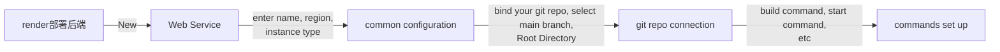
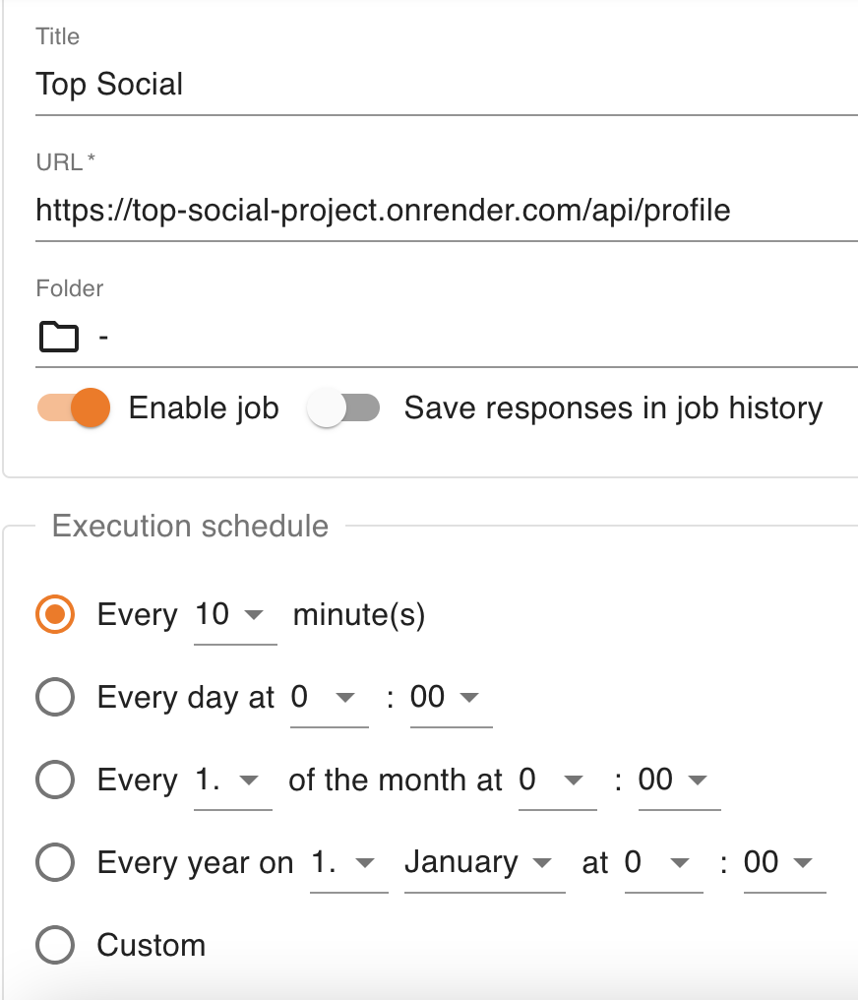
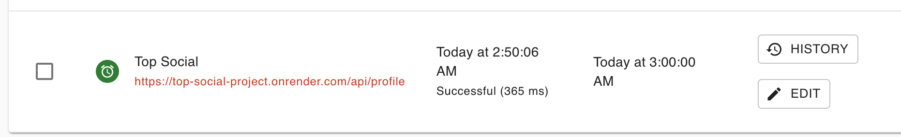
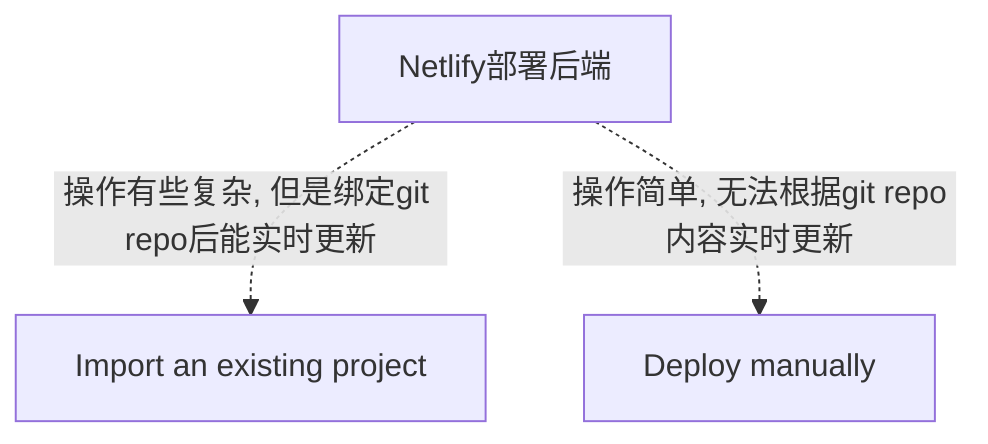
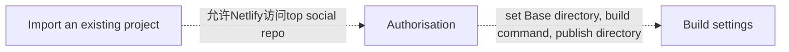

- [Class Notes](#class-notes)
  - [Resources](#resources)
  - [Frontend\_3 (`30/08/2023`)](#frontend_3-30082023)
    - [从后端拿数据 (避免在HTML 中直接写)](#从后端拿数据-避免在html-中直接写)
      - [之前的HTML](#之前的html)
      - [预期的HTML](#预期的html)
      - [利用DOM方法实现参数传递](#利用dom方法实现参数传递)
    - [createCards方法(classList \& appendChild)](#createcards方法classlist--appendchild)
      - [index.js](#indexjs)
      - [common.js](#commonjs)
    - [Top Social项目部署](#top-social项目部署)
      - [后端部署(render)](#后端部署render)
        - [Common mistakes](#common-mistakes)
        - [结果图](#结果图)
        - [用postman做测试](#用postman做测试)
        - [突破render免费版本15mins自动sleep的限制](#突破render免费版本15mins自动sleep的限制)
      - [更新前后端代码](#更新前后端代码)
        - [更新后端server.js](#更新后端serverjs)
        - [更新前端env文件](#更新前端env文件)
        - [更新前端database.js (根据自己写的api进行修改)](#更新前端databasejs-根据自己写的api进行修改)
          - [修改导入axios方式](#修改导入axios方式)
      - [前端部署(Netlify)](#前端部署netlify)
        - [Import an existing project](#import-an-existing-project)
        - [Deploy manually](#deploy-manually)
          - [Deploy manually debugging](#deploy-manually-debugging)
    - [成果展示](#成果展示)
    - [PageSpeed Insights](#pagespeed-insights)
      - [Test for mobile](#test-for-mobile)
      - [Test for desktop](#test-for-desktop)

# Class Notes

## Resources
[Class code](http://github.com/jessieyu1/top-soical-fe/tree/main)<br>
[netlify](https://www.netlify.com/)<br>
[fly.io](https://fly.io/)<br>
[render](https://render.com/)<br>
[PageSpeed Insights](https://pagespeed.web.dev/)

## Frontend_3 (`30/08/2023`)
<p align='center'></p>

### 从后端拿数据 (避免在HTML 中直接写)
#### 之前的HTML
```html
<a href="/" class="profile">
<div class="profile-photo">
    
</div>
<div class="profile-description">
    <h2>Jess Ye</h2>
    <p>Jess Ye</p>
</div>
</a>
```

#### 预期的HTML
```html
<a href="/" class="profile">
<div class="profile-photo">
    
</div>
<div class="profile-description">
    <h2></h2>
    <p></p>
</div>
</a>
```

#### 利用DOM方法实现参数传递
```js
const main = document.querySelector("main");
const main_container = main.querySelector(".container");
const left = main_container.querySelector(".main-left");
const left_profile = left.querySelector(".profile");
const left_profile_name = left_profile.querySelector("h2");
const left_profile_at = left_profile.querySelector("p");
const left_profile_img = left_profile.querySelector("img");
left_profile_name.textContent = profile.name;
left_profile_at.textContent = profile.at;
left_profile_img.src = profile.img_src;
```

### createCards方法(classList & appendChild)
#### index.js
```js
import "./index.css";

import { highline, profile, cards } from "@/js/database";

import {
  left_profile_name,
  left_profile_at,
  left_profile_img,
  middle_highline_description,
  middle_highline_description_img,
  middle_highline_description_p,
  create_news,
  create_picture_structure
} from "@/js/common.js";

//main left

left_profile_name.textContent = profile.name;
left_profile_at.textContent = profile.at;
left_profile_img.src = profile.img_src;

//main middle

middle_highline_description_p.forEach((ele, i) => {
  ele.textContent = highline.description[i];
});

// background image
middle_highline_description.forEach((ele, i) => {
  ele.style.backgroundImage = `url("./images/highline/highline_${i + 1}.jpeg")`;
});
//profile
middle_highline_description_img.forEach((ele, i) => {
  ele.src = `./images/profile/profile_${i + 1}.png`;
});

//middle form
const middle = document.querySelector(".main-middle")
const middle_form = middle.querySelector("form");
const middle_form_input_text = middle_form.querySelector("#create-post");
//name
middle_form_input_text.placeholder = `What's on your mind, ${profile.name}`;

//Cards

const cardsDom = document.querySelector(".card")

cards.forEach((element) => {
 const doms = create_news();
 cardsDom.appendChild(doms.info)
 create_picture_structure(doms.info_picture, element.picture)
})
```

#### common.js
```js
/* Main Left */
const main = document.querySelector("main");
const main_container = main.querySelector(".container");
const left = main_container.querySelector(".main-left");
const left_profile = left.querySelector(".profile");
export const left_profile_name = left_profile.querySelector("h2");
export const left_profile_at = left_profile.querySelector("p");
export const left_profile_img = left_profile.querySelector("img");

/* Main middle highline */
const middle = document.querySelector(".main-middle");
const middle_highline = middle.querySelector(".highline");
export const middle_highline_description = middle_highline.querySelectorAll(".description");
export const middle_highline_description_img = middle_highline.querySelectorAll(".description img");
export const middle_highline_description_p = middle_highline.querySelectorAll(".description p");

/* Main middle cards */
export const create_news = () => {
    const doms = {
        info: document.createElement("div"),
        info_profile: document.createElement("div"),
        info_picture: document.createElement("div"),
        info_control: document.createElement("div"),
        info_comment: document.createElement("div"),
    };
    doms.info.classList.add("info");
    doms.info_profile.classList.add("info-profile");
    doms.info_picture.classList.add("info-picture");
    doms.info_control.classList.add("info-control");
    doms.info_comment.classList.add("info-comment");
    doms.info.appendChild(doms.info_profile);
    doms.info.appendChild(doms.info_picture);
    doms.info.appendChild(doms.info_control);
    doms.info.appendChild(doms.info_comment);
    return doms;
};

export const create_picture_structure = (picture_dom, info) => {
    const picture = document.createElement("img");
    picture.setAttribute("width", "100%");
    picture_dom.appendChild(picture);
    picture.src = info.img_src;
};
```

### Top Social项目部署
`思路: 先部署好后端, 输入生成的新url测试一下, 能拿到数据后更新前后端代码, 最后部署前端`

#### 后端部署([render](https://render.com/))


*完成以上步骤后, render platform会生成一个链接如https://top-social-project.onrender.com*

##### Common mistakes
> Root Directory一定要根据自己main branch上的路径填写, 我项目的后端代码的文档名叫Backend, 所以我填的是Backend.<br>
> Build Command写npm i就好, Start Command要根据自己后端package.json的script名称填写. 可能是npm run dev/ npm run prod等

##### 结果图
<div style='display:inline-flex; justify-content: space-between'>
    
    
    
</div>

<p align='center'></p>

<p align='center'></p>

##### 用postman做测试
<p align='center'></p>

> 注意: 由于server.js中有/api前缀, 测试时要加上/api

##### 突破render免费版本15mins自动sleep的限制
> render免费版每15分钟如果没有新的request, 你部署的后端server会sleep<br>
> 这非常不方便, 意味着你每隔一段时间访问网址都要等它从sleep状态到active状态, 有很长img都刷新不出来

我的方法是使用[cron-job](https://console.cron-job.org), 每10分钟call一次render的其中一个api. 这样我就保证任意15分钟内有request, render的server会一直保持active

<p align='center'></p>

<p align='center'></p>

#### 更新前后端代码
`这是整个部署里最复杂也是最难的部分, 虽然render和Netlify提供了GUI, 简化了操作, 但你必须对应修改前端和后端代码`

##### 更新后端server.js
```js
const express = require("express"),
    cors = require("cors"),
    compression = require("compression"),
    router = require("./routes/index"),
    app = express(),
    errorHandler = require("./middleware/errorMiddleware"),
    PORT = process.env.PORT || 8000; // 得到环境变量的端口号

app.use(cors()); // 允许跨域资源共享
app.use(compression()); // Gzip compressing - improve performance
app.use(express.urlencoded({ extended: false }));
app.use(express.json()); // 将JSON解析成JavaScript对象
app.use("/api", router); // 挂载路由到指定路径
app.use(errorHandler); // 设置异常处理全局中间件

app.listen(PORT, "0.0.0.0", () => console.log(`server is running on port ${PORT}`)); // 0.0.0.0接受来自任何ip的请求
```

##### 更新前端env文件
```shell
# VITE_DB_PATH="localhost:3000"
VITE_DB_PATH="top-social-project.onrender.com/api" # 根据自己的render url替换
```

> .env文件要写入.gitignore中, 不要上传到git repo

##### 更新前端database.js (根据自己写的api进行修改)
```js
import { getPath } from "./utils";
import axios from "//cdn.jsdelivr.net/npm/axios@1.3.5/+esm";
const getInfo = async path => {
    try {
        return await axios.get(path);
    } catch (error) {
        console.error(error);
    }
};
export const [cards, profile, highline, message, request] = await Promise.all([
    (async () => (await getInfo(getPath("cards/all"))).data.data)(),
    (async () => (await getInfo(getPath("profile"))).data.data)(),
    (async () => (await getInfo(getPath("highline"))).data.data.highline)(),
    (async () => (await getInfo(getPath("message"))).data.data.message)(),
    (async () => (await getInfo(getPath("request/all"))).data.data)(),
]);
```

> 用promise.all提升效率, 使用箭头函数简化代码.

###### 修改导入axios方式
> 这里我删除了`import axios from 'axios';`, 同时用`npm un axios`删除了axios包. 原因是你在browser上会看到下面一句话<br>
***Uncaught TypeError: Failed to resolve module specifier "http". Relative references must start with either "/", "./", or "../".***

> 在GitHub上也有类似的讨论
[axios bug](https://github.com/axios/axios/issues/4490)

> 我用的方法是直接引入cdn文件
```js
import axios from "//cdn.jsdelivr.net/npm/axios@1.3.5/+esm";
```

`package.json`
```json
{
    "name": "client",
    "private": true,
    "version": "0.0.0",
    "type": "module",
    "scripts": {
        "dev": "vite",
        "build": "vite build",
        "preview": "vite preview",
        "server": "json-server --watch ./data/db.json --port 3001"
    },
    "devDependencies": {
        "vite": "^4.4.5",
        "vite-plugin-top-level-await": "^1.3.1"
    },
    "dependencies": {
        "normalize.css": "^8.0.1",
        "path-browserify": "^1.0.1"
    }
}
```

#### 前端部署([Netlify](https://www.netlify.com/))


##### Import an existing project


> Base directory要根据你git repo前端文档的名字写. 写的时候前面没有/ <br>
> Publish directory 一般是`前端文档的名/dist`, 而不是`前端文档的名/public`

<p align='center'></p>

##### Deploy manually
```bash
cd Frontend
npm run build
```

> 上面的指令会生成一个dist文档, 当你选择Deploy manually时, Netlify会提示你把dist拖进去. 很容易就部署成功了. 但是你之后每次更新git repo Frontend的内容都必须重新生成dist, 很不方便.

###### Deploy manually debugging
> 如果运行npm run build出现关于await的error, 可以尝试下面方法
`安装vite-plugin-top-level-await`
```bash
npm i vite-plugin-top-level-await -D
```

`更新vite.config.js`
```js
import { defineConfig } from "vite";
import topLevelAwait from "vite-plugin-top-level-await";
import path from "path";

export default defineConfig({
    resolve: {
        alias: {
            "@": path.resolve(__dirname, "./src"),
        },
    },
    plugins: [
        topLevelAwait({
            promiseExportName: "__tla",
            promiseImportName: i => `__tla_${i}`,
        }),
    ],
});
```

### 成果展示
[Top Social Project](https://topsocial.netlify.app)
<p align='center'></p>

### PageSpeed Insights
<https://pagespeed.web.dev/>

#### Test for mobile
<p align='center'></p>

#### Test for desktop
<p align='center'></p>