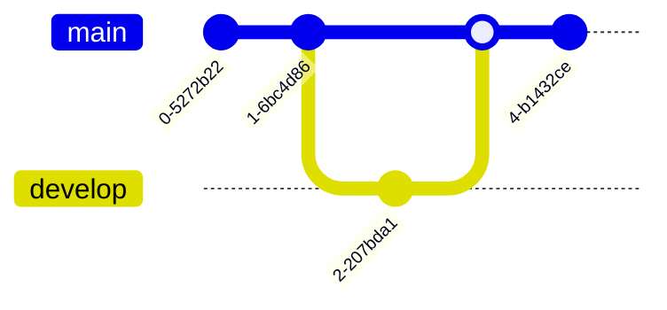

- [Class Notes](#class-notes)
  - [Resources](#resources)
  - [Git (`12/07/2023`)](#git-12072023)
    - [为什么要使用Git?](#为什么要使用git)
    - [如何设置Git](#如何设置git)
    - [Git的工作原理](#git的工作原理)
      - [Git 的三个分区](#git-的三个分区)
      - [Git工作原理流程图](#git工作原理流程图)
      - [注意事项](#注意事项)
    - [Git常用指令](#git常用指令)
    - [GIT提交过程详解](#git提交过程详解)
      - [创建仓库(repository)](#创建仓库repository)
      - [将修改加到暂存区](#将修改加到暂存区)
      - [将暂存区内容提交到本地仓库](#将暂存区内容提交到本地仓库)
      - [将本地仓库的内容提交到远程仓库](#将本地仓库的内容提交到远程仓库)
    - [创建新分支 (一般基于master创建新分支, 内容和master一样)](#创建新分支-一般基于master创建新分支-内容和master一样)
    - [不同分支commit \& merge流程图举例](#不同分支commit--merge流程图举例)
    - [Git可视化工具](#git可视化工具)
    - [Git clone/pull/push失败](#git-clonepullpush失败)
      - [Git clone配置http连接详解](#git-clone配置http连接详解)
      - [Git clone配置ssh详解](#git-clone配置ssh详解)

# Class Notes

## Resources
[Git指南](./git.pdf)<br>
[Error: Permission denied (publickey)](https://docs.github.com/en/authentication/troubleshooting-ssh/error-permission-denied-publickey)<br>

## Git (`12/07/2023`)
<p align='center'></p>

### 为什么要使用Git?
> Git是一种分布式版本控制工具. 它具备以下几种功能
- 撤销改动和回退版本
- 回溯历史
- 小组合作
- 备份

<hr>

### 如何设置Git

```bash
git config --global user.name "<Your-Full-Name>"
git config --global user.email "<your-email-address>"
git config --global color.ui auto
git config --global merge.conflictstyle diff3
git config --global core.editor "code --wait"
```

<hr>

### Git的工作原理

#### Git 的三个分区
1. 工作区 (working directory)
2. 暂存区 (staging area)
3. Git仓库 (git repository)

#### Git工作原理流程图


#### 注意事项
`commit要有意义, 不要用以下的语句来命名`
- *code additions/edits*
- *here have code*
- *more code*
- *misc bugfixes*

<hr>

### Git常用指令
`git status`: 命令可以让我们时刻掌握仓库当前的状态<br>
`git diff`: 查看⼯作区和版本库⾥⾯最新版本的区别<br>
`git log`: 命令显⽰从最近到最远的提交⽇志<br>
`git reflog`: 查看本地操作日志<br>
`git reset HEAD^/ git reset HEAD~1`: 回退commit到工作区<br>
`git reset HEAD file_name`: 撤销暂存区修改<br>
> ***reset后面加--hard的意思是将上次commit的修改也删除***<br>

`git checkout -- file_name`: 可以丢弃⼯作区的修改<br>
> ***对刚创建文件无效, 用vscode点discard changes就好***
>> ***不要忘记写--,这样就会切换到另⼀个分⽀***

`git rm file_name`: 删除文件<br>
`git branch`, `git branch -d <branch name>`: 查看分支/删除本地分支<br>
`git log --all --decorate --oneline --graph`: 用图形化展示分支和合并情况<br>
`git branch -u name/branch`: 将当前分支和远程分支进行关联<br>
`git remote -v`: 查看远程库信息<br>
`git pull`: 同步更新<br>
> 在push前一定要pull

### GIT提交过程详解

#### 创建仓库(repository)


#### 将修改加到暂存区


#### 将暂存区内容提交到本地仓库


#### 将本地仓库的内容提交到远程仓库


<hr>

### 创建新分支 (一般基于master创建新分支, 内容和master一样)


<hr>

### 不同分支commit & merge流程图举例



`想要把其他分支的内容merge到master, 当前分支需要是master, 且其他分支的修改已经commit了`

<hr>

### Git可视化工具
- GitHub Desktop
- Sourcetree

### Git clone/pull/push失败


#### Git clone配置http连接详解
```bash
http连接 -> 使用developer settings里的token进行验证
```

#### Git clone配置ssh详解
```bash
ssh连接 -> ssh-keygen
ssh-keygen -t ed25519 -C "email_address"
eval "$(ssh-agent -s)"
touch ~/.ssh/config -> 写入
Host *
    AddKeysToAgent yes
    IdentityFile ~/.ssh/id_ed25519
ssh-add ~/.ssh/id_ed25519
在github setting中添加.ssh文件中的public key
ssh -T git@github.com -> 做测试
```
