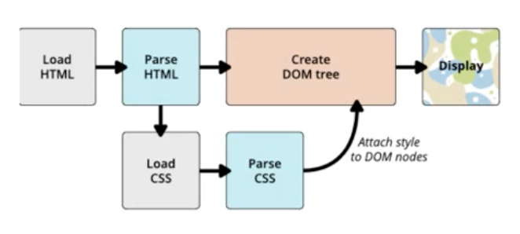
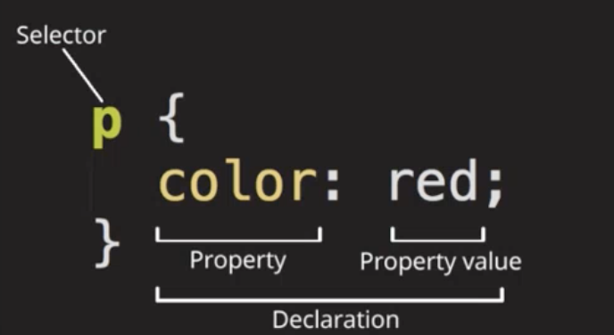
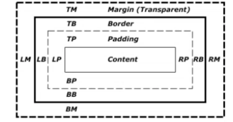
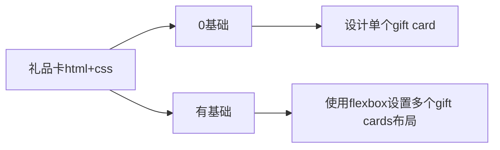

- [Class Notes](#class-notes)
  - [Resources](#resources)
  - [HTML \& CSS Part 2 (`05/07/2023`)](#html--css-part-2-05072023)
    - [CSS介绍](#css介绍)
    - [CSS工作原理](#css工作原理)
    - [CSS如何加载的三种方法](#css如何加载的三种方法)
    - [CSS的优先级 (Specificity Calculator)](#css的优先级-specificity-calculator)
      - [CSS的优先级顺序](#css的优先级顺序)
    - [CSS语法](#css语法)
    - [CSS选择器](#css选择器)
      - [+ 选择器](#-选择器)
      - [~ 选择器](#-选择器-1)
      - [\> 选择器和后代选择器区别](#-选择器和后代选择器区别)
      - [p:last-child和p:last-of-type的区别](#plast-child和plast-of-type的区别)
      - [p:only-child和p:only-of-type的区别](#ponly-child和ponly-of-type的区别)
      - [not选择器用法](#not选择器用法)
    - [BEM命名规范 (如何给选择器取名)](#bem命名规范-如何给选择器取名)
    - [Box Model](#box-model)
    - [color命名](#color命名)
    - [text的属性](#text的属性)
    - [font的属性](#font的属性)
      - [引用Google Font的两种方法](#引用google-font的两种方法)
    - [长度单位](#长度单位)
  - [课后作业](#课后作业)
    - [制作Gift Card](#制作gift-card)
    - [完成Background CSS Practice](#完成background-css-practice)
    - [尝试写个人网站Blog Page](#尝试写个人网站blog-page)

# Class Notes

## Resources
[html&css书写规范](https://github.com/australiaitgroup/html-css-guide)<br>
[css选择器练习](https://flukeout.github.io/)<br>
[gift card practice resource](https://www.davidjones.com/home-and-food/dining/glassware)<br>
[background border practice](https://github.com/jessieyu1/intro-2-web-developmentV2/tree/main/practice/background-borders)<br>

## HTML & CSS Part 2 (`05/07/2023`)

<p align='center'></p>

### CSS介绍
Cascading Style Sheets
- Tells a browser how to render a page.
- To style and layout web pages
- Extended with Sass/Less

***~~CSS is a programming language~~***<br>
***~~CSS is a markup language~~***<br>
***CSS is a stylesheet language***

### CSS工作原理
`原理图`<br>


> 在parse css时, 有attributes可以多样化selector

### CSS如何加载的三种方法
1. External CSS (最推荐)
```html
    <link rel='stylesheet' href='style.css' />
```

2. Internal CSS (其次)
在html的head标签中使用`<style></style>`

1. Inline CSS (不推荐)
> 为什么不推荐inline css?<br>
- ***可复用性差: 无法像类选择器一样能在多个元素中共享, 造成代码冗余;***
- ***权重问题: inline css的优先级很高, 仅次于!important, 这意味着你在维护项目时很难通过常规的id/class选择器做覆盖***

### CSS的优先级 (Specificity Calculator)
两个相同的selector同时定义一个property, 后面的会覆盖前面的.<br>
> 执行顺序从上到下
但是如果我们在开始定义一个***优先度更高的***selector, 后面***优先级不高的***selector是不会覆盖前面的设置的
> 覆盖的意思是覆盖重复定义的property; 不是说优先级高的会覆盖所有优先级低的, 优先度低的内容如果在优先度高里面没有, 优先度低声明的这部分内容仍会生效.

#### CSS的优先级顺序
- !Important > Inline style > ID > Class > Element > Universal

- Internal css > External css

### CSS语法
`举例一个element selector`<br>


***更改a的颜色***
```css
a{
    text-decoration: none;
    color: #ccc
}
```

### CSS选择器
`练习网址`<br>
<https://flukeout.github.io/>

***可以对几个selector同时设置css, 避免重复代码***

```css
p, .class_name, #id_name{
    color: #000000;
}
```

#### + 选择器
`两个子元素紧挨着, 有相同父级`

```css
h1+p{
    color: green; /*修改h1后面p的字体颜色*/
}
```

#### ~ 选择器
`匹配所有在h1后面的p元素, 不要求紧邻, 有相同父级`

```css
h1~p{
    color: green; /*修改h1后面所有的p字体颜色*/
}
```

#### > 选择器和后代选择器区别
| div>p | div p |
| :---: | :---: |
| ***p必须是div的第一个直接子元素*** | ***匹配div中的所有子元素p(可以跳跃)*** |


#### p:last-child和p:last-of-type的区别

| p:last-child | p:last-of-type |
| :---: | :---: |
| ***匹配任意父级元素最后一个子元素, 并且子元素必须是p标签*** | ***匹配任意父级元素最后一个类型为p的子元素*** |

> `即使最后一个元素不是p, 如果前面有p标签, last-of-type仍能匹配到, 但last-child就不行`

#### p:only-child和p:only-of-type的区别
| p:only-child | p:only-of-type |
| :---: | :---: |
| ***p的父级必须只包含一个元素, 这个元素是p*** | ***p的父级只包含一个p元素, 但可以有其他非p的子元素*** |

#### not选择器用法
```css
p:not(.irrelevant) {
  font-weight: bold; /*将没有类名为irrelevant的p标签字体变粗*/
}

p > :not(strong, b.important) {
  color: green; /*将p的直接子元素中除了strong元素和有important类名的b元素字体颜色变绿*/
}
```

### BEM命名规范 (如何给选择器取名)
> BEM会把每个block命名
`B: block`
`E: Element`
`M: Modifier`

***举例***
```html
<div class="card">
    <div class="card_img">
        
    </div>
    <div class="card_title">
        card title
    </div>
    <div class="card_description">
        card description
    </div>
    <div class="card_button">
        Read More
    </div>
</div>
```

```html
<header class="header">
    
    <form class="header_search-from">
        <input class="header_search-from_input" type="input" />
        <button class="header_search-from_button" type="button"></button>
    </form>
    <div class="header_lang-switcher"></div>
</header>
```

`不要使用元素命名, 命名要和功能有关`

这样做的好处？
> 可读性和可维护性好<br>
> 避免命名冲突<br>
> 可重用性+扩展<br>

### Box Model
*网站上的元素都遵循box model*



- Padding vs Border vs Margin
  - padding是紧贴content的部分
  - border是紧贴padding的部分
  - margin是紧贴border的部分(两个相邻的div, margin在紧贴的block处会overlap, 取最大值而不是相加)

- padding, border, margin常见declaration
  - padding: 10px 5px 20px 15px;<br>
  - padding: 10px 30px;<br>
  - border: 20px solid black;<br>
  - border-width: 1px 1px 1px 1px;<br>
  - border-style: solid;<br>
  - border-color: black;<br>
  - border-radius: 50% //圆形 <br>
  - margin: 0 1rem; `很多html元素有默认的margin`<br>

### color命名
***不要使用color用rgba的原因***
> 不同broswer对color名的解析可能不同
    > 使用rgba能精确调整颜色

### text的属性
- text-align `对齐方式`
- text-transform `显示方式(大小写)`
- text-decoration `装饰效果`
- text-indent `缩进`

### font的属性
- font-family `指定使用的字体 - 可以用逗号多写几个备用`
- font-size `字体大小`
- font-style `字体样式`

#### 引用Google Font的两种方法
<https://fonts.google.com/>

1. 导入external css
```html
<head>
  <link rel="stylesheet" href="//fonts.googleapis.com/css?family=Roboto">
</head>
```

2. 在css文档的顶部使用@import
```css
@import url('//fonts.googleapis.com/css2?family=Roboto&display=swap');
p {
  font-family: 'Roboto', sans-serif;
}
```

### 长度单位
*相对单位: em/rem/%/vw/vh*
- em的font-size基于父元素的font-size, width/height/padding/margin的大小基于自身的font-size <br>
- rem基于html元素的font-size, 与父级font-size无关 <br>
- %基于父级的大小决定 <br>
- vw/vh的取值和视图width/height有关

*绝对单位: px*
- **不**随screen宽度/高度, 变化而变化

## 课后作业

### 制作Gift Card

<https://www.davidjones.com/home-and-food/dining/glassware>



### 完成Background CSS Practice
<https://github.com/jessieyu1/intro-2-web-developmentV2/tree/main/practice/background-borders>

### 尝试写个人网站Blog Page