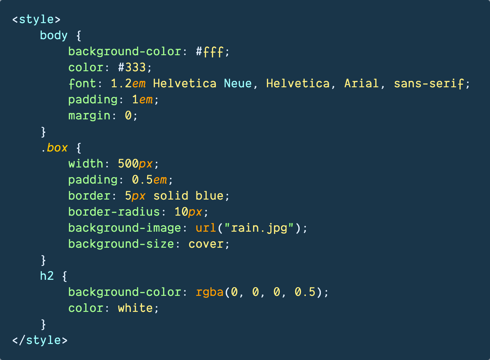
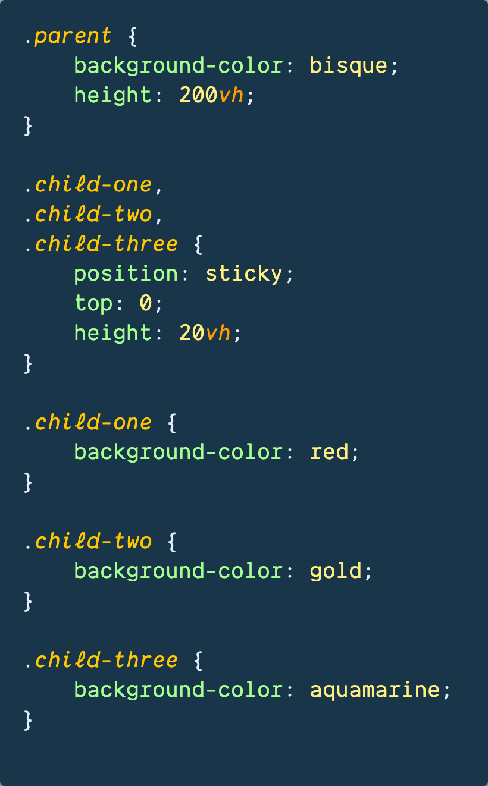
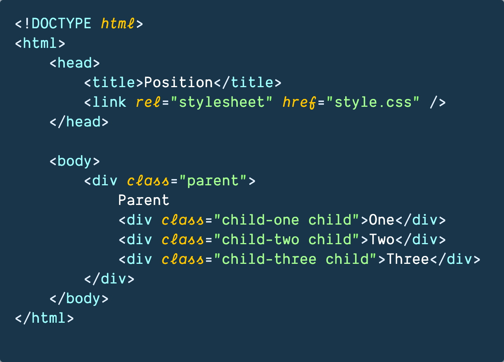
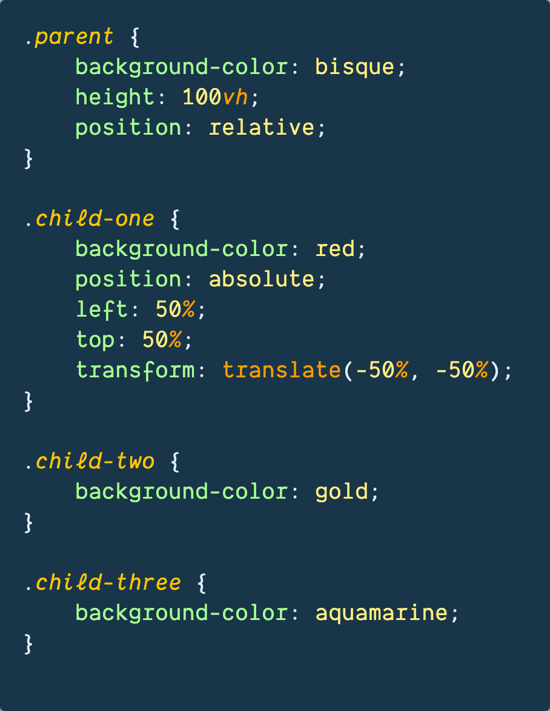
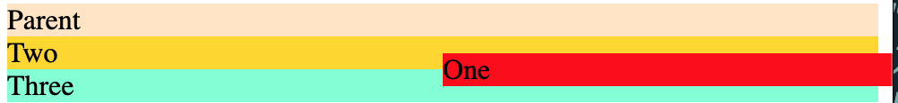
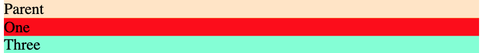
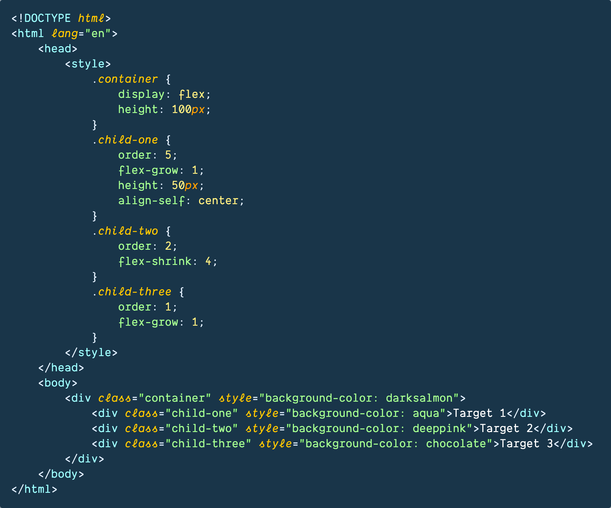

- [Class Notes](#class-notes)
  - [Resources](#resources)
  - [HTML \& CSS Part 3 (`09/07/2023`)](#html--css-part-3-09072023)
    - [上节课知识点复习](#上节课知识点复习)
    - [Website Layout](#website-layout)
    - [Pseudo Class Selector](#pseudo-class-selector)
      - [常见的Pseudo Class Selector](#常见的pseudo-class-selector)
    - [上节课作业background and borders](#上节课作业background-and-borders)
      - [background-size和object-fit](#background-size和object-fit)
    - [Position](#position)
      - [Position课上代码练习](#position课上代码练习)
      - [Position课上代码总结](#position课上代码总结)
    - [Flexbox布局参考资料](#flexbox布局参考资料)
    - [Grid布局练习网址](#grid布局练习网址)
    - [Responsive Design: 在多个设备上, 获得更好的视觉体验](#responsive-design-在多个设备上-获得更好的视觉体验)
  - [作业](#作业)
    - [完成position练习](#完成position练习)
    - [Flexbox CSS练习](#flexbox-css练习)
    - [写个人网站](#写个人网站)

# Class Notes

## Resources
[w3schools](https://www.w3schools.com/css/css_pseudo_classes.asp)<br>
[css tricks](https://css-tricks.com/snippets/css/a-guide-to-flexbox/)<br>
[css garden - grid](https://cssgridgarden.com/)<br>
[position practice](https://github.com/jessieyu1/intro-2-web-developmentV2/tree/main/practice/position/practice1)<br>
[blog practice](https://github.com/jessieyu1/intro-2-web-developmentV2/blob/main/PROTFOLIO/html/blog.html)<br>
[personal website example](https://v3.brittanychiang.com/)<br>

## HTML & CSS Part 3 (`09/07/2023`)

<p align='center'></p>

### 上节课知识点复习
1. 什么是Box Model
> ***Box model is used to define how elements are rendered in a webpage. It consists four parts: content, padding, border, and margin.***
   - Content: 多为文本或图片, 尺寸用 **width** and **height** 定义
   - Padding: content和border中间的部分, 尺寸用**padding**定义(*一般定义padding时不用负数*)
   - Border: 环绕在padding和content外, 尺寸,样式和颜色用 **border**定义
   - Margin: 不同元素间的距离, 尺寸用**margin**定义. (*很多HTML元素有默认的margin*)

2. CSS Specificity
> !important > inline > id > class > element<br>
> inline style > internal style

3. CSS Basic Selector
> id -> #<br>
> class -> .<br>
> universal -> *<br>

4. Grid vs Flexbox
> Grid: 二维布局, 适合网格状布局.<br>
> Flexbox: 一维布局, 适合响应式布局.

5. CSS rule
> 不推荐override css rules. 做debugging时, 优先search下"!important".

6. Color format in CSS
> rgb, hsl, hex

<hr>

### Website Layout

<hr>

### Pseudo Class Selector
*语法* -> `选择器+:`
> 用来实现元素的不同状态和行为,
- 鼠标点击的特效
- 鼠标悬停的特效
- 已访问过的链接的特效

#### 常见的Pseudo Class Selector
| 伪类选择器 | 用途 |
| :---: | :---: |
| :hover | 悬停状态 |
| :active | 点击状态 |
| :focus | 聚焦状态 |
| :visited | 已访问的链接状态 |

<hr>

### 上节课作业background and borders
<p align="center"></p>

#### background-size和object-fit
**background-size属性: 调整背景图片**
- `auto`: 默认值, 背景按原大小显示
- `contain`: 保留原有比例,缩放至图片自身能完全显示出来, 但可能有空白区域
- `cover`: 保留原有比例, 铺满整个容器的宽高，而图片多出的部分则会被截掉 (类似放大镜效果)

**object-fit属性: 用于控制可替换元素如何适应容器, 一般对象是img/video元素, 非常适合在响应式布局里做控制**
- `fill`: 不保证保持原有的比例，内容拉伸填充整个内容容器。
- `contain`: 保持原有尺寸比例, 内容被缩放
- `cover`: 保持原有尺寸比例, 但部分内容可能被剪切
- `none`: 被替换的内容将保持其原有的尺寸
- `scale-down`: 选none和contain尺寸小的显示
- `inherit`: 继承父级的object-fit属性

<hr>

### Position
Position常用的Property
- `static` (position的默认属性) : 元素按照默认布局进行定位 (不脱离文档流)，不受top、right、bottom、left和z-index属性的影响.

- `relative`: 元素按照默认布局进行定位 (不脱离文档流), 通过设置top、right、bottom、left属性，可以相对于元素在文档流中的位置进行偏移.

- `absolute`: absolute一般找最近的非static父级元素定位(父级大多用relative, 子级用absolute). 如果所有的父级都没有定义position/所有父级是static, 子元素会相对于浏览器窗口定位 (和fixed很像).

- `fixed`: fixed元素相对于浏览器窗口进行定位 (可以理解成它的parent就是viewpoint).

- `sticky`: 位置上是relative (定义top等定位属性时不能超过父元素边界, 否则无效), 滚动到边界时切换成fixed (用于导航栏, 广告悬浮). 父级不需要是非static的position<br>
***sticky生效的条件***
1. 父级保留默认overflow: visible
2. 父级有确定的高度
3. 为sticky的子元素设置top属性
4. 父元素没有transfrom

<p align='center'></p>

https://github.com/ESJiang/JR16-notes/assets/43910771/b7cf21cb-920c-44c1-ba95-0b51070e4b35

#### Position课上代码练习
<div style="display:flex; justify-content: space-between">
    
    
</div>

#### Position课上代码总结
> 对于块级元素div, 在没指定width和height, 会尽量让width:100%/占满父级元素的宽度. 但是height取决于内容

>> 一旦给块级元素position设置为absolute, 明显的改变是width不会强制占满父级, width取决于内容

***如上图所示, 当父元素为realtive并且子元素是absolute. 使用left:50%, top:50%, transform: translate(-50%, -50%), child 1可以居中. 但是为什么推荐多写transform: translate(-50%, -50%)呢?***
> 使用"left:50%; top:50%"只适用于宽高确定的情况, 原理是将子元素的左上角和父元素的中心重合. 但是这种方法无法没有真正将子元素自身的中心位置和父元素的中心位置重合. translate(-50%, -50%)会根据子元素自身宽高, 进行平移.

<div style="display: flex">
    <figure>
        
        <figcaption>未使用transform</figcaption>
    </figure>
    <figure>
        
        <figcaption>使用transform</figcaption>
    </figure>
</div>

<hr>

### Flexbox布局参考资料
<https://css-tricks.com/snippets/css/a-guide-to-flexbox/>

<p align='center'></p>

<hr>

### Grid布局练习网址
<https://cssgridgarden.com/>

<hr>

### Responsive Design: 在多个设备上, 获得更好的视觉体验
- Display：none (删元素)
- Flexbox-direction (改摆列方式)

```css
@media only screen and (min-width: 600px){
    /* write your preferred declarations */
}
```

*注意: 后面的@media范围不能包含前面@media的范围, 因为这样做前面@media的设置会失效*


`clamp([min], [calculated], [max])`: 在最小值和最大值时浮动(一般控制font-size, margin, etc)
> 好处是不需要写多个@media控制了, 节省代码量，维持元素间的相对关系

举例: *font-size: clamp(1.5rem, 2.5vw, 4rem);*
> 2.5vw代表视窗宽度的2.5%

`calc()`: 可以用来自动调整大小以适应其父级容器的大小

`可以在:root中定义变量, 直接使用var()调用`

```css
:root{
    --first-color: #16f;
    --second-color: #ff7;
}

#firstParagraph{
    background-color: var(--first-color);
    color: var(--second-color);
}
```

## 作业

### 完成position练习

<https://github.com/jessieyu1/intro-2-web-developmentV2/tree/main/practice/position/practice1>

### Flexbox CSS练习
<https://github.com/jessieyu1/intro-2-web-developmentV2/blob/main/PROTFOLIO/html/blog.html>

### 写个人网站
