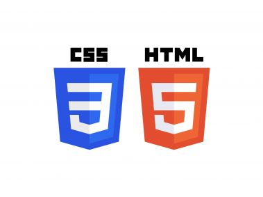

- [Class Notes](#class-notes)
  - [Resources](#resources)
  - [HTML \& CSS tutorial (`19/07/2023`)](#html--css-tutorial-19072023)
    - [写个人网站的注意事项](#写个人网站的注意事项)
    - [边偏移](#边偏移)
    - [transition和transform区别](#transition和transform区别)
    - [Flexbox practice code](#flexbox-practice-code)
      - [HTML](#html)
      - [CSS](#css)
    - [minhpham.design](#minhphamdesign)

# Class Notes

## Resources
[css-transition](https://www.w3schools.com/css/css3_transitions.asp)<br>
[css-transform](https://www.w3schools.com/css/css3_2dtransforms.asp)<br>
[flexbox-practice-code](https://github.com/jessieyu1/intro-2-web-developmentV2/blob/main/PROTFOLIO/html/blog.html)<br>
[dribbble](https://dribbble.com/shots)<br>
[beautiful buttons](https://getcssscan.com/css-buttons-examples)<br>
[color palettes](https://coolors.co/palettes/trending)<br>
[minhpham.design](https://minhpham.design/)<br>

## HTML & CSS tutorial (`19/07/2023`)

<p align='center'></p>

### 写个人网站的注意事项
> bem命名规范<br>
`Modifier要尽量和元素内容或功能相关, 这会提升可读性+写css更容易`<br>
> 学别人的design和配色<br>
> Responsive Design要注意图片和文字大小, margin等<br>
> 颜色要协调, 主色调要统一<br>
> 所有页面的字体要一致, 可以有一两处花体字<br>
> 英语语法和拼写的细节<br>
> 文字不能溢出容器<br>
> 设置段落间距兼顾可读性<br>

### 边偏移
当一个元素设置position后, 一般top/bottom选一个, left/right选一个来定位

- `relative`: 元素按照默认布局进行定位 (不脱离文档流), 通过设置top、right、bottom、left属性，可以相对于元素在文档流中的位置进行偏移.

- `absolute`: absolute一般找最近的非static父级元素定位 (脱离文档流).

### transition和transform区别
`transition和transform在商业环境中较少使用`
| transition | transform |
| :---: | :---: |
| ***设置delay, 让动画效果更自然*** | ***旋转, 颜色变化, 大小变化*** |

### Flexbox practice code

[flexbox-practice-code](https://github.com/jessieyu1/intro-2-web-developmentV2/blob/main/PROTFOLIO/html/blog.html)

#### HTML
```html
<!doctype html>
<html lang="en">
    <head>
        <title>Blog with photos</title>
        <meta charset="utf-8" />
        <meta name="viewport" content="width=device-width, initial-scale=1.0" />
        <meta name="description" content="HTML Cheat Sheet" />
        <meta name="author" content="Jessie" />
        <link rel="icon" href="../images/favicon.ico" type="image/x-icon" />
        <link rel="stylesheet" href="../styles/blog_style.css" />
    </head>

    <body>
        <!-- header -->
        <header class="header">
            <nav class="header_navbar">
                <a href="index.html">Home</a>
                <a href="blog.html">Blog</a>
                <a href="skills.html">Skills</a>
                <a href="portfolio.html">Portfolio</a>
                <a href="contact.html">Contact</a>
            </nav>
        </header>
        <!-- main -->
        <main class="main">
            <div class="main_title">
                <h2 class="main_title_topic">Dev's Life</h2>
                <h1 class="main_title_number">01</h1>
                <h1 class="main_title_content">Blog Post pictures</h1>
            </div>
            <figure class="main_profile">
                
            </figure>
            <section class="main_blog">
                <h2 class="main_blog_title">Blog Post with pictures</h2>
                <small class="main_blog_date">Jessie Posted on 2/4/2023</small>
                <article class="main_blog_article">
                    <p class="main_blog_article_p1">
                        Lorem ipsum dolor sit amet consectetur adipisicing elit. Enim, blanditiis? Cupiditate molestias perferendis eveniet ducimus dicta, veniam corporis id quod aliquid tempore
                        voluptates. Repudiandae aliquid odit accusantium veritatis. Lorem ipsum dolor sit amet consectetur adipisicing elit. In voluptatem quasi ducimus perferendis odit laudantium
                        eveniet inventore eligendi, architecto reprehenderit, nisi, soluta praesentium explicabo nulla delectus ea unde aut amet sit doloremque dolor! Minus, magni quas fuga assumenda
                    </p>
                    <p class="main_blog_article_p2">
                        Lorem ipsum dolor sit amet consectetur adipisicing elit. Enim, blanditiis? Cupiditate molestias perferendis eveniet ducimus dicta, veniam corporis id quod aliquid tempore
                        voluptates. Repudiandae aliquid odit accusantium veritatis in corporis.
                    </p>
                    <p class="main_blog_article_p3">
                        Lorem ipsum dolor sit amet consectetur adipisicing elit. Enim, blanditiis? Cupiditate molestias perferendis eveniet ducimus dicta, veniam corporis id quod aliquid tempore
                        voluptates. Repudiandae aliquid odit accusantium veritatis in corporis.
                    </p>
                    <br />
                </article>
                <aside>
                    <button class="button-89" role="button">Read More</button>
                </aside>
            </section>
        </main>
        <!-- footer -->
        <footer class="footer">
            <p>©2023 Jessie Yu</p>
        </footer>
    </body>
</html>

```

#### CSS
```css
@import url("https://fonts.googleapis.com/css2?family=Raleway:ital,wght@0,100;1,100&display=swap");

* {
    box-sizing: border-box;
    margin: 0;
    padding: 0;
    font-family: "Raleway", sans-serif;
    --bg: #ccc;
}

/* header */
.header {
    display: flex;
    justify-content: space-between;
    width: clamp(50%, 1000px, 100%);
    --bg: #ccc;
    --color: #000;
    --font-size: 1.5rem;
    margin: auto;
    margin-top: clamp(0.5rem, 2vw, 2rem);
    margin-bottom: clamp(0.5rem, 2vw, 2rem);
}

.header_navbar a {
    text-decoration: none;
    color: var(--color);
    font-size: clamp(1rem, 2vw, var(--font-size));
    margin: 1rem;
}

.header_navbar a:hover {
    color: var(--bg);
}

.header_navbar a:active {
    color: #fff;
}

/* footer */
.footer {
    display: flex;
    justify-content: center;
    align-items: center;
    margin-bottom: 10px;
}

/* main */

.main {
    display: flex;
    width: 100vw;
    height: 80vh;
    justify-content: space-between;
}

/* main title */
.main_title {
    display: flex;
    flex-direction: column;
    margin-left: 2rem;
    justify-content: space-between;
}

.main_title_number {
    color: var(--bg);
    font-size: 5rem;
    font-weight: bold;
}

.main_title_topic {
    border-left: 1px solid var(--bg);
}

.main_title_content {
    transform: rotate(0.75turn);
    color: grey;
    border-top: 1px solid grey;
    font-weight: bold;
}

.main_title_content:hover {
    color: var(--bg);
}

/* main profile */

.main_profile {
    width: 100%;
}

.main_profile img {
    max-width: 100%;
    width: 100%;
    height: 100%;
    object-fit: contain;
}

/* main blog */

.main_blog {
    width: 100%;
    display: flex;
    flex-direction: column;
    justify-content: space-evenly;
    margin: 2rem;
    font-size: 1rem;
    width: 80%;
    height: 100%;
}
.main_blog_article {
    display: flex;
    flex-direction: column;
    justify-content: space-evenly;
    font-size: 1rem;
    width: 80%;
    height: 100%;
}

.main_blog_article_p1::first-letter {
    initial-letter: 4;
}
.main_blog_article_p2 {
    border-bottom: 1px solid var(--bg);
    border-image: linear-gradient(to left, var(--bg) 50%, transparent 50%) 100% 1;
}

/* responsive */

@media only screen and (max-width: 1200px) {
    .main_title {
        display: none;
    }
    .main_profile {
        display: none;
    }
    .main_blog {
        width: 100%;
        padding: 2rem;
        display: flex;
        flex-direction: column;
        justify-content: space-evenly;
    }
    .header {
        display: flex;
        justify-content: center;
    }
}

/* button */

.button-89 {
    --b: 3px; /* border thickness */
    --s: 0.45em; /* size of the corner */
    --color: #373b44;

    padding: calc(0.5em + var(--s)) calc(0.9em + var(--s));
    color: var(--color);
    --_p: var(--s);
    background: conic-gradient(from 90deg at var(--b) var(--b), #0000 90deg, var(--color) 0) var(--_p) var(--_p) / calc(100% - var(--b) - 2 * var(--_p)) calc(100% - var(--b) - 2 * var(--_p));
    transition: 0.3s linear, color 0s, background-color 0s;
    outline: var(--b) solid #0000;
    outline-offset: 0.6em;
    font-size: 16px;

    border: 0;

    user-select: none;
    -webkit-user-select: none;
    touch-action: manipulation;
}

.button-89:hover,
.button-89:focus-visible {
    --_p: 0px;
    outline-color: var(--color);
    outline-offset: 0.05em;
}

.button-89:active {
    background: var(--color);
    color: #fff;
}
```

### minhpham.design
<https://minhpham.design/>