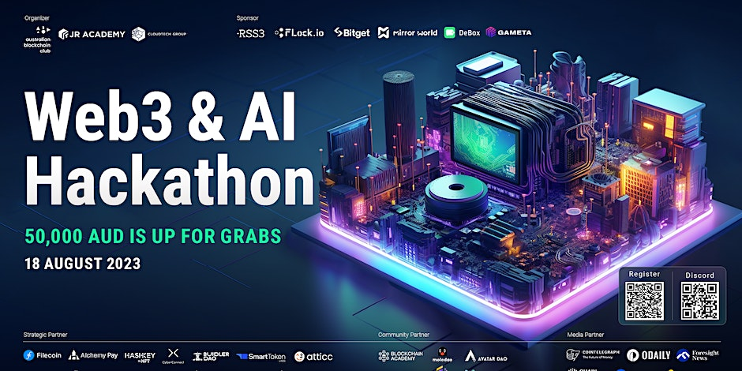
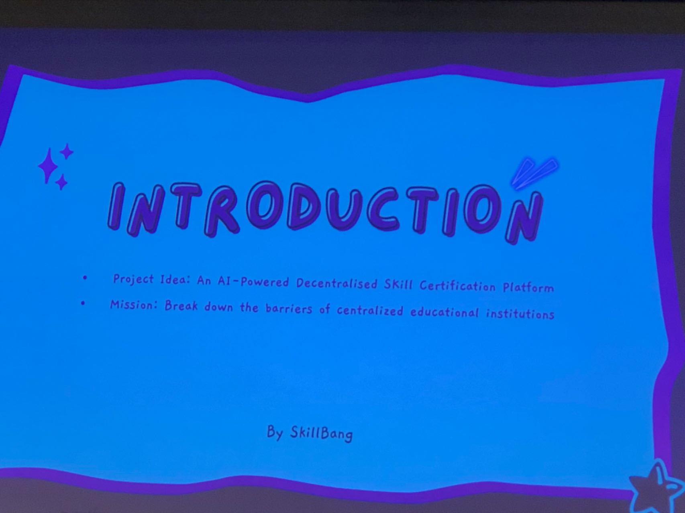
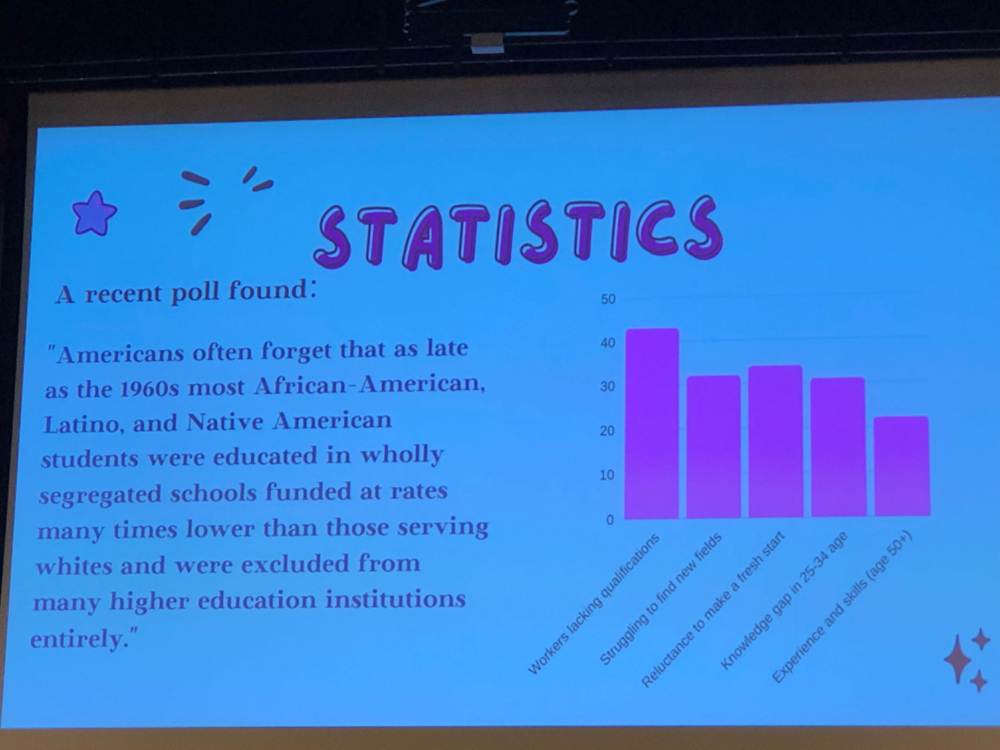
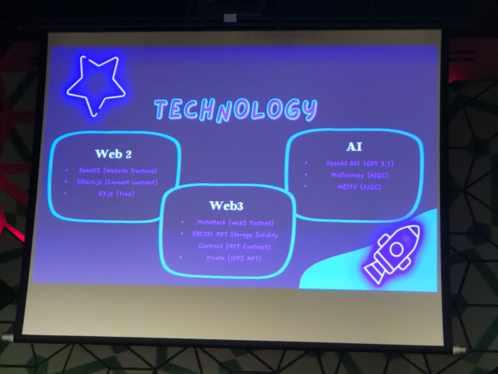
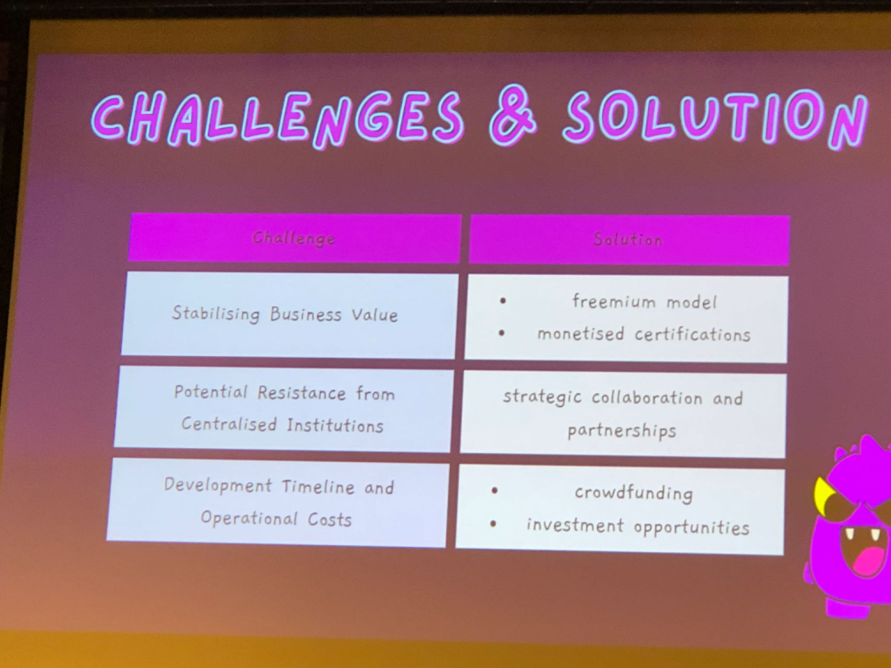

- [Class Notes](#class-notes)
  - [Resources](#resources)
  - [Web3 \& AI Hackfest (`18/08/2023`)](#web3--ai-hackfest-18082023)
    - [Cobweb Pay](#cobweb-pay)
    - [neovim](#neovim)
    - [SkillVerse Web3 \& AI](#skillverse-web3--ai)
      - [Video](#video)
      - [SkillVerse的项目意义](#skillverse的项目意义)
      - [亮点](#亮点)
      - [项目roadmap](#项目roadmap)
      - [项目使用的技术栈](#项目使用的技术栈)
        - [WEB2](#web2)
        - [WEB3](#web3)
      - [如何使用SkillVerse平台](#如何使用skillverse平台)
      - [项目遇到的困难和解决方法](#项目遇到的困难和解决方法)
    - [答辩问的最多两个问题](#答辩问的最多两个问题)

# Class Notes

## Resources
[活动链接](https://www.eventbrite.com/e/web3-ai-hackfest-tickets-567553215947/
)<br>
[web3hackfest.net](https://web3hackfest.net/)<br>
[Rust Language Cheat Sheet](https://cheats.rs/)

## Web3 & AI Hackfest (`18/08/2023`)

<p align='center'></p>

`Revolutionising Web3 & AI: Building Decentralised, AI-Powered Solutions for a Sustainable Future`

### Cobweb Pay
<https://www.cobwebpay.com/>
> 一种支付app, 可以支持支付, 数字资产和外汇交易.
> 使用最新的

### neovim
> neovim可以理解成vim的更新版本. 支持异步插件, 可以不堵塞编辑流程, 为处理大项目带来更好的性能.

```shell
# macOS
brew install neovim
# Debian
apt install neovim
# edit ~/.zshrc
alias vim='nvim'
alias vi='nvim'
```

### SkillVerse Web3 & AI
#### Video
[SkillVerse Demo](./Skillverse.mp4)

#### SkillVerse的项目意义
<p align='center'></p>

<p align='center'></p>

-  一个基于web3的教育娱乐平台, 让更多人在游戏中学习知识, 获得奖励

#### 亮点
- 使用一个虚拟加密代币(SKV), 本质是一种NFT. 用于市场上治理, 交易资产
- 当通过问题/完成学习/解决谜题挑战时, 用户得到代币, 代币越多,激活的神经元越多

#### 项目roadmap
<p align='center'></p>

#### 项目使用的技术栈
<p align='center'></p>

##### WEB2
- ReactJS: 使用component和virtual dom的一个JS框架
- Ether.js: 一个区块链开发库, 实现钱包管理、智能合约创建和部署、交易签名等。
- D3.js: 数据可视化的JS框架

##### WEB3
- MetaMask: 钱包插件，用于管理数字资产和与 DApps 互动
- ERC-721: 一种NFT标准
- Solidity: 编写智能合约
- NFT Contract: 基于Solidity, 用于创建和管理非同质化代币(NFTs)
- Pinata: 在IPFS上存储 NFT 元数据、图像、音频和其他媒体文件

#### 如何使用SkillVerse平台
1. 输入interest和career goal -> 生成一个recommendation map
2. 通过完成任务, 收集NFT.

#### 项目遇到的困难和解决方法
<p align='center'></p>

### 答辩问的最多两个问题
- 一些底层的security问题. 不管什么实现方式(block chain, web3, etc). 基本安全性和隐私保护如何实现的. 这也是为什么要引入WEB3的原因. WEB3使用block chain实现去中心化, 用户数据用户掌握, 支持数字身份和加密货币.

- 就和写论文一样, 你的information gathering做的怎么样. 项目的新颖度和价值需要和现在的competitors和以前的projects做对比(技术栈, 功能等).