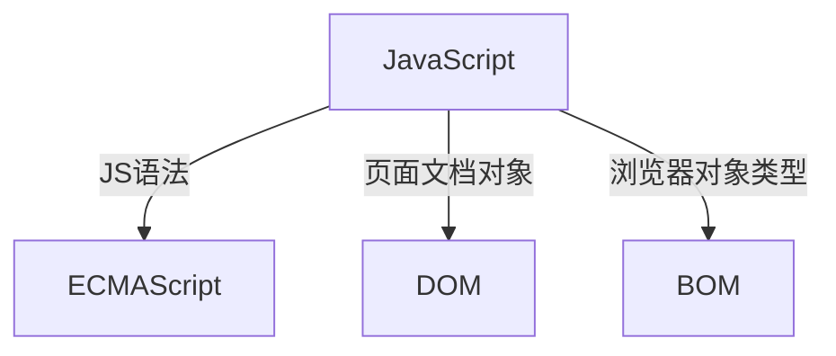
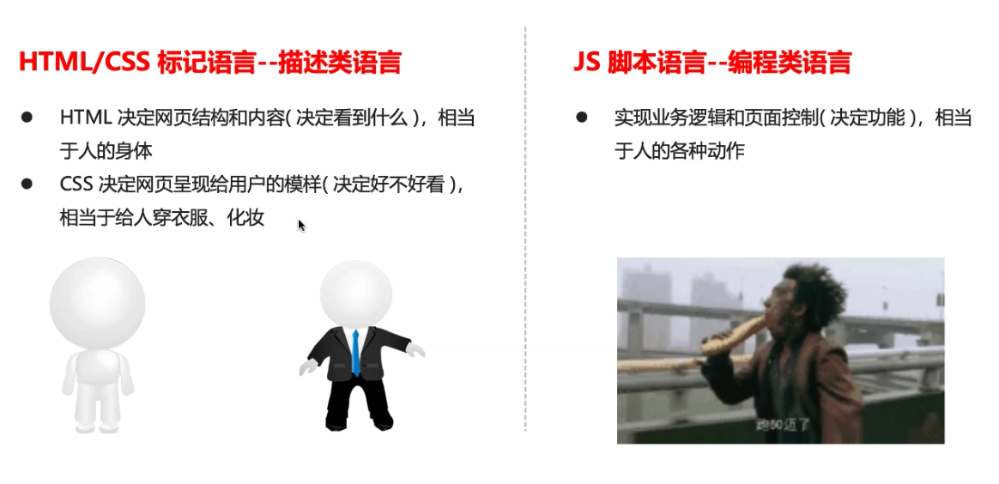

- [Class Notes](#class-notes)
  - [Resources](#resources)
  - [JavaScript\_1 (`18/07/2023`)](#javascript_1-18072023)
    - [汇编语言和高级语言](#汇编语言和高级语言)
    - [编程语言和标记语言](#编程语言和标记语言)
    - [JS的用途](#js的用途)
    - [JS的组成](#js的组成)
    - [html/css/js的关系](#htmlcssjs的关系)
    - [vscode添加注释快捷键](#vscode添加注释快捷键)
    - [js的3种写法](#js的3种写法)
    - [alert/console/prompt](#alertconsoleprompt)
    - [变量命名规范](#变量命名规范)
      - [变量声明](#变量声明)
    - [交换两个变量的值](#交换两个变量的值)
    - [字符串](#字符串)
      - [转换字符串](#转换字符串)
    - [boolean和数字](#boolean和数字)
    - [检测数据类型](#检测数据类型)
    - [打印数据结果(使用逗号分隔string和变量名)](#打印数据结果使用逗号分隔string和变量名)
    - [转化成数字型](#转化成数字型)
      - [浮点数计算](#浮点数计算)
    - [前自增/后自增](#前自增后自增)
  - [作业](#作业)

# Class Notes

## Resources

## JavaScript_1 (`18/07/2023`)

<p align='center'></p>

### 汇编语言和高级语言
| 汇编语言 | 高级语言 |
| :---: | :---: |
| ***对硬件操作, 它使用机器码和符号来表示指令和数据*** | ***通过编译器或解释器转换为机器码才能在计算机上运行*** |

### 编程语言和标记语言
| 编程语言 | 标记语言 |
| :---: | :---: |
| ***if/else/for/while*** | ***被动读取, 不直接向计算机发出指令*** |

### JS的用途
- 密码强度检测
- 网页特效
- 服务端开发
- 桌面程序
- app
- 控制硬件
- etc

### JS的组成


### html/css/js的关系
<p align='center'></p>

### vscode添加注释快捷键
`ctrl/command + /`

### js的3种写法
1. 行内
```html
<input type="button" value="click me" onclick="alert('Hello World');" />
```

2. 内嵌
```html
<script>
    alert('Hello World');
</script>
```

3. 外部
```html
<script src="my.js"></script>
```

### alert/console/prompt
| alert | console | prompt |
| :---: | :---: | :---: |
| ***弹窗*** | ***在控制台看到*** | ***prompt返回的是string***

### 变量命名规范
- 区分大小写
- 不能数字开头
- 不能是关键字
- 驼峰命名法 (e.g myFirstName)
- 语义化

#### 变量声明
```js
var name; // undefined
var name = 'Jack';
var name = 'James';

let name; // undefined
let name = 'Jack';
let name = 'James'; // error

const name; // error
const name = 'Jack';
const name = 'James'; // error
```

### 交换两个变量的值
```js
let apple1 = 1;
let apple2 = 2;
let temp = apple1;
apple1 = apple2;
apple2 = temp;
```
### 字符串
- `字符串长度: str.length`
- 字符串+任何类型 = 字符串

#### 转换字符串
> toString() 常用<br>
> String() 强制转换<br>
> 加号拼接 隐式转换

```js
let name = prompt("please enter your age: ");
console.log("Your age is " + name + " years old");
```

### boolean和数字
`true + 1 -> 2`
`false + 1 -> 1`

### 检测数据类型
```js
let num = 10;
console.log(typeof num); // number

let a = null;
console.log(typeof a); // object
```

### 打印数据结果(使用逗号分隔string和变量名)
```js
let num = 10;
console.log("num", num);
```

### 转化成数字型
- parseInt(str)
- parseFloat
- Number()
- 隐式转换

```js
console.log(parseInt('3.14')) // 3
console.log(parseInt('120px')) // 120
console.log(parseInt('rem120px')) // NaN
console.log(parseFloat('3.14')) // 3.14
console.log(parseFloat('120px')) // 120
console.log(parseFloat('rem120px')) // NaN

// 不要用+, 这样会隐式转化成str
console.log('12' - 0); // 12
console.log('123' - '120'); // 3
console.log('123' * 1); // 123
console.log('123' / 1); // 123
```

#### 浮点数计算
```js
let num = 0.1 + 0.2; // 0.30000000000000004
console.log(num.toFixed(1)); // 0.3
```

### 前自增/后自增
```js
let num = 1;
console.log(num++); // 1

let age = 18;
console.log(++age); // 19
```

## 作业
课件上的三个练习