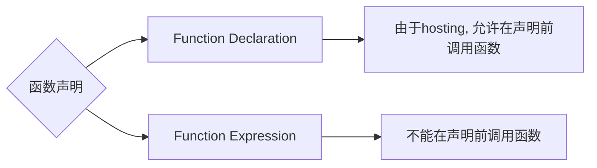

- [Class Notes](#class-notes)
  - [Resources](#resources)
  - [JavaScript\_3 (`25/07/2023`)](#javascript_3-25072023)
    - [函数](#函数)
    - [函数的使用](#函数的使用)
      - [函数声明的不同方法](#函数声明的不同方法)
        - [Function Declaration](#function-declaration)
        - [Function Expression](#function-expression)
      - [求和函数](#求和函数)
    - [函数的参数](#函数的参数)
      - [形参和实参](#形参和实参)
      - [形参和实参个数不匹配](#形参和实参个数不匹配)
    - [return关键字](#return关键字)
      - [return的注意事项](#return的注意事项)
      - [return demo](#return-demo)
      - [得到两个数中最大值](#得到两个数中最大值)
      - [求数组的最大值](#求数组的最大值)
      - [不写return关键字的后果](#不写return关键字的后果)
    - [作用域](#作用域)
      - [ES6之前](#es6之前)
      - [ES6之后 (使用let/const提升安全性)](#es6之后-使用letconst提升安全性)
      - [闭包 (Lexical scope)](#闭包-lexical-scope)
    - [Object练习](#object练习)
    - [Math方法](#math方法)
      - [max方法](#max方法)
      - [abs方法](#abs方法)
      - [floor/ceil/round方法](#floorceilround方法)
      - [random方法](#random方法)
        - [用random方法得到两个数之间的随机整数](#用random方法得到两个数之间的随机整数)
        - [用random方法随机得到数组的任一元素(随机点名)](#用random方法随机得到数组的任一元素随机点名)
    - [String方法](#string方法)
      - [charAt方法](#charat方法)
      - [concat方法](#concat方法)
      - [substr方法](#substr方法)
      - [replace方法](#replace方法)
      - [split方法](#split方法)
    - [格式化输出date](#格式化输出date)
    - [DOM方法](#dom方法)
      - [08-dom\_method.html练习](#08-dom_methodhtml练习)
      - [11-dom\_appendChild.html练习](#11-dom_appendchildhtml练习)
        - [appendchild添加新元素只能是last-child, 怎样在指定位置插入新元素?](#appendchild添加新元素只能是last-child-怎样在指定位置插入新元素)
      - [12-dom\_style.html练习](#12-dom_stylehtml练习)
      - [13-dom\_eventListener.html练习](#13-dom_eventlistenerhtml练习)
  - [作业](#作业)

# Class Notes

## Resources

## JavaScript_3 (`25/07/2023`)

<p align='center'></p>

### 函数
> for循环语句能实现简单的重复操作, 但有局限性. 另一个方法是定义函数<br>
>> 函数是封装了一段可重复调用执行的代码块. 通过调用函数可以实现大量的代码复用.

### 函数的使用
*声明函数 + 调用函数*

```js
funciton 函数名() { // 使用Function Declaration声明函数
    // 函数体代码
}
函数名() // 调用函数
```
> function关键字必须小写, 函数名用动词
> function的{}不能省略 (即使执行语句只有一句)

#### 函数声明的不同方法



##### Function Declaration
```js
getValue(); // correct
function getValue() {
    console.log("hello world");
}
```

##### Function Expression
```js
isFormValidated(); // error
let isFormValidated = function () {
    console.log(true);
};
```

#### 求和函数
```js
function getSum(start, end) {
    let sum = 0;
    for (let i = start; i <= end; i++) sum += i;
    console.log(sum);
}
getSum(1, 100); //5050
```

### 函数的参数
> *参数: 函数内部的值不固定, 根据传入参数决定*

#### 形参和实参
`形参: 不用声明的变量`<br>
`实参: 实际传输的参数`

#### 形参和实参个数不匹配

| 实参个数=形参 | 实参个数>形参个数 | 实参个数<形参个数 |
| :---: | :---: | :---: |
| ***正常*** | ***只取到形参的个数, 多余的忽略*** | ***多的形参是undefined***

```js
function getSum(num1, num2) {
    console.log(num1 + num2);
}
getSum(3,5); //8, 3+5=8
getSum(1,2,3) //3 1+2=3
getSum(1) //NaN 1+undefined=NaN
```

### return关键字
`让函数返回值, 可以用变量保存`
#### return的注意事项
> *在使用return语句时, return后的语句不会执行*<br>
> *在 return 语句中，逗号被用来分隔不同的表达式，但是只会返回最后一个表达式的值 return num1, num2 => 只返回num2*

#### return demo
```js
// 比起直接console.log, return更常用
function getResult() {
    return 'hello';
}
const res = getResult();
```

#### 得到两个数中最大值
```js
// 方法1: Ternary Operator
function getMax(num1, num2) {
    return num1 > num2 ? num1 : num2;
}
console.log(getMax(7, 6)); //7

// 方法2: if-else statements
function getMax2(num1, num2) {
    if (num1 > num2)  return num1;
    else return num2;
}
console.log(getMax2(7, 6)); //7
```

#### 求数组的最大值
```js
// 方法1: Ternary Operator
let arr = [5, 2, 99, 101, 67, 77];

function getArrayMax(arr) {
    let max = arr[0];
    for (let i = 1; i < arr.length; i++) max = arr[i] > max ? arr[i] : max;
    return max;
}
console.log(getArrayMax(arr)); // 101

// 方法2: if-else statements
function getArrayMax2(arr) {
    let max = arr[0];
    for (let i = 1; i < arr.length; i++) if (arr[i] > max) max = arr[i];
    return max;
}
console.log(getArrayMax2(arr));
```

#### 不写return关键字的后果
```js
function getStr() {
    'hello'
}
console.log(getStr()) // undefined
```

### 作用域
> ES6之前: 全局作用域+局部作用域(函数作用域)<br>
> ES6后: 块级作用域 (let/const)

*obj本身不构成作用域*

#### ES6之前
```js
// 全局作用域 (污染全局的命名空间)
var num = 10;
var num = 30;
console.log(num); // 30

if (true) var a = 1;

console.log("a", a); // a 1

for (var i = 0; i < 10; i++) {}
console.log("i", i);

// 变量提升
console.log(foo); // undefined
var foo = 2;

// 内层变量被外层修改
var tmp = new Date();
function fn() {
    console.log(tmp);
    if (false) var tmp = "hello world";
}
fn(); // undefined (拿不到外部的tmp)

// 局部作用域
function fn() {
    var num1 = 20;
    console.log("num1", num1);
}
console.log("num1", num1); // error
```

#### ES6之后 (使用let/const提升安全性)
```js
console.log(a); // error
let a = 1;
```

```js
let tmp = new Date();
function fn() {
    console.log(tmp);
    if (false) tmp = "hello world";
}
fn(); //正常输出date
```

#### 闭包 (Lexical scope)
```js
// 闭包: 先找自身方法内部有没有这个变量, 再找父级function有没有, 最后找全局变量 -> 这种机制可以保护被调用的方法内部定义的变量不会被外部修改 (私有化)
const scope = "global scope";
function checkscope() {
    const scope = "checkscope() scope";
    return () => {
        const scope = "f() scope";
        return scope;
    };
}
console.log(checkscope()()); // f() scope
```

### Object练习
```js
const info = {
    name: "Ben",
    age: 20,
    gender: "male",
    comments: "hello",
};
// 方法一: Template Strings
console.log(`The user's name is ${info.name}`);
// 方法二: '+' operator
console.log("The user's name is " + info.name);

const puppy = {
    name: "coco",
    type: "alaska",
    age: 5,
    desex: false,
    color: "brown",
    skills: "bark",
};
// 方法一: Template Strings
console.log(`${puppy.name} is a ${puppy.age} years old dog who likes ${puppy.skills}`);
// 方法二: '+' operator
console.log(puppy.name + " is a " + puppy.age + " years old dog who likes " + puppy.skills);
```

### Math方法
#### max方法
```js
console.log(Math.max(1, 99, 3)); // 99
console.log(Math.max(-1, -10)); // -1
console.log(Math.max(1, 99, "Hi")); // NaN
console.log(Math.max()); // -Infinity
```

#### abs方法
```js
console.log(Math.abs(1)) // 1
console.log(Math.abs(-1)) // 1
console.log(Math.abs('-1')) // 1
console.log(Math.abs('hello')) // NaN
```

#### floor/ceil/round方法
```js
console.log(Math.floor(1.1)) // 1
console.log(Math.floor(3.9)) // 3
console.log(Math.ceil(1.2)) // 2
console.log(Math.ceil(1.9)) // 2
console.log(Math.round(1.2)) // 1
console.log(Math.round(1.9)) // 2
```

#### random方法
```js
console.log(Math.random()); // 0~1随机数
```

##### 用random方法得到两个数之间的随机整数
```js
const random = Math.floor(Math.random() * (max-min+1)) + min;
```

##### 用random方法随机得到数组的任一元素(随机点名)
```js
let arr = ["Jane", "Ben", "Chris", "John", "Andrew", "Amy"];
function getRandom(min, max) {
    return Math.floor(Math.random() * (max - min + 1)) + min;
}
const index = getRandom(0, 5);
console.log(arr[index]);
console.log(arr[Math.floor(Math.random() * arr.length)]);
```

### String方法
#### charAt方法
```js
// charAt(index) 根据位置返回字符
var str = "andy";
console.log(str.charAt(3)); // y
// 遍历所有的字符
for (let i = 0; i < str.length; i++) console.log(str[i]);
```

#### concat方法
```js
// concat将多个字符串连接(不改变原array)
var str = 'andy';
console.log(str.concat(" ", "hi")) // "andy hi"
```

#### substr方法
```js
// 2. substr(不改变原array)
var str1 = "abcdefghijk";
console.log(str1.substr(2, 2)); // "cd"
```

#### replace方法
```js
// replace替换
var str1 = "abcoefoxyozzopp";
console.log(str1.replace("a", "b")) // bbcoefoxyozzopp

// 全部替换
// 方法一 - replace方法
var str2 = "abcoefoxyozzopp";
const newString = str2.replace(/o/g, "*");
console.log(newString); // abc*ef*xy*zz*pp

// 方法2 - while循环
while (str2.indexOf("o") !== -1) str2 = str2.replace("o", "*");
console.log(str2); // abc*ef*xy*zz*pp
```

#### split方法
```js
var str3 = 'red, pink, blue';
console.log(str3.split(",")); // [ 'red', ' pink', ' blue' ]
```

### 格式化输出date
```js
const arr = ["Sunday", "Monday", "Tuesday", "Wednesday", "Thursday", "Friday", "Saturday"];

function addZero(num) {
    return num < 10 ? "0" + num : num;
}
let date = new Date();
let year = date.getFullYear();
let month = date.getMonth() + 1;
month = addZero(month);
let dates = date.getDate();
dates = addZero(dates);
let day = date.getDay();
console.log(year + "-" + month + "-" + dates + " " + arr[day]);
```

### DOM方法
#### 08-dom_method.html练习
```js
const title = document.getElementById("title");
title.innerHTML = "Hello World";
const skills = document.getElementByclassName("skill");
skills[0].style.color = 'red';
const intros = document.getElementByclassName('intro');
document.getElementById('demo').innerHTML = intros[0].textContent;
```

#### 11-dom_appendChild.html练习
```js
p.innerHTML = "js";
const parent = document.getElementById("list");
parent.appendChild(p);
```

##### appendchild添加新元素只能是last-child, 怎样在指定位置插入新元素?
```js
const newElement = document.createElement("p");
newElement.textContent = "new_item";
document.getElementById("list").insertBefore(newElement, document.getElementById("css"));
```

<p align='center'></p>

#### 12-dom_style.html练习
```js
const element = document.getElementById("p-id");
element.style.cssText = "color: #ff0000; font-size: 20px; padding-top: 20px;";
element.innerHTML = "hello world";
```

#### 13-dom_eventListener.html练习
```js
document.getElementById("myBtn").addEventListener("click", () => (document.getElementById("demo").innerHTML = Date()));
```

## 作业
09 + 10 + 50个projects选一两个做