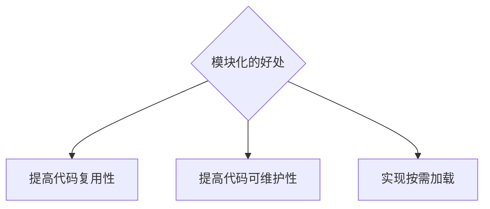
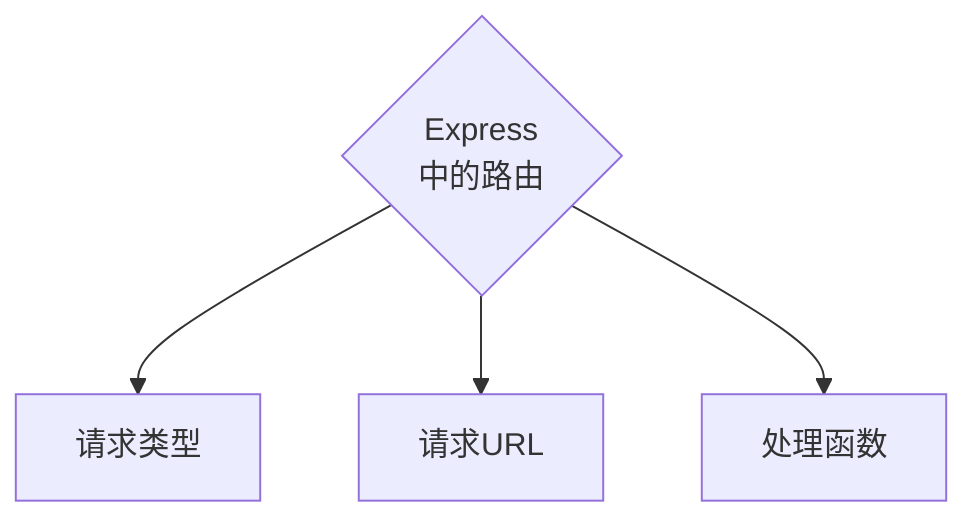

- [Class Notes](#class-notes)
  - [Resources](#resources)
  - [Node\_3 (`01/08/2023`)](#node_3-01082023)
    - [package.json vs package-lock.json vs node\_modules](#packagejson-vs-package-lockjson-vs-node_modules)
    - [模块化](#模块化)
    - [模块作用域](#模块作用域)
    - [Express介绍](#express介绍)
      - [两种服务器](#两种服务器)
        - [安装express和nodemon](#安装express和nodemon)
      - [搭建server](#搭建server)
    - [Express中的路由](#express中的路由)
      - [模块化路由](#模块化路由)
        - [server.js](#serverjs)
        - [router.js](#routerjs)
        - [userRouter.js](#userrouterjs)
        - [journalRouter.js](#journalrouterjs)
  - [作业](#作业)

# Class Notes

## Resources
[npm express](https://www.npmjs.com/package/express)<br>
[npm nodemon](https://www.npmjs.com/package/nodemon)<br>

## Node_3 (`01/08/2023`)
<p align='center'></p>

### package.json vs package-lock.json vs node_modules
| package.json | package-lock.json | node_modules
| :---: | :---: | :---: |
| ***项目信息和依赖项信息*** | ***npm包的地址,来源,具体版本号*** | ***下载包的位置*** |

> ^2.29.4：表示可以使用 2.29.4 版本及其后续的次版本或修订版本, 但不包括 3.x.x 版本. 换句话说, 它允许在 2.x.x 版本范围内自动更新, 但不允许更新到 3.x.x 版本.

`package.json和js中的object差别在于`
- package.json最后出现逗号会报错. js的object最后的逗号是可选的

### 模块化
> 遵循特定的规则, 把大文件拆成小文件<br>


### 模块作用域
> 自定义模块中定义的变量,方法只能在模块内被访问

Node.js -> CommonJS的规范
- 默认用module.exports/require()

### Express介绍
#### 两种服务器
- WEB服务器: http -> createServer
- API服务器: Express (简化了http内置模块, 使用express更方便)

API: Application Programming Interface
> 连接前后端的桥梁

<p align='center'></p>

##### 安装express和nodemon
```shell
npm init
npm i express # 装在dependencies下
npm i nodemon -D # 装在devDependencies下
```

#### 搭建server
```js
const express = require("express");
const app = express();
const PORT = 8080;
app.get("/user", (req, res) => {
    console.log(req.query);
    res.send({ name: "Chris", age: 20 });
});
app.post("/user", (req, res) => {
    res.send("request succeeded");
});
app.get("/", (req, res) => {
    console.log(req.query);
    res.send(req.query);
});
app.get("/profiles/:name", (req, res) => {
    console.log("name", req.params.name);
    res.send(req.params);
});
app.get("/users/:id/:room", (req, res) => {
    console.log("id", req.params.id);
    console.log("room", req.params.room);
    res.send(req.params);
});
app.listen(PORT, () => console.log("server is running on 8080."));
```

> npx nodemon (启动server + 实时更新)<br>
> req.query默认是{}, 可以使用?name=Chris&age=20 传输数据<br>
> req.params通过:匹配动态参数<br>

### Express中的路由


> 请求类型和请求URL同时匹配成功, Express就会允许处理函数(从上到下匹配)<br>

#### 模块化路由
为了方便管理, 不应该把[路由挂载到app上](#搭建server), 推荐将路由抽离成独立的模块

##### server.js
```js
const express = require("express");
const router = require("./router");
const userRouter = require("./userRouter");
const journalRouter = require("./journalRouter");
const app = express();
app.use(express.urlencoded({ extended: false }));
app.use(express.json());
app.use(router);
app.use(userRouter);
app.use(journalRouter);
app.listen(8080, () => console.log("server is running on 8080"));
```

##### router.js
```js
const express = require("express");
const router = express.Router();
router.get("/list", (req, res) => res.send("get list succeed"));
router.post("/profile", (req, res) => res.send("add new profile"));
module.exports = router;
```

##### userRouter.js
```js
const express = require("express");
const userRouter = express.Router();
userRouter.post("/add", (req, res) => {
    const body = req.body;
    console.log("body", body);
    res.send({
        status: 0,
        msg: "add user succeed",
        data: body,
    });
});
module.exports = userRouter;
```

##### journalRouter.js
```js
const express = require("express");
const journalRouter = express.Router();
let journal = [
    { event: "work", squirrel: true },
    { event: "cycling", squirrel: false },
    { event: "break", squirrel: true },
    { event: "brushed teeth", squirrel: true },
];

journalRouter.get("/event", (req, res) => {
    const eventToFind = req.query.event;
    if (!eventToFind) {
        return res.status(400).send("Event parameter is missing");
    }
    const foundEvent = journal.find(item => item.event === eventToFind);
    if (!foundEvent) {
        return res.status(404).send("Event not found");
    }
    res.send(foundEvent);
});

journalRouter.post("/events", (req, res) => {
    const { event, squirrel } = req.body;
    if (!event || !squirrel) {
        return res.status(400).send("Event and squirrel are required");
    }
    const newEvent = { event, squirrel };
    journal.push(newEvent);
    res.status(201).send({
        msg: "Add event succeeded",
        data: newEvent,
    });
});

module.exports = journalRouter;
```

## 作业
1. 写两个api (retrieve all list + get an event by params)

2. 针对新data, 写4个api
```js
let journal = [
    {
        events: ["work", "touched tree", "pizza", "running", "television"],
        squirrel: false,
    },
    {
        events: ["work", "ice cream", "cauliflower", "lasagna", "touched tree", "brushed teeth"],
        squirrel: false,
    },
    {
        events: ["weekend", "cycling", "break", "peanuts", "beer"],
        squirrel: true,
    },
];
```
