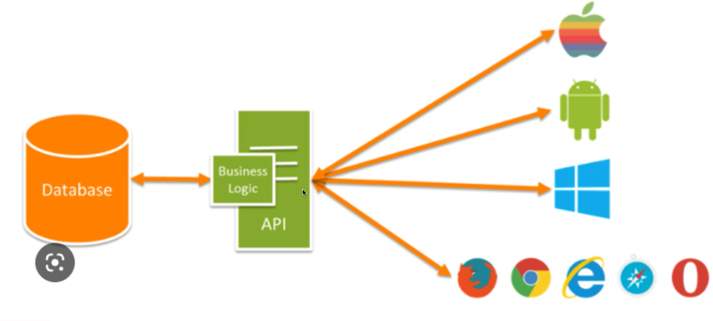
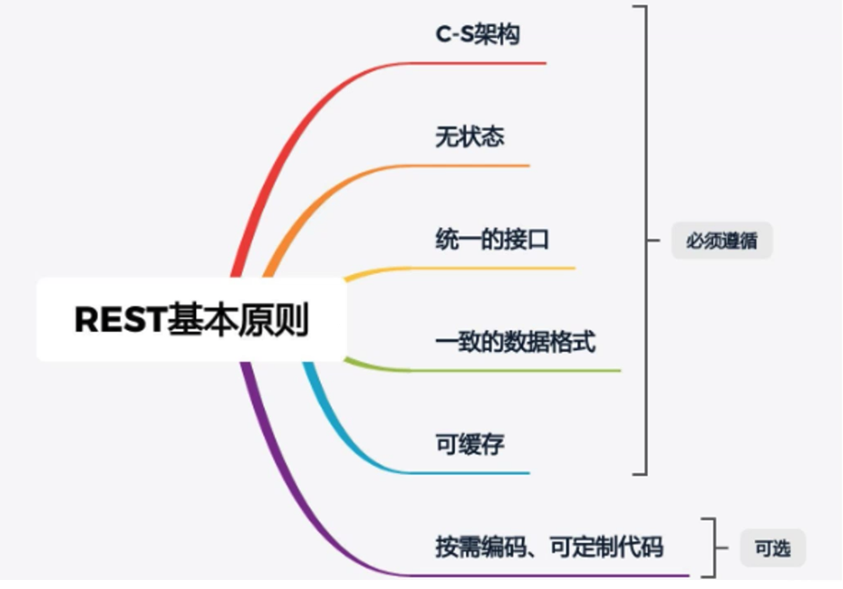
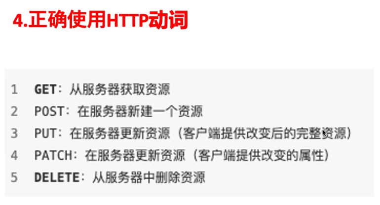

- [Class Notes](#class-notes)
  - [Resources](#resources)
  - [Node\_4 (`06/08/2023`)](#node_4-06082023)
    - [静态资源托管](#静态资源托管)
      - [添加前缀 (解决上面的冲突问题)](#添加前缀-解决上面的冲突问题)
    - [CORS 跨域资源共享](#cors-跨域资源共享)
    - [RESTful API](#restful-api)
      - [http动词](#http动词)
        - [get vs post](#get-vs-post)
      - [http状态码](#http状态码)
    - [User list后端练习](#user-list后端练习)
      - [npm安装](#npm安装)
      - [index.js](#indexjs)
      - [router.js](#routerjs)

# Class Notes

## Resources
[express static](https://expressjs.com/en/starter/static-files.html)<br>

## Node_4 (`06/08/2023`)
<p align='center'></p>

### 静态资源托管
- express.static()

```js
app.use(express.static('./public'));
```

`可以访问public文件夹下的文件:`<br>
http://localhost:3000/images/bg.jpg<br>
http://localhost:3000/css/style.css<br>
http://localhost:3000/js/login.js<br>

> 如果f其他文件夹下面也有相同文件名, 会执行第一个找到的文件
```js
app.use(express.static('./public')); // 找到public下面的文件就停了
app.use(express.static('./files'));
```

#### 添加前缀 (解决上面的冲突问题)
```js
app.use("./public", express.static("./public"));
app.use("./user", express.static("./files"));
```
> 以"/public"开头的请求将从 "./public" 目录中提供文件; 以 "/user" 开头的请求将从 "./files" 目录中提供文件.

http://localhost/public/1.html<br>
http://localhost/user/1.html

### CORS 跨域资源共享
浏览器的"Same Origin Policy"默认阻止网页跨域访问资源. 如果配置了CORS相关的header, 就能解决这个问题. 一般也可以用npm安装cors来解决.

> npm i cors

`一定在app.use(router)前使用app.use(cors())`

<p align='center'></p>

### RESTful API
一种设计风格: 请求和响应简洁, 可读性强
一个架构符合REST原则, 就称它符合RESTful架构

<p align='center'></p>

> URL中名词应该用复数

#### http动词
<p align='center'></p>

##### get vs post
| get | post |
| :---: | :---: |
| ***从服务器上获取数据*** | ***向服务器发送数据*** |
| ***< 2KB*** | ***默认不受限制*** |
| ***不安全*** | ***较安全*** |

#### http状态码
<p align='center'></p>

### User list后端练习
#### npm安装
```shell
npm init
npm i express cors body-parser
npm i nodemon -D
```

#### index.js
```js
const express = require('express');
const app = express();
const router = require('./router');
const cors = require('cors');
const parser = require("body-parser");
app.use(cors());
app.use(parser.json());
app.use("/api", router);
const PORT = 8080;
// lsof -i tcp:8080
// kill -9 id
app.listen(PORT, function(){
    console.log("Server is running on http://localhost:8080");
})
```

#### router.js
```js
const express = require("express");
const router = express.Router();
let user = [
    { id: 1, name: "Ben", age: 20 },
    { id: 2, name: "John", age: 30 },
    { id: 3, name: "Chris", age: 40 },
    { id: 4, name: "Jane", age: 60 },
];

router.get("/users", function (req, res) {
    res.status(200).json({
        status: "success",
        msg: "Retrievedd users successfully",
        data: user,
    });
});

function getNextUser(users) {
    const userIds = users.map(function (user) {
        return user.id;
    });
    return Math.max(...userIds) + 1;
}

router.post("/users", function (req, res) {
    const newUser = req.body;
    if (!newUser.name || !newUser.age) {
        return res.status(400).json({ msg: "missing parameters" });
    }
    const newId = getNextUser(user);
    let obj = { id: newId, ...newUser };
    user.push(obj);
    res.status(201).json({ status: "success", msg: "add user successfully", data: user });
});

router.delete("/users", function (req, res) {
    user = [];
    res.status(204).send();
});

router.delete("/users/:id", function (req, res) {
    const userIdToDelete = parseInt(req.params.id);
    const initialUserCount = user.length;
    user = user.filter(function (user) {
        return user.id !== userIdToDelete;
    });
    if (user.length === initialUserCount) {
        return res.status(404).json({
            status: "error",
            msg: "User not found",
        });
    }
    res.status(200).json({
        status: "success",
        msg: "User deleted successfully",
    });
});
module.exports = router;
```
