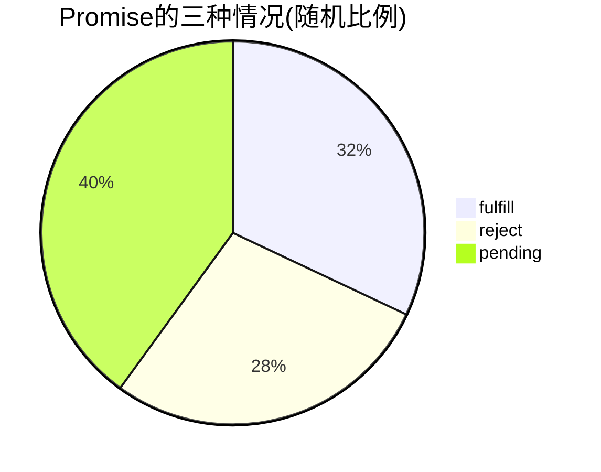
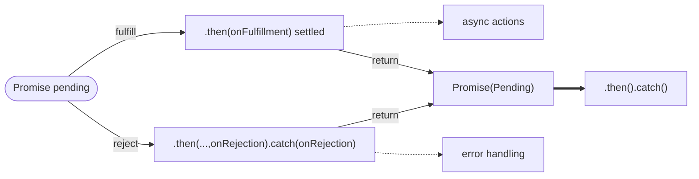

- [Class Notes](#class-notes)
  - [Resources](#resources)
  - [Node\_tutorial (`17/08/2023`)](#node_tutorial-17082023)
    - [前端如何拿到后端数据?](#前端如何拿到后端数据)
      - [Promise的三种情况](#promise的三种情况)
      - [Promise流程图](#promise流程图)
      - [fetch方法使用](#fetch方法使用)
      - [async/await方法使用](#asyncawait方法使用)
    - [Event bubble](#event-bubble)
      - [Event bubble demo](#event-bubble-demo)
    - [Event preventDefault](#event-preventdefault)
    - [Message Board 前后端练习](#message-board-前后端练习)
      - [package.json](#packagejson)
      - [server.js](#serverjs)
      - [router.js](#routerjs)
      - [index.html](#indexhtml)
      - [script.js](#scriptjs)

# Class Notes

## Resources
[Promise](https://developer.mozilla.org/en-US/docs/Web/JavaScript/Reference/Global_Objects/Promise)<br>
[Event Bubble](https://developer.mozilla.org/en-US/docs/Web/API/Event/bubbles)<br>
[Message_Board_Class_Solution](https://github.com/ESJiang/JR16-notes/tree/main/Message_Board_Class_Solution)<br>
[Message_Board_Solution_Two](https://github.com/ESJiang/JR16-notes/tree/main/Message_Board_Solution_Two)

## Node_tutorial (`17/08/2023`)
<p align='center'></p>

### 前端如何拿到后端数据?
>`在前后端通信过程中，一般使用一些异步机制来处理请求和响应 (更好的用户体验-不堵塞程序). 后端可以返回前端一个promise`

#### Promise的三种情况
A `Promise` is in one of these states:

- pending: initial state, neither fulfilled nor rejected.
- fulfilled: meaning that the operation was completed successfully.
- rejected: meaning that the operation failed.



#### Promise流程图
*A promise is said to be `settled` if it is either fulfilled or rejected, but not pending.*<br>


```js
const myPromise = new Promise((resolve, reject) => {
    setTimeout(() => {
        resolve("foo");
    }, 300);
});

myPromise.then(handleFulfilledA, handleRejectedA).then(handleFulfilledB, handleRejectedB).then(handleFulfilledC, handleRejectedC);
```

#### fetch方法使用
`原生的写法, Chained Promises`
```js
fetch("url", {
    method: "POST",
    headers: { "Content-Type": "application/json" }, // 注意拼写, 是headers不是headers
    body: body,
})
    .then(response => {
        // 在第一个then块中处理请求1的响应
        // 这里的代码可能涉及处理响应数据、提取信息等
        return request2(response); // 返回request2的Promise结果，继续到下一个then块
    })
    .then(result => {
        // 在第二个then块中处理request2的结果
        // 这里的代码可能涉及进一步处理数据，或者其他操作
        // 返回结果会继续传递到下一个then块
    })
    .catch(error => {
        // 在catch块中处理任何异常情况
        // 这里的代码会在任何一个Promise链中的阶段抛出异常时执行
    });
```

#### async/await方法使用
> 避免了Callback Hell, 减少代码嵌套. 一般配合try-catch
```js
// 使用async/await的示例
async function asyncFunction() {
    try {
        const response1 = await Promise1(); // 等待Promise1的结果
        // 在这里处理response1的结果
    } catch (error) {
        // 捕捉并处理可能的错误
    }
}

// 调用async函数
asyncFunction();
```

### Event bubble
> `除了特殊情况(focus,blur,resize等), 子元素和父元素同时注册监听事件, 触发子事件时, 会一直向上执行其他祖先上的事件`

```js
//在子元素添加下面一行来避免event bubble
e.stopPropagation();
```

#### Event bubble demo
https://github.com/ESJiang/JR16-notes/assets/43910771/5e0da7e7-bd96-4903-8097-cf703cf4110c


### Event preventDefault
> `有些html元素有默认事件(form, checkbox, etc). 通过使用下面指令, 来阻止默认事件的发生`

```js
e.preventDefault();
```
### Message Board 前后端练习
#### package.json
```json
{
    "scripts": {
        "dev": "nodemon server.js"
    },
    "dependencies": {
        "cors": "^2.8.5",
        "express": "^4.18.2",
        "fs": "^0.0.1-security"
    },
    "devDependencies": {
        "nodemon": "^3.0.1"
    }
}
```

#### server.js
```js
//1.导入express
const express = require("express");
const cors = require('cors')
//2.创建一个web服务器
const app = express()
const messageRouter = require('./router')


//解析请求体中的json数据
app.use(express.json())

//设置cors请求头
//允许跨域请求
app.use(cors())


//4.处理一个简单的request
app.get('/',(req,res)=>{
	res.send("hello world");
})

app.use(messageRouter);
//3.启动服务器
app.listen(8080, () => {
    console.log("Server is running on port 8080");
});
```

#### router.js
```js
const express = require('express')
const router=express.Router()
const fs = require('fs')
const messages = require('./messages.json').messages//const {messages}=require('./messages.json')

const writeMessagesFile = async(newMessages)=>{
    const data = JSON.stringify({
        messages:newMessages
    })
    await fs.writeFileSync("messages.json",data);
}
//CRUD

//Get:获取所有的留言 R：READ
router.get('/messages',(req,res)=>{
    res.status(200).json(messages)
})


//POST:添加留言 C: CREATE
router.post('/messages',async(req,res)=>{
    const newMessageId = messages.length;
    const {name, message} = req.body;

    //es6解构
    //const {name, message} = req.body;
    //const a=[1,2,3]
    //const [item1,,item3]=a

    const newMessage = {
        id: newMessageId,
        name,
        message
    }

    //messages.push(newMessage);//A
    const newMessages = [...messages, newMessage]

    await writeMessagesFile(newMessages)

    res.status(201).send({
        message:'Create success',
        data:newMessages
    })
})

//DELETE: 删除留言 D:DELETE
router.delete('/messages/:id',async(req,res)=>{
    const {id} = req.params
    const index = messages.findIndex(message=>message.id===parseInt(id));
    if(index === -1) res.sendStatus(404)
    messages.splice(index,1);//从'参数1'(index)开始删除'参数2'(1)个
    const newMessages = messages;
    await writeMessagesFile(newMessages);
    res.status(200).send({
        messages:'delete messages',
        data:newMessages
    })

})

//PUT: 更新留言 U：UPDATE
router.put("/messages/:id", async(req, res) => {
    const {id} = req.params
    const index = messages.findIndex(message=>message.id===parseInt(id));
    if(index === -1) res.sendStatus(404);
    messages.splice(index,1);
    const {name, message} = req.body;
    const newMessages = [...messages,{id:parseInt(id),name:name, message:message}]
    await writeMessagesFile(newMessages);
    res.status(201).send({
        messages:'update messages',
        data:newMessages
    })
});
module.exports = router
```

#### index.html
```html
<!doctype html>
<html>
    <head>
        <title>留言板</title>
        <script src="https://unpkg.com/axios/dist/axios.min.js" defer></script>
    </head>
    <body>
        <h1>留言板</h1>
        <form id="message-form">
            <input type="text" id="name-input" placeholder="姓名" />
            <textarea id="message-input" placeholder="留言"></textarea>
            <button type="submit">提交</button>
        </form>
        <ul id="message-list"></ul>
        <script src="script.js"></script>
    </body>
</html>
```

#### script.js
```js
const api = "http://localhost:8080"; //提取url的公共部分, 配合template string使用, 从而节省代码量

// 删除留言
const handleDelete = async event => {
    const messageId = event.target.getAttribute("data-id");
    const response = await axios.delete(`${api}/messages/${messageId}`);
    if (response.status === 200) {
        getMessages();
    }
};

// 更新留言
const handleUpdate = event => {
    const messageId = event.target.getAttribute("data-id");
    let nameInput = document.getElementById("name-input");
    let messageInput = document.getElementById("message-input");

    let updateMessage = {
        name: nameInput.value,
        message: messageInput.value,
    };
    fetch(`${api}/messages/${messageId}`, {
        method: "PUT",
        headers: {
            "Content-Type": "application/json",
        },
        body: JSON.stringify(updateMessage),
    }).then(response => {
        if (response.status === 201) {
            getMessages();
        }
    });
};

// 获取留言
const getMessages = () => {
    const promise = fetch(`${api}/messages`, {
        method: "GET",
    });
    promise
        .then(response => response.json())
        .then(messages => {
            const messageList = document.getElementById("message-list");
            messageList.innerHTML = ``;
            messages.forEach(message => {
                let messageItem = document.createElement("li");
                messageItem.innerHTML = `
                <strong>${message.name}</strong>${message.message}
                <button class='delete-button' data-id=${message.id}>删除</button>
                <button class='update-button' data-id=${message.id}>更新</button>
            `;
                messageList.appendChild(messageItem);
            });
            const deleteButtons = document.querySelectorAll(".delete-button");
            deleteButtons.forEach(button => {
                button.addEventListener("click", handleDelete);
            });
            const updateButtons = document.querySelectorAll(".update-button");
            for (let i = 0; i < updateButtons.length; i++) {
                updateButtons[i].addEventListener("click", handleUpdate);
            }
        });
};

// 增加留言
const handleCreateMessage = event => {
    event.preventDefault();
    const nameInput = document.getElementById("name-input");
    const messageInput = document.getElementById("message-input");
    const newMessage = {
        name: nameInput.value,
        message: messageInput.value,
    };
    const promise = fetch(`${api}/messages`, {
        method: "POST",
        headers: {
            "Content-Type": "application/json",
        },
        body: JSON.stringify(newMessage),
    });
    promise.then(response => {
        if (response.status === 201) {
            getMessages();
            nameInput.value = "";
            messageInput.value = "";
        }
    });
};

document.getElementById("message-form").addEventListener("submit", handleCreateMessage);
getMessages();
```
