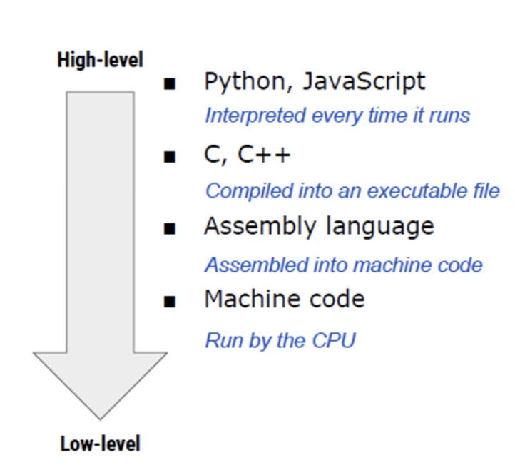
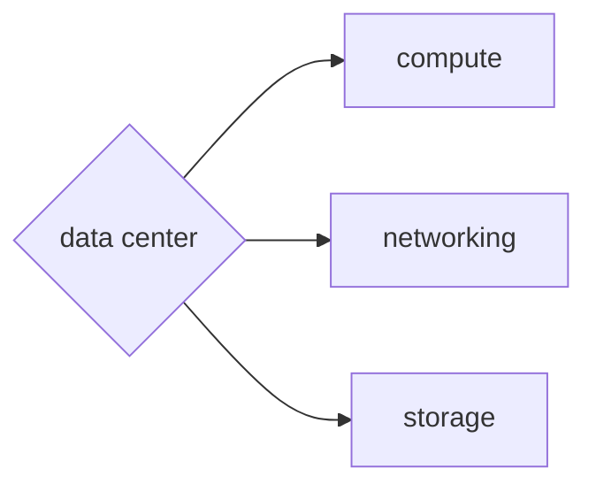

- [Class Notes](#class-notes)
  - [Resources](#resources)
  - [Python\_1 (`15/07/2023`)](#python_1-15072023)
    - [OCR](#ocr)
    - [ETL (Extract + Transform + Load)](#etl-extract--transform--load)
    - [Angular和React](#angular和react)
    - [Bootstrap](#bootstrap)
    - [Django](#django)
    - [SQL(bquery)的优势](#sqlbquery的优势)
    - [Kubernetes和GKE](#kubernetes和gke)
    - [什么是Python?](#什么是python)
      - [OOP 面向对象](#oop-面向对象)
      - [Interpreted language vs Compiled language](#interpreted-language-vs-compiled-language)
      - [State in Object](#state-in-object)
    - [为什么学Python](#为什么学python)
    - [Cloud](#cloud)
    - [DevOps证书](#devops证书)

# Class Notes

## Resources
[Bootstrap](https://getbootstrap.com/) 
[Weed AI](https://github.com/Weed-AI/Weed-AI) 
[chatgpt interpreter](https://openai.com/blog/chatgpt-plugins#code-interpreter) 
[AWS certification](https://aws.amazon.com/certification) 

## Python_1 (`15/07/2023`)

### OCR
`将图像中的文本转换为可编辑文本的技术``

*OpenCV对图像进行预处理, 使用OCR对预处理完的图像进行文本识别, 将结果保存在csv文件中*

### ETL (Extract + Transform + Load)
*ETL是数据处理的过程, 将原始数据转换为可用于机器学习的数据集*

### Angular和React

| Angular | React
| :---: | :---:
| Google开发和维护的js框架 | Facebook开发而维护的js框架 (Virtual DOM)

### Bootstrap
*它提供了一套用于构建响应式、移动优先的网页和应用程序的工具和组件*

<https://getbootstrap.com/>

### Django
*基于Python的网络框架*

### SQL(bquery)的优势
- 执行速度快
- 便宜 (按查询的存储和计算收费)
- Software Development Kit (sdk): 提供了很多语言支持

### Kubernetes和GKE
| Kubernetes | GKE
| :---: | :---:
| 游乐园的管理员, 保证服务器能正常运行 | 游乐园的主人, GKE会帮你提供Kubernetes

### 什么是Python?
*高级语言 - 主流里最接近人类语言的编程语言*

1. CPU二极管 - 发送信号(1 0)
2. 汇编语言: 最快速度转化成机器语言的语言 - 直接与计算机硬件相关
3. C语言比较低级 (面向过程), 性能优化好
4. C++: 在c语言的基础上加入OOP, 加入C++的生态
5. Java/C#: 高级语言, 企业级平台会用这些
6. golang(Google开发的语言)/kotlin(语法接近Java)
7. Python/JS (TypeScript)

#### OOP 面向对象
*Class/Object/继承/多态*

#### Interpreted language vs Compiled language

| Interpreted language | Compiled language
| :---: | :---:
| 边解释边执行 (如Python) | 编译后执行

> `Interpreted language的灵活性在于运行时逐行解释代码, 即使在最后出现了语法错误, 仍然能尽可能打印前面部分执行结果. 这意味着开发人员能更快定位出问题, 进行修复.`

#### State in Object
*object中有state属性用来存储对象的状态或数据*

### 为什么学Python
| 职位 | 职责 |
| :---: | :---: |
| Tech consultant | Automation (可能被code interpreter取代) |
| Business Analyst | dashboarding (tableau powerbi) |
| Data Analyst | python scripting, sql, bigquery (data warehouse) |
| Data Scientist | DA + modeling |
| SDE, software Developer(frontend/backend) | google, Django golang |
| Quantitative | c++, python |
| Data Engineer | java,python,scala,spark,hadoop,MapReduce |
| Site Reliability Engineer | 运维 (python + kotlin) |

### Cloud
data center: cloud provider (aws/gcp/azire) -> 多计算机, 多网线

AWS prime day: 流量大, 把闲置的resource租出去

on premise: 1cpu + 4gb + 100gb ssd

elastic: pay-as-you-go (需要多少用多少)

S3(simple storage service), EC2(Elastic cloud computing) -> 存储和运算

### DevOps证书
<https://aws.amazon.com/certification>
