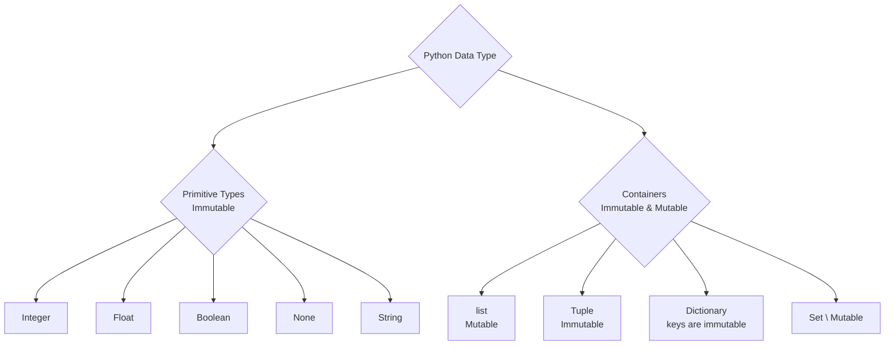
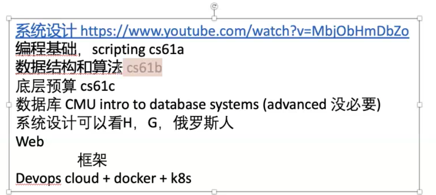

- [Class Notes](#class-notes)
  - [Resources](#resources)
  - [Python\_2 (`22/07/2023`)](#python_2-22072023)
    - [安装Python](#安装python)
      - [Anaconda和Python](#anaconda和python)
      - [Python调试](#python调试)
      - [安装pygame](#安装pygame)
      - [遇到Unknown Word解决方法](#遇到unknown-word解决方法)
      - [VScode Workspace Setting](#vscode-workspace-setting)
    - [Python数据类型](#python数据类型)
    - [Python和JavaScript的命名差异](#python和javascript的命名差异)
    - [Python和JavaScript添加注释](#python和javascript添加注释)
    - [获得包的帮助信息](#获得包的帮助信息)
    - [and和or的区别](#and和or的区别)
    - [推荐课程](#推荐课程)

# Class Notes

## Resources
[anaconda](https://www.anaconda.com/download/)

## Python_2 (`22/07/2023`)

<p align='center'></p>

### 安装Python
[anaconda](https://www.anaconda.com/download/)

#### Anaconda和Python
> Anaconda是Python的发行版, 包含超过1500个科学包. 装包后, 就可以直接使用预先封装的方法.

`collection.abc: 抽象基类(Abstract Base Classes)`

#### Python调试

- import pdb; pdb.set_trace()
- python -i test.py

#### 安装pygame

```plaintext
conda create -n snake python=3.9
conda activate snake
conda env list
pip install pygame==2.1.2
python
import pygame
```

`vscode - select python interpreter`

#### 遇到Unknown Word解决方法
setting -> search spell

#### VScode Workspace Setting
```json
{
    "workbench.editorAssociations": {
        "*.ipynb": "jupyter-notebook"
    },
    "notebook.cellToolbarLocation": {
        "default": "right",
        "jupyter-notebook": "left"
    },
    "terminal.integrated.inheritEnv": false,
    "python.analysis.typeCheckingMode": "basic",
    "editor.formatOnSaveMode": "file",
    "editor.formatOnSave": true,
    "python.linting.enabled": true,
    "python.formatting.provider": "none",
    "redhat.telemetry.enabled": true,
    "window.zoomLevel": 2,
    "[python]": {
        "editor.formatOnType": true,
        "editor.defaultFormatter": "ms-python.black-formatter"
    },
    "cSpell.diagnosticLevel": "Hint",
    "cSpell.enabled": false
}
```

<hr>

### Python数据类型
> Primitive type(不可变): integer/float/boolean/none/string

> container type: list(可修改)/tuple(不可变)/set(不同元素只保存一次,可变)/dictionary(可变)



```python
a = 1
b = 1
print(a == b)  # True
print(id(a) == id(b))  # True
print(a is b)  # True
c = []
d = []
print(c == d)  # True
print(id(c) == id(d))  # False
print(c is d)  # False
```

`id(1) -> 地址信息`
`hash(1) -> hash值`
`hash是用于在散列数据结构中快速查找对象的唯一标识`

> 注意只有immutable type才是hashable.

```python
# set中的元素必须是hashable的, 不能直接添加unhashable的list
a= set()
a.add([]) # error
a.add(tuple([])) # correct -> {()}

# dict中的key必须是hashable的, 而value随意
c = dict()
c[[1]] = [1]  # error
c[tuple([1])] = [1]  # correct -> {(1,): [1]}
```

<hr>

### Python和JavaScript的命名差异
<p align='center'></p>

### Python和JavaScript添加注释
- Python
  - \#
  - """

- JavaScript
  - //
  - /* */

<hr>

### 获得包的帮助信息

```python
import pygame
print(help(pygame))
```

<hr>

### and和or的区别
> and: 有一个false就是false<br>
> or: 有一个true就是true

`and和or本质上返回一个真正的值, 而不是boolean`

<hr>

### 推荐课程
<p align='center'></p>