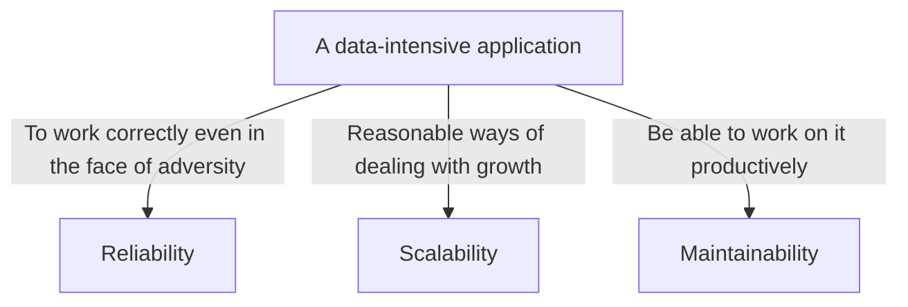
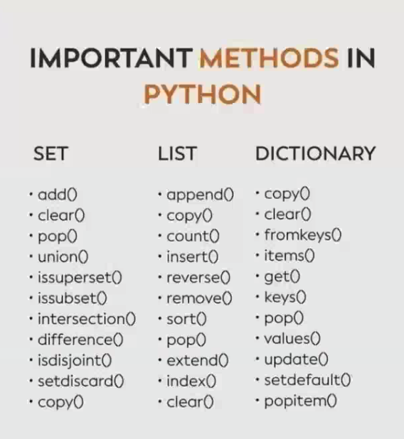

- [Class Notes](#class-notes)
  - [Resources](#resources)
  - [Python\_3 (`29/07/2023`)](#python_3-29072023)
    - [A data-intensive application](#a-data-intensive-application)
      - [Vertical scale和Horizontal scale](#vertical-scale和horizontal-scale)
    - [数据结构 (Trade-off)](#数据结构-trade-off)
      - [映射关系](#映射关系)
      - [Array: 有序 + 连续存储](#array-有序--连续存储)
      - [Linked List: 有序 + 不连续存储(链式存储)](#linked-list-有序--不连续存储链式存储)
      - [Hashtable: 无序 + 不连续存储](#hashtable-无序--不连续存储)
      - [Stack vs Queue](#stack-vs-queue)
        - [Priority queue(heap)](#priority-queueheap)
    - [Python-Set/List/Dict的常用方法](#python-setlistdict的常用方法)

# Class Notes

## Resources
[Cinder](https://github.com/facebookincubator/cinder)<br>
[Data Structures](https://sp23.datastructur.es/)<br>
[labuladong的算法小抄](https://labuladong.github.io/algo/di-ling-zh-bfe1b/xue-xi-sua-01220/)

## Python_3 (`29/07/2023`)

<p align='center'></p>

### A data-intensive application



#### Vertical scale和Horizontal scale
| Vertical scale | Horizontal scale |
| :---: | :---: |
| ***Adding hardware resources to a single server, such as CPU, memory, disk, etc.*** | ***Adding more servers or nodes to the system*** |

`Vertical scale和Horizontal scale是提升系统性能的两种方法. Horizontal scale普遍认为优于Vertical scale, 因为多server可以更好处理负载增加, 采用分布式结构等. 但对于资源有限/重视latency的情况, 可以考虑使用Vertical scale.`

<hr>

### 数据结构 (Trade-off)
#### 映射关系
>DFS -> stack<br>
>BFS -> queue

#### Array: 有序 + 连续存储
*优势: 快速直接访问任意位置的元素(用index)*<br>
*劣势: 插入和删除元素时效率低(没有指针, 要先移动元素)*

```python
# Dynamic -> Length + Type
a = list()
for i in range(10):
    a.append(i) # the length of array a is changed
a[1] = "1" # add a new type to array a

class Test:
    pass

a[2] = Test() # add a new type to array a
print(a)  # [0, '1', <__main__.Test object at 0x7fd6d006c910>, 3, 4, 5, 6, 7, 8, 9]
```

#### Linked List: 有序 + 不连续存储(链式存储)
*优势: 插入和删除元素时效率很高(改变指针方向)*<br>
*劣势: 访问任意位置的元素效率低 (没有index, 每次都要从头开始找)*<br>
- 二叉树本质上是特殊的Linked List

`尽管Array和Listed List在访问元素和插入删除各有千秋, 但它们的搜索复杂度都是O(n). 有没有别的数据结构有较低的搜索复杂度?`
> Hashtable

####  Hashtable: 无序 + 不连续存储
*优势: 访问查找和插入删除效率高(哈希函数将键映射到存储位置)*<br>

*劣势: 容易出现hash collision, 访问查找和插入删除的算法复杂度变成了(O(n)). 解决hash collision可以使用chaining.*

#### Stack vs Queue
| Stack | Queue |
| :---: | :---: |
| ***last in first out*** | ***first in first out*** |

##### Priority queue(heap)

```python
import heapq

min_heap = []
heapq.heappush(min_heap, 5)
heapq.heappush(min_heap, 3)
heapq.heappush(min_heap, 7)
heapq.heappush(min_heap, 1)
min_element = heapq.heappop(min_heap)
print("Min heap elements:", min_heap)  # Min heap elements: [3, 5, 7]
print("Min element:", min_element)  # Min element: 1
```

<hr>

### Python-Set/List/Dict的常用方法

<p align='center'></p>