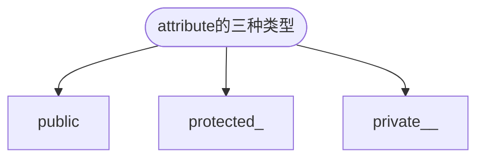
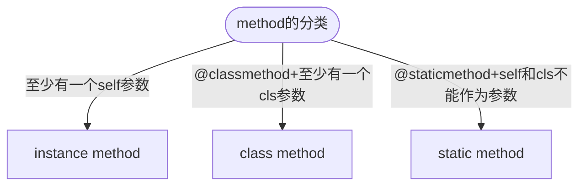

- [Class Notes](#class-notes)
  - [Resources](#resources)
  - [Python\_6 (`19/08/2023`)](#python_6-19082023)
    - [Python OOP](#python-oop)
    - [为什么需要class](#为什么需要class)
      - [object的state和behavior](#object的state和behavior)
      - [class attribute vs object attribute](#class-attribute-vs-object-attribute)
      - [class attribute vs object attribute demo](#class-attribute-vs-object-attribute-demo)
    - [namespace中的\_\_module\_\_](#namespace中的__module__)
      - [obj.attribute\_name的查找流程](#objattribute_name的查找流程)
      - [class中使用type annoation](#class中使用type-annoation)
    - [attribute的三种属性](#attribute的三种属性)
    - [method的分类](#method的分类)
    - [python多态](#python多态)
    - [python继承](#python继承)
    - [在一个class的方法前面添加"\_"或者"\_\_"](#在一个class的方法前面添加_或者__)

# Class Notes

## Resources
[Python OOP](https://www.w3schools.com/python/python_classes.asp)

## Python_6 (`19/08/2023`)
<p align='center'></p>

### Python OOP
blue print: 蓝图, 图纸 -> reusable
<p align='center'></p>

### 为什么需要class
> 当很多objects具有相同属性和行为时, 我们没必要一个一个object定义; 用同一个class实例化对象可以减少代码.

#### object的state和behavior
- state(属性): brand, body type, fuel type, model car, fuel level
- behavior(函数): 启动, 刹车, 踩油门, 开雨刷, 开大灯, 加fuel

#### class attribute vs object attribute
<p align='center'></p>

#### class attribute vs object attribute demo
```python
class Student:
    school_name = 'JR'
    def __init__(self, name):
        self.name = name # self.name是object的属性, name是形参

s1 = Student("Emma")
s2 = Student("Jessa")

# s1修改school_name不会影响其他objs的school_name
s1.school_name = "JR_1"
print(s1.school_name) # JR_1
print(s2.school_name) # JR

# 用类名直接修改school_name, 所有objs的school_name都会改变
Student.school_name = "JR_2"
print(s1.school_name) # JR_1
print(s2.school_name) # JR_2
```

### namespace中的__module__
> '__module__': '__main__': class在主程序中定义<br>
> '__module__': 'teacher': class在teacher.py中定义

#### obj.attribute_name的查找流程
> 先找object的namespace再找class的namespace


#### class中使用type annoation
```python
class Student:
    school_name = "JR"

    def __init__(self, name: str):
        self.name = name  # self.name是object的属性, name是形参

s3 = Student(1)
print(s3.name) # 1
```

> type annotation不会对运行程序造成影响, 只起到提示作用

### attribute的三种属性


```python
class Employee:
    # public
    company = "JR"
    # protected
    _address = "QLD"
    # private
    __abn = "24242342"

    @property
    def abn(self):
        return self.__abn


e = Employee()  # 没有构造函数, 没有参数
print(e.__dict__)  # {}
print(e.company)  # JR
print(e._address)  # QLD
print(e._Employee__abn)  # 24242342 不推荐这种方法
print(e.abn)  # 24242342
```

### method的分类


### python多态
```python
class Animal:
    def speak(self):
        pass


class Dog(Animal):
    def speak(self):
        print("Woof!")


class Cat(Animal):
    def speak(self):
        print("Meow!")


def animal_sound(animal):
    animal.speak()


dog = Dog()
cat = Cat()

animal_sound(dog) # Woof!
animal_sound(cat) # Meow!
```

### python继承
```python
from abc import ABC, abstractmethod


class Human(ABC):
    @abstractmethod
    def eat(self):
        pass


class Employee(Human):
    def __init__(self, name, fav_food):
        self.name = name
        self.fav_food = fav_food

    def eat(self, any_food=None):
        print(f"Eat {any_food}") if any_food else print(f"Eat {self.fav_food}")


class Engineer(Employee):
    def __init__(self, name, fav_food, tech_stack):
        super().__init__(name, fav_food) # 相当于继承了Employee的__init__方法
        self.tech_stack = tech_stack

    def code(self):
        print(f"Coding with stack of {self.tech_stack}")


class FrontEndEngineer(Engineer):
    def design_front(self):
        print("Designing user interface")


class BackEndEngineer(Engineer):
    def build_api(self):
        print("Designing api")


class FullStackEngineer(FrontEndEngineer, BackEndEngineer):
    def testing(self):
        print("Testing api")

    def build_api(self):
        print("Building api 1.1")

    def build_old_api(self):
        BackEndEngineer.build_api(self)


a = Employee("tim", "pizza")
a.eat("apple")  # 输出: Eat apple
a.eat()  # Eat pizza

Jack = FullStackEngineer("amy", "apple", "nextjs")
Jack.build_old_api() # # "Designing api"
```

### 在一个class的方法前面添加"_"或者"__"
> 一般使用_起到对方法的保护, __很少用

```python
class Parent:
    name = "xxxx"  # Parent class attribute

    def c(self):
        print("This is parent's public instance method.")

    @classmethod
    def __b(cls):
        print(f"{cls.name}This is Parent's private class method.")

    @classmethod
    def _b(cls):
        print(f"{cls.name}This is Parent's protected class method.")

    @staticmethod
    def __a():
        print("This is Parent's private static method.")

    @staticmethod
    def _a():
        print("This is Parent's protected static method.")


class Child(Parent):
    def c(self):
        print("This is Child's public instance method.")

    @classmethod
    def __b(cls):
        print(f"{cls.name}This is Child's private class method.")

    @classmethod
    def _b(cls):
        print(f"{cls.name}This is Child's protected class method.")

    @staticmethod
    def __a():
        print("This is Child's private static method.")

    @staticmethod
    def _a():
        print("This is Child's protected static method.")


"""
instance method private vs protected
"""
print("================================================")
print("Testing instance method")
parent_obj = Parent()
child_obj = Child()
print(child_obj.name)
child_obj.c()
super(Child, child_obj).c()
print("================================================")
print("\n")
"""
classmethod private vs protected
"""
print("================================================")
print("Testing classmethod private vs protected")
# Parent.__b()
# Child.__b()
Child._Child__b()  # type: ignore
Parent._Parent__b()  # type: ignore

Parent._b()
Child._b()
# Parent._Parent_b()
# Child._Child_b()
print("================================================")
print("\n")

"""
staticmethod private vs protected
"""
print("================================================")
print("Testing staticmethod private vs protected")
# Parent.__a()
# Child.__a()
Parent._Parent__a()  # type: ignore
Child._Child__a()  # type: ignore

Parent._a()
Child._a()
# Parent._Parent_a()
# Child._Child_a()
```
