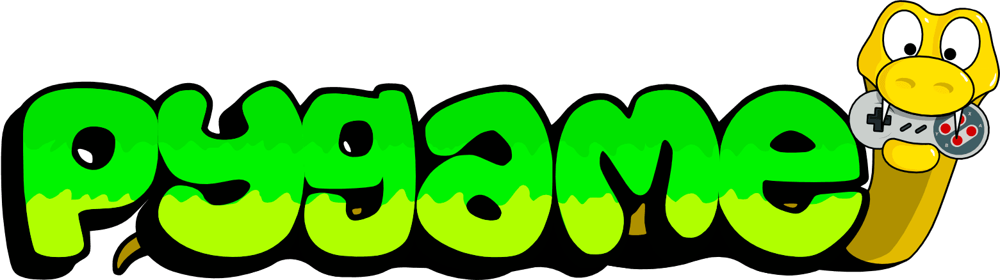
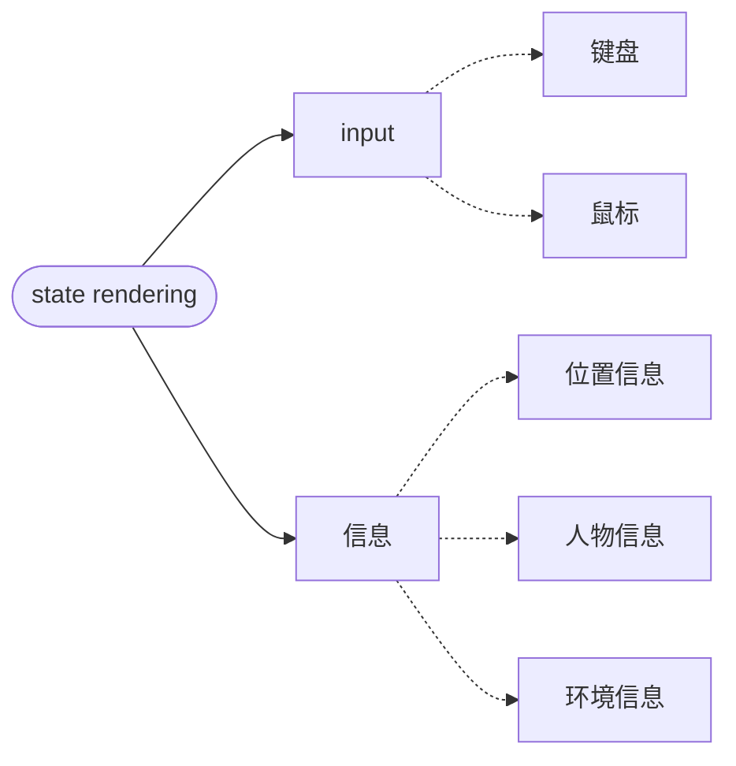
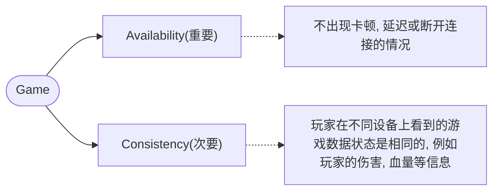
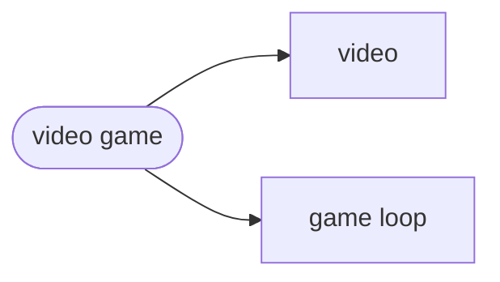
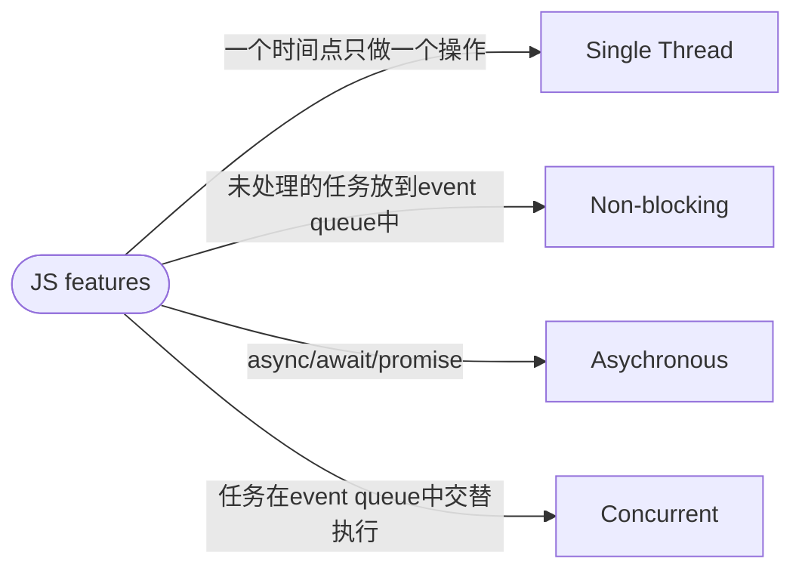

- [Class Notes](#class-notes)
  - [Resources](#resources)
  - [Python\_7 (`26/08/2023`)](#python_7-26082023)
    - [strict-policy-cross-origin](#strict-policy-cross-origin)
    - [游戏的本质](#游戏的本质)
      - [游戏中consistency vs availability](#游戏中consistency-vs-availability)
      - [The game loop](#the-game-loop)
    - [JS event loop](#js-event-loop)
    - [Node.JS system](#nodejs-system)
    - [Pygame Project](#pygame-project)
      - [课堂代码](#课堂代码)

# Class Notes

## Resources
[Pandas](https:/pandas.pydata.org/)<br>
[Pygame Library Documentation](https://www.pygame.org/docs/)<br>
[Snake game repo](https://github.com/ElevnLi/SnakeGame16)

## Python_7 (`26/08/2023`)
<p align='center'></p>

### strict-policy-cross-origin
```html
<meta http-equiv="Content-Security-Policy" content="strict-policy-cross-origin">
```
> strict-policy-cross-origin是Content Security Policy的一部分, 意思是如果不满足同源策略, 就不允许跨域请求.

### 游戏的本质
*OOP (Object-Oriented Programming)*



#### 游戏中consistency vs availability
> 将游戏看成一个分布式系统



#### The game loop
<p align='center'></p>



> 游戏的执行速度可能导致一些inconsistency. 可以设置Frame rate解决

### JS event loop
<p align='center'></p>



### Node.JS system
<p align='center'></p>

### Pygame Project
#### 课堂代码
```python
import pygame
import sys

from pygame.math import Vector2

pygame.init() # pygame初始化


COLOUR_BG = (175, 215, 70) # 背景颜色
COLOUR_FRUIT = (183, 111, 122) # 水果颜色

canvas = pygame.display.set_mode((800, 800))  # 画布大小
clock = pygame.time.Clock()


class Fruit:
    def __init__(self): # 初始化对象
        self.position = Vector2(0, 0)
        self.direction = Vector2(0, 0)

    def draw(self): # 对象方法一
        fruit_rect = pygame.Rect(self.position.x, self.position.y, 50, 50)
        pygame.draw.rect(canvas, COLOUR_FRUIT, fruit_rect)

    def move(self): # 对象方法二
        self.position += self.direction * 5


fruit = Fruit() # 创建一个Fruit实例, 名称为fruit

while True:
    for event in pygame.event.get():
        if event.type == pygame.QUIT: # 点击左上角按钮退出程序
            pygame.quit()
            sys.exit()
        elif event.type == pygame.KEYDOWN: # 识别键盘事件
            if event.key == pygame.K_LEFT: # 左
                fruit.direction = Vector2(-1, 0)
            elif event.key == pygame.K_RIGHT: # 右
                fruit.direction = Vector2(1, 0)
            elif event.key == pygame.K_UP: # 上
                fruit.direction = Vector2(0, -1)
            elif event.key == pygame.K_DOWN: # 下
                fruit.direction = Vector2(0, 1)
    canvas.fill(COLOUR_BG) # 给画布填出颜色
    fruit.draw() # 在画布上画水果
    fruit.move() # 移动水果
    pygame.display.update() # 更新显示
    clock.tick(60) # frame rate
```
