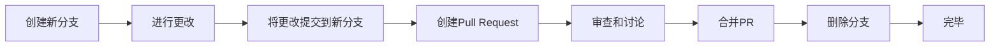

- [Class Notes](#class-notes)
  - [Resources](#resources)
  - [Python\_8 (`02/09/2023`)](#python_8-02092023)
    - [贪吃蛇项目](#贪吃蛇项目)
      - [加载png和wav](#加载png和wav)
      - [Class Fruit实现](#class-fruit实现)
      - [Class Snake实现](#class-snake实现)
        - [Snake初始化](#snake初始化)
        - [Snake draw方法](#snake-draw方法)
        - [Snake move方法](#snake-move方法)
        - [Snake更新蛇头和蛇尾图像](#snake更新蛇头和蛇尾图像)
      - [Class SnakeGame实现](#class-snakegame实现)
      - [键盘指令控制](#键盘指令控制)
    - [pull request的流程](#pull-request的流程)

# Class Notes

## Resources
[Class Solution](https://github.com/ElevnLi/SnakeGame16)<br>
[Solution 2](https://github.com/ElevnLi/SnakeGame15)

## Python_8 (`02/09/2023`)
<p align='center'></p>

### 贪吃蛇项目
#### 加载png和wav
```python
fruit_graphic = pygame.image.load(
    os.path.join("./", "Assets", "Graphics", "apple.png")
).convert_alpha()
head_up_graphic = pygame.image.load(
    os.path.join(package_base_path, "Assets", "Graphics", "head_up.png")
).convert_alpha()
head_down_graphic = pygame.image.load(
    os.path.join(package_base_path, "Assets", "Graphics", "head_down.png")
).convert_alpha()
head_right_graphic = pygame.image.load(
    os.path.join(package_base_path, "Assets", "Graphics", "head_right.png")
).convert_alpha()
head_left_graphic = pygame.image.load(
    os.path.join(package_base_path, "Assets", "Graphics", "head_left.png")
).convert_alpha()
tail_up_graphic = pygame.image.load(
    os.path.join(package_base_path, "Assets", "Graphics", "tail_up.png")
).convert_alpha()
tail_down_graphic = pygame.image.load(
    os.path.join(package_base_path, "Assets", "Graphics", "tail_down.png")
).convert_alpha()
tail_right_graphic = pygame.image.load(
    os.path.join(package_base_path, "Assets", "Graphics", "tail_right.png")
).convert_alpha()
tail_left_graphic = pygame.image.load(
    os.path.join(package_base_path, "Assets", "Graphics", "tail_left.png")
).convert_alpha()

body_vertical_graphic = pygame.image.load(
    os.path.join(package_base_path, "Assets", "Graphics", "body_vertical.png")
).convert_alpha()
body_horizontal_graphic = pygame.image.load(
    os.path.join(package_base_path, "Assets", "Graphics", "body_horizontal.png")
).convert_alpha()

body_tr_graphic = pygame.image.load(
    os.path.join(package_base_path, "Assets", "Graphics", "body_tr.png")
).convert_alpha()
body_tl_graphic = pygame.image.load(
    os.path.join(package_base_path, "Assets", "Graphics", "body_tl.png")
).convert_alpha()
body_br_graphic = pygame.image.load(
    os.path.join(package_base_path, "Assets", "Graphics", "body_br.png")
).convert_alpha()
body_bl_graphic = pygame.image.load(
    os.path.join(package_base_path, "Assets", "Graphics", "body_bl.png")
).convert_alpha()
crunch_sound_graphic = pygame.mixer.Sound(
    os.path.join(package_base_path, "Assets", "Sound", "crunch.wav")
)
```

#### Class Fruit实现
```python
class Fruit:
    def __init__(self):
        self.random_place()

    def random_place(self): # 随机位置
        self.x = randint(0, CELL_NUMBER - 1)
        self.y = randint(0, CELL_NUMBER - 1)
        self.pos = Vector2(self.x, self.y)

    def draw(self): # 画水果
        fruit_rect = pygame.Rect(
            self.pos.x * CELL_SIZE, self.pos.y * CELL_SIZE, CELL_SIZE, CELL_SIZE
        )
        canva.blit(fruit_graphic, fruit_rect)
```

#### Class Snake实现
##### Snake初始化
```python
class Snake:
    def __init__(self):
        self.body: List[Vector2] = [Vector2(5, 10), Vector2(6, 10), Vector2(7, 10)]
        self.direction = Vector2(1, 0)
        self.add_body = False
        self.head_graphic = head_right_graphic
        self.tail_graphic = tail_left_graphic
```

- self.body定义了蛇一开始的位置
- self.direction定义了蛇在游戏开始时方向
- self.add_body定义一个flag属性, 表示默认不变长
- self.head_graphic定义蛇头的图像
- self.tail_graphic定义蛇尾的图像

##### Snake draw方法
```python
def draw(self):
    self.update_head_graphic()
    self.update_tail_graphic()
    for index, block in enumerate(self.body):
        block_rect = pygame.Rect(
            block.x * CELL_SIZE, block.y * CELL_SIZE, CELL_SIZE, CELL_SIZE
        )
        if index == self.length - 1: # 判断画蛇头
            canva.blit(self.head_graphic, block_rect)
        elif index == 0: # 判断画蛇尾
            canva.blit(self.tail_graphic, block_rect)
        else:
            prev_block = self.body[index - 1] - block
            next_block = self.body[index + 1] - block
            if prev_block.x == next_block.x: # 竖直方向相邻
                canva.blit(body_vertical_graphic, block_rect)
            elif prev_block.y == next_block.y: # 水平方向相邻
                canva.blit(body_horizontal_graphic, block_rect)
            else: # 不同方向相邻
                # tr
                if (
                    prev_block.x == 1
                    and next_block.y == -1
                    or next_block.x == 1
                    and prev_block.y == -1
                ):
                    canva.blit(body_tr_graphic, block_rect)
                # tl
                elif (
                    prev_block.x == -1
                    and next_block.y == -1
                    or next_block.x == -1
                    and prev_block.y == -1
                ):
                    canva.blit(body_tl_graphic, block_rect)
                # br
                elif (
                    prev_block.x == 1
                    and next_block.y == 1
                    or next_block.x == 1
                    and prev_block.y == 1
                ):
                    canva.blit(body_br_graphic, block_rect)
                # bl
                elif (
                    prev_block.x == -1
                    and next_block.y == 1
                    or next_block.x == -1
                    and prev_block.y == 1
                ):
                    canva.blit(body_bl_graphic, block_rect)
```

##### Snake move方法
```python
@property
def head(self):
    return self.body[-1]


@property
def tail(self):
    return self.body[0]


@property
def length(self):
    return len(self.body)


def move(self): # 蛇移动逻辑
    current_head = self.head
    new_head = current_head + self.direction # 计算蛇移动后的新位置

    if not self.add_body: # 判断蛇是否需要添加一个身体块
        new_body = self.body[1:]
        new_body.append(new_head)
        self.body = new_body[:]
    else: # 当蛇吃到了fruit, 调用grow()方法时
        self.body.append(new_head)
        self.add_body = False # 表示已经添加了一个身体块


def grow(self):
    self.add_body = True
```

##### Snake更新蛇头和蛇尾图像
```python
def update_head_graphic(self):
    head_direction = self.head - self.body[-2]
    if head_direction == Vector2(1, 0):
        self.head_graphic = head_right_graphic
    elif head_direction == Vector2(-1, 0):
        self.head_graphic = head_left_graphic
    elif head_direction == Vector2(0, -1):
        self.head_graphic = head_up_graphic
    elif head_direction == Vector2(0, 1):
        self.head_graphic = head_down_graphic


def update_tail_graphic(self):
    tail_direction = self.tail - self.body[1]
    if tail_direction == Vector2(1, 0):
        self.tail_graphic = tail_right_graphic
    elif tail_direction == Vector2(-1, 0):
        self.tail_graphic = tail_left_graphic
    elif tail_direction == Vector2(0, -1):
        self.tail_graphic = tail_up_graphic
    elif tail_direction == Vector2(0, 1):
        self.tail_graphic = tail_down_graphic
```

#### Class SnakeGame实现
```python
class SnakeGame:
    def __init__(self):
        self.fruit = Fruit()
        self.snake = Snake()

    def draw(self):
        self.fruit.draw()
        self.snake.draw()

    def update(self):
        self.snake.move()
        self.check_eat()
        self.check_fail()

    def check_eat(self):
        if self.fruit.pos == self.snake.head:
            # 长长一节
            self.snake.grow()
            # 重新摆放水果
            self.fruit.random_place()

    def check_fail(self):
        # 蛇头撞墙
        if (
            not 0 <= self.snake.head.x < CELL_NUMBER
            or not 0 <= self.snake.head.y < CELL_NUMBER
        ):
            self.game_over()
        # 蛇头撞自己
        for block in self.snake.body[:-1]:
            if block == self.snake.head:
                self.game_over()

    def game_over(self):
        pygame.quit()
        sys.exit()


snake_game = SnakeGame()
```

#### 键盘指令控制
```python
while True:
    for event in pygame.event.get():
        if event.type == pygame.QUIT:
            snake_game.game_over()
        if event.type == SNAKE_UPDATE:
            snake_game.update()
        if event.type == pygame.KEYDOWN:
            if event.key == pygame.K_UP:
                if snake_game.snake.direction != Vector2(0, 1):
                    snake_game.snake.direction = Vector2(0, -1)
            elif event.key == pygame.K_DOWN:
                if snake_game.snake.direction != Vector2(0, -1):
                    snake_game.snake.direction = Vector2(0, 1)
            elif event.key == pygame.K_LEFT:
                if snake_game.snake.direction != Vector2(1, 0):
                    snake_game.snake.direction = Vector2(-1, 0)
            elif event.key == pygame.K_RIGHT:
                if snake_game.snake.direction != Vector2(-1, 0):
                    snake_game.snake.direction = Vector2(1, 0)
```

### pull request的流程


```bash
git clone xxx
git checkout -b featureA
git add .
git commit -m "xxx"
git push -u origin featureA
```

> 在github中使用创建pull request, 写一些comments, 分配reviewers, 等approval后, merge到main/master branch.