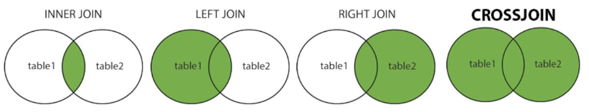
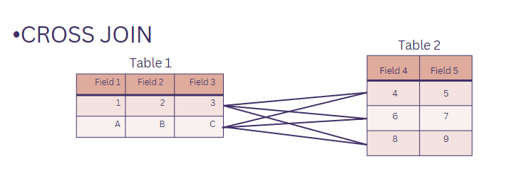
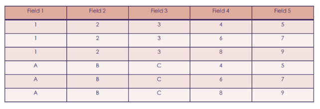
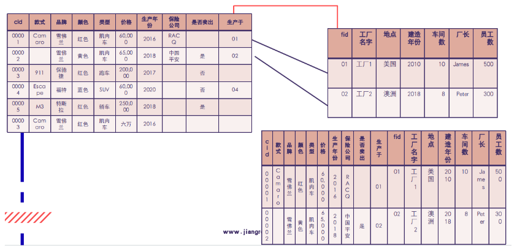

# Note

## Database_Tutorial (`10/12/2023`)

### 数据库实操练习
#### 创建表格
- 创建主表Factories，创建完记得在左边的table处刷新
```sql
CREATE TABLE Factories(
fid INTEGER PRIMARY KEY NOT NULL,
`工厂名字` TEXT,
`地址` TEXT,
`建造年份` INTEGER,
`员工数量` INTEGER,
`主管` TEXT,
`车间数量` INTEGER,
`品牌` TEXT
);
```
- 创建另一张表Cars，用来给foreign key引用
```sql
CREATE TABLE `Cars` (
`cid` INT AUTO_INCREMENT,
`款式` TEXT,
`品牌` TEXT,
`颜色` TEXT,
`类型` TEXT,
`价格` INT,
`生产年份` INT,
`是否卖出` TEXT,
PRIMARY KEY(`cid`)
);
```
- 创建第三张表Production，用来展示foreign key
```sql
CREATE TABLE Production(
`pid` INT PRIMARY KEY AUTO_INCREMENT,
`cid` INT NOT NULL,
`fid` INT NOT NULL,
`生产日期` TEXT,
`负责员工` TEXT,
FOREIGN KEY(`cid`) REFERENCES Cars(`cid`),
FOREIGN KEY(`fid`) REFERENCES Factories(`fid`)
);
```
#### 插入数据
- 插入车辆数据
```sql
INSERT
	INTO
	Cars(
	`款式`,
	`品牌`,
	`颜色`,
	`类型`,
	`价格`,
	`生产年份`,
	`是否卖出`)
VALUES (
"Camaro",
"雪佛兰",
"红色",
"肌肉⻋",
60000,
2016,
"是");
```
- 插入工厂数据
```sql
INSERT
	INTO
	Factories(
	 	`fid`,
	`工厂名字`,
	`地址` ,
	`建造年份` ,
	`员工数量` ,
	`主管` ,
	`车间数量` ,
	`品牌` )
VALUES (
	1,
	"123",
	"address",
	1994,
	100,
	"bob",
	10,
	"雪佛兰"
);
```
- 插入production数据
```sql
INSERT INTO Production(`cid`, `fid`, `生产日期`, `负责员工`)
VALUES (1, 1, "20150908", "Zavier");
```

#### 删除数据
- 
```sql
DELETE FROM Cars WHERE cid=1;
```

#### 联表查询
- 此时的指令会将整个表都选择出来
```sql
SELECT * FROM Cars, Production, Factories WHERE Production.`生产日期`="20150908" AND Production.cid=Cars.cid
AND Factories.fid=Production.fid;
```

#### Aggregation
- 计算之前记得从文件导入数据，此时注意导入的数据文件完整性，然后此时的空白表格中有没有与之冲突的数据

- COUNT函数：用来计算一个数据库表中的行数
```sql
SELECT COUNT(*)
FROM Cars
WHERE `款式`= "Camaro";
```
- MAX函数：选择某列的最大值，这里的情境是选择camaro款式中价格最贵的一款
```sql
SELECT MAX(`价格`) FROM Cars
WHERE `款式`="Camaro";
```
- MIN函数：选择某列的最小
```sql
SELECT MIN(`价格`) FROM Cars
WHERE `款式`="Camaro";
```
- SUM函数：为一个数值列计算总和
```sql
SELECT SUM(`价格`) FROM Cars
WHERE `款式`="Camaro";
```
- AVG函数：计算某列的平均值
```sql
SELECT AVG(`价格`) FROM Cars
WHERE `款式`="Camaro";
```
- UPPER/LOWER函数：把字符串转换为大写/小写字母
```sql
SELECT UPPER(`款式`) FROM Cars;
SELECT LOWER() (`款式`) FROM Cars;
```
- LENGTH函数：返回字符串的长度
```sql
SELECT `款式`, LENGTH(`款式`) FROM Cars;
```

#### HAVING
- HAVING子句允许指定条件来过滤出现在最终结果中的分组结果
- 与WHERE区别：前者在所选列上设置条件，后者在GROUP BY句子上创建的分组上设置条件
- 本次具体例子的意思是：选择出款式>3的车型，并通过'款式'GROUP BY出来
```sql
SELECT `款式`,LENGTH(`款式`) from Cars
GROUP BY `款式`,LENGTH(`款式`)
HAVING LENGTH(`款式`)>3
```

### Create Integrity Constraint

```sql
CREATE TABLE EMPLOYEE(
“ID” INTEGER PRIMARY KEY NOT NULL,  “NAME” TEXT NOT NULL,
“AGE” INTEGER NOT NULL,
“ADDRESS” CHAR(50),
“SALARY” REAL
);
```

#### NOT NULL约束：确保其某列不能有NULL值
#### DEFAULT约束：当某列没有指定值时，为该列提供默认值
#### UNIQUE约束：确保某列中的所有值是不同的
#### PRIMARY Key约束：位置标识数据库表中的各行/记录
#### CHECK约束：CHECK约束确保某列中的所有值满足一定条件

### Join
- 当表格之前有关联性的key相互引用时，通过JOIN语句将其以不同形式汇总起来

<p align='center'></p>

#### CROSS JOIN
- 它用于组合两个表中的记录
- 此命令容易产生超大数据的结果，谨慎使用
<p align='center'></p>

```sql
SELECT * FROM Table1 CROSS JOIN Table2
```

- 执行指令会变成如下结果
<p align='center'></p>

#### Inner Join
- 它用于将两个或多个数据库表中满足特定条件的记录组合在一起
- 注意是依据这些表之间的共同属性或条件来匹配记录
- 即对比的两表中都有内容才会放到输出的新表中来

```sql
SELECT Table1.*, Table2.*
FROM Table
INNER JOIN Table2 ON Table1.cid = Table2.fid;
```
<p align='center'></p>

#### LEFT/RIGHT JOIN
- Left/Right Join:左边/右边的表格value全部会输出，但右边/左边没有对应的filed values会使用Null替代

<p align='center'></p>


### Union
- Union 和 Union all的区别

| union | union all |
| :---: | :---: |
| ***不包含重复行*** | ***包含重复行*** |

- 使用Union
```sql
SELECT
    *
FROM
    Cars
WHERE
    颜色 = '红色'
UNION
SELECT
    *
FROM
    Cars
WHERE
    类型 = '跑车';
```

<p align='center'></p>


- 使用Union All
```sql
SELECT
    *
FROM
    Cars
WHERE
    颜色 = '红色'
UNION ALL
SELECT
    *
FROM
    Cars
WHERE
    类型 = '跑车';
```

<p align='center'></p>


