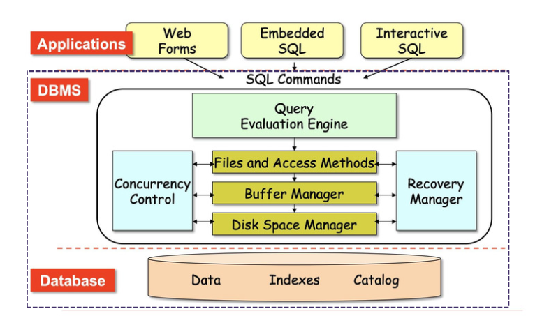
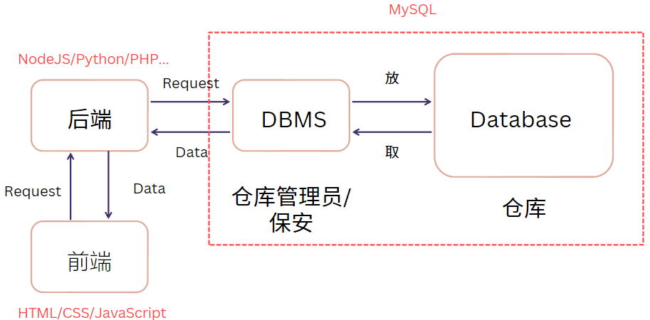
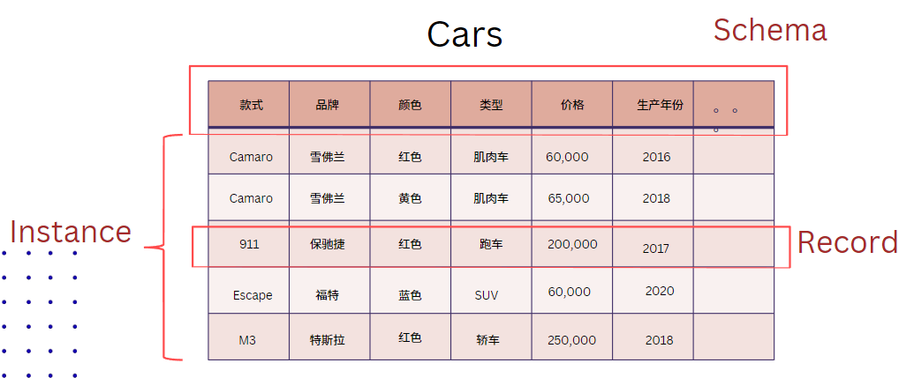
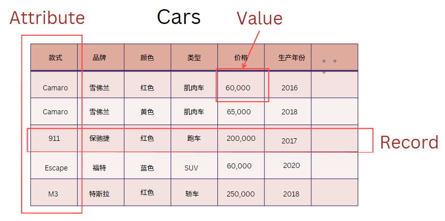

# Note

## Database1 (`06/12/2023`)

### 什么是数据
- 最通俗的解释：储存数据的仓库
- 对客观事物、事件进行记录并且可以被鉴别符号

#### 举例：如何描述一辆车
`类型、价格、几门、手动还是自动挡、品牌、年份、款式、颜色、引擎？`

#### 数据有哪些类型
- 文字
- 数字
- 图片
- 文件
- 视频
- ...

#### 大量数据的处理办法
- 文件夹储存 -> 问题：数据不准、噪点
- 表格储存

#### Database vs File system
| Database | File system |
| :---: | :---: |
| ***存储同一类数据*** | ***存储不同类型的数据*** |

### 数据库
#### 什么是数据库
- 储存数据的仓库
- 可以/便于 检索数据
- 不同权限的用户可以看不同的数据

#### 数据库组成

#### 前后端拿取数据的结构

#### 什么是数据模型
- Schema：表示这张表里有哪些attribute
- Instance：具体生成的所有数据的统称
- Record：单行数据的统称

- Attribute：单列数据的统称
- Value：单个cell的值

#### 数据结构
##### Structured data（结构化数据）
- Predefined schema
- 易于存储和搜索
- 可以建立关系模型

##### Semi structured data（半结构化数据）
- 同样提供可分类信息，但格式灵活多变
- 一般数据格式，顺序不受限制
- 举例：JSON

##### Unstructured data（非结构化数据）
- 如何存储：一般可放网上，引用url来提取
- 不同类型数据存储对比
| 结构化存储 | 非结构化存储 |
| :---: | :---: |
| ***key*** | ***QR code*** |
| ***以表格形式存储*** | ***文件、图像、音频、视频等*** |

#### Primary Key 主键
- Unique（独一无二的值）
- Not Null（每个Record必须有）

#### Foreign Key 外键
- 用来和其他表建立联系的键
- 一般为其他表的主键
- 可以重复
- 可以为空值

#### 关系模型
- 一对一：身份证号、学生证号
- 一对多：班级-学生、部门-职员
- 多对多：课程-学生、书籍-作者

#### 数据库类型
##### 关系型数据库
| 优点 | 缺点 |
| :---: | :---: |
| ***数据一致性*** | ***I/O（读写较差）*** |
| ***便于查询（SQL）*** | ***不适合处理过于复杂的关系模型*** |
