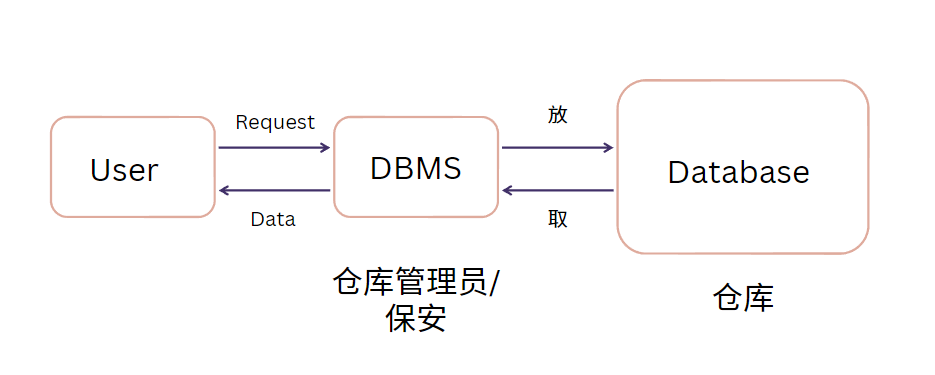

# Note

## Database1 (`06/12/2023`)

### 什么是数据
- 最通俗的解释：储存数据的仓库
- 对客观事物、事件进行记录并且可以被鉴别符号

#### 举例：如何描述一辆车
`类型、价格、几门、手动还是自动挡、品牌、年份、款式、颜色、引擎？`

#### 数据有哪些类型
- 文字
- 数字
- 图片
- 文件
- 视频
- ...

#### 大量数据的处理办法
- 文件夹储存 -> 问题：数据不准、噪点
- 表格储存

#### Database vs File system
| Database | File system |
| :---: | :---: |
| ***存储同一类数据*** | ***存储不同类型的数据*** |

### 什么是数据库
- 储存数据的仓库
- 可以/便于 检索数据
- 不同权限的用户可以看不同的数据

#### 数据库组成

