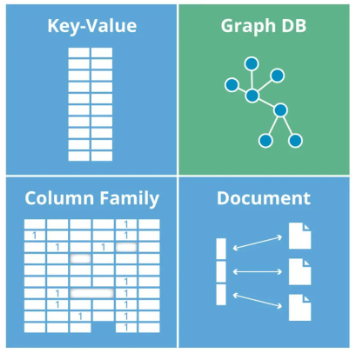

# Note

## Database1 (`06/12/2023`)

### 什么是数据
- 最通俗的解释：储存数据的仓库
- 对客观事物、事件进行记录并且可以被鉴别符号

#### 举例：如何描述一辆车
`类型、价格、几门、手动还是自动挡、品牌、年份、款式、颜色、引擎？`

#### 数据有哪些类型
- 文字
- 数字
- 图片
- 文件
- 视频
- ...

#### 大量数据的处理办法
- 文件夹储存 -> 问题：数据不准、噪点
- 表格储存

#### Database vs File system
| Database | File system |
| :---: | :---: |
| ***存储同一类数据*** | ***存储不同类型的数据*** |

### 数据库
#### 什么是数据库
- 储存数据的仓库
- 可以/便于 检索数据
- 不同权限的用户可以看不同的数据

<p align='center'></p>

#### 数据库组成
<p align='center'></p>

#### 前后端拿取数据的结构
<p align='center'></p>


#### 什么是数据模型
- Schema：表示这张表里有哪些attribute
- Instance：具体生成的所有数据的统称
- Record：单行数据的统称

<p align='center'></p>

- Attribute：单列数据的统称
- Value：单个cell的值

<p align='center'></p>


#### 数据结构
##### Structured data（结构化数据）
- Predefined schema
- 易于存储和搜索
- 可以建立关系模型

##### Semi structured data（半结构化数据）
- 同样提供可分类信息，但格式灵活多变
- 一般数据格式，顺序不受限制
- 举例：JSON

##### Unstructured data（非结构化数据）
- 如何存储：一般可放网上，引用url来提取
- 不同类型数据存储对比<br>

| 结构化存储 | 非结构化存储 |
| :---: | :---: |
| ***key*** | ***QR code*** |
| ***以表格形式存储*** | ***文件、图像、音频、视频等*** |

#### Primary Key 主键
- Unique（独一无二的值）
- Not Null（每个Record必须有）

#### Foreign Key 外键
- 用来和其他表建立联系的键
- 一般为其他表的主键
- 可以重复
- 可以为空值

#### 关系模型
- 一对一：身份证号、学生证号
- 一对多：班级-学生、部门-职员
- 多对多：课程-学生、书籍-作者

#### 数据库类型
##### 关系型数据库
- 依据关系模型来创建的数据库

| 优点 | 缺点 |
| :---: | :---: |
| `数据一致性` | `I/O（读写较差）` |
| `便于查询（SQL）` | `不适合处理过于复杂的关系模型` |

##### 非关系型数据库
- NoSQL没有固定的表结构，且数据之前不存在表与表之间的关系，数据之间是可以独立的
- 因此NoSQL也可以用于分布式系统上

<p align='center'></p>


| 优点 | 缺点 |
| :---: | :---: |
| `Schema flexibility` | `不能联表查询` |
| `Locality` | `不能保证数据事务的ACID原则` |
| `更加接近于应用端组织数据的方式` | `数据缺乏一致性` |


#### 完整性约束
- 数据库中每一个instance都要满足的所有条件
- IC是在定义Schema（创建table）的时候就已经被specified table中
- 内容被修改的时候IC也是强制实施的

##### 基本类型
- Domian Integrity Constraint
- Primary Key Integrity Constraint
- Unique Value Integrity Constraint
- NotNull Integrity Constraint
- Foreign Key Integrity Constraint

#### ACID性质
- Atomicity: 要么执行成功要么恢复原状
- Consisency: 数据库完整性不被破坏 (符合预设规则)integrity constriant
- Isolaion: 一件一件做和一起做是一样的
- Durability: 失败的改动不影响原数据 (可以rollback)


### 安装mysql和DBeaver
| Mac用户 | Windows用户 |
| :---: | :---: |
| `brew install mysql` | `参考MySQL环境搭建PDF` |
| `brew services list` | `` |
| `brew services start mysql` | `` |


### 数据库语言
#### Data Definition Language(DDL)
- Define schemas
- Define Itegrity Constraints

#### Data Manipulation Language(DML)
- Query(ask question)
- 增删改查

#### SQLite支持的数据类型
- INTEGER(INT)：一个正常大小的整数
- CHAR：定长字符串
- VARCHAR：长度可变字符串
- TEXT：文本字符串，使用数据库编码存储（UTF-8[最常用]，UTF-16BE或UTF-16LE）
- BLOB：二进制大对象，怎么输入就怎么存储
- FLOAT：浮点数
- DECIMAL：小数
- NULL：NULL值
- NUMERIC：也是一种数字类型

#### 数据库语言练习
- 创建一个table
```sql
CREATE TABLE `Cars` (
`cid` INT AUTO_INCREMENT, `款式` TEXT,
`品牌` TEXT,
`颜色` TEXT,
`类型` TEXT,
`价格` INT,
`生产年份` INT,
`是否卖出` TEXT,
PRIMARY KEY(`cid`)
);
```
- 插入一条数据
```sql
INSERT INTO Cars(`款式`, `品牌`, `颜色`, `类型`, `价格`, `生产年份`, `是否卖出`)
VALUES ("Camaro", "雪佛兰", "红色", "肌肉⻋", 60000, 2016, "是");
```
- 插入多条数据
```sql
INSERT INTO Cars(`款式`, `品牌`, `颜色`, `类型`, `价格`, `生产年份`, `是否卖出`)
VALUES ("Camaro", "雪佛兰", "黄色", "肌肉⻋", "65000", "2018", "是"),
("911", "保驰捷", "红色", "跑⻋", "200000", "2017", "否"),
("Escape", "福特", "蓝色", "SUV", "60000", "2020", "否");
```
- 删除一行数据
```sql
DELETE FROM Cars WHERE cid = 1;
```
- 删除所有数据
```sql
DELETE FROM Cars;
```
- 删除整个table
```sql
DROP TABLE Cars;
```
- 修改表格名字
```sql
ALTER TABLE Cars RENAME TO Cars_1;
```


