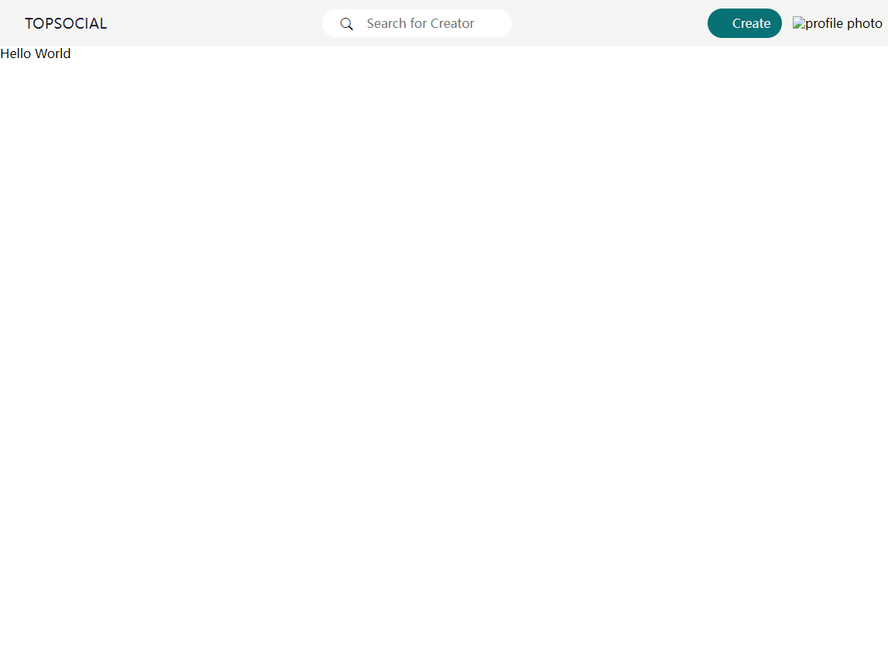

- [Note](#Note)
  - [Frontend1 (`13/12/2023`)](#Frontend1-13122023)
    - [Resources](#Resources)
    - [Vite](#Vite)
      - [Vite初始化](#Vite初始化)
    - [Top Social前端](#Top-Social前端)
      - [本节课主要目的](#本节课主要目的)
      - [index.html](#index.html)
      - [index.css](#index.css)
      - [common.css](#common.css)
      - [nav.css](#nav.css)


<p align='center'></p>


# Note

## Frontend1 (`13/12/2023`)

### Resources
[vite](https://vitejs.dev/guide/)<br>
[React](https://react.dev/)<br>
[classCode](https://github.com/HAIXIN-ZHANG/WEB-17)<br>
[Basics of Package.json](https://nodesource.com/blog/the-basics-of-package-json/)<br>


### Vite
[vite](https://vitejs.dev/guide/)

#### Vite初始化
- 先输入以下指令创建初始文件夹
```shell
cd frontend
npm create vite@latest # yes Vanilla JavaScript
cd client
npm i
npm run dev
```
- 删除不需要的文件`main.js`, `counter.js`, `style.css`和public文件夹下面的`vite.svg`
- 创建`index.css`，`index.js`，`index.html`文件
- 在frontend下创建src文件夹, 在src文件夹下面创建`componets`, `frames`, `fundation`文件夹
- 在frames文件夹下创建`nav`文件夹，在nav文件夹里创建`nav.css`文件
- 在fundation文件夹下创建`common.css`文件


### Top Social前端
#### 本节课主要目的
- 创建完成基础的标题框架（nav bar左、中、右sections）

#### index.html
```html
<!doctype html>
<html lang="en">
  <head>
    <meta charset="UTF-8" />
    <meta name="viewport" content="width=device-width, initial-scale=1.0" />
    <title>TopSocial</title>

    <!-- Icon import -->
    <link rel="stylesheet" href="https://cdn.jsdelivr.net/npm/bootstrap-icons@1.3.0/font/bootstrap-icons.css">
  </head>

  <body>

    <!-- nav -->
    <nav>
      <div class="nav-container">
        <!-- logo -->
        <div class="logo">
          <a href="/">TOPSOCIAL</a>
        </div>
        <!-- Search Bar -->
        <div class="search-bar">
          <i class="bi bi-search"></i>
          <input class="search-txt" type="text" placeholder="Search for Creator"/>
        </div>
        <!-- Button -->
        <div class="create">
          <button class="btn btn-primary">Create</button>
          <!-- profile photo -->
          <div class="profile-photo">
            
          </div>
      </div>
      </div>
    </nav>
    <!-- main -->

    <div id="app">
      Hello World
    </div>
    <script type="module" src="/index.js"></script>
  </body>
</html>
```

#### index.css
```css
@import "normalize.css";

/* Fundation */
@import "./src/css/fundation/common.css";

/* Frames */
@import "./src/css/frames/nav/nav.css";
```

#### common.css
```css
/* --- Basic --- */
:root {
    --color-white: #f5f5f3;
    --color-black: #1c2033;
    --color-gray: #3d3d3d;
    --color-primary: #077175;
    --panel-bgcolor: #fff;
    --font-size: 1.5rem;
    --btn-padding: 0.6rem 2rem;
    --btn-border-radius: 2rem;
    --mainright-margin: 0.5rem;
}
```

#### nav.css
```css
/* Nav */

nav {
    width: 100%;
    background-color: var(--color-white);
    padding: 0.7rem 0;
 }

nav .nav-container {
    display: flex;
    align-items: center;
    justify-content: space-between;
    gap: 1rem;
 }

nav .logo {
    font-size: 1.2rem;
    text-transform: uppercase;
    user-select: none;
    font-family: "Comfortaa";
    color: var(--color-black);
    margin: 0 2rem;  
 }

nav a {
    text-decoration: none;
    color: var(--color-black);
 }

nav .search-bar {
    background-color: var(--panel-bgcolor);
    width: 20vw;
    padding: 0.5rem;
    display: flex;
    align-items: center;
    border-radius: 2rem;
    /* min-width: 20vw; */
 }

nav .bi.bi-search {
    margin: 0 1rem;
}

nav input[type="text"] {
    border: none;
    outline: none;
}

nav .btn {
    width: 6rem;
    color: var(--color-white);
    border-radius: var(--btn-border-radius);
    padding: var(--btn-padding);
    box-shadow: none;
    border: none;
}

nav .btn-primary {
    background-color: var(--color-primary);
}

nav .create {
    display: flex;
    width: 15rem;
    align-items: center;
    justify-content: space-around;
}
```


#### 最后出来的基本效果

<p align='center'></p>

