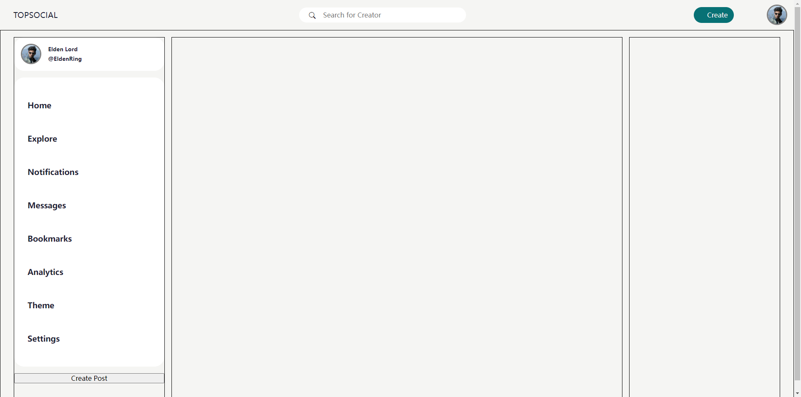

- [Note](#Note)
  - [Frontend2 (`17/12/2023`)](#Frontend2-17122023)
    - [创建image文件夹](#创建image文件夹)
    - [创建profile.css文件](#创建profile.css文件)
    - [创建media文件夹/media.css文件](#创建media文件夹mediacss文件)
    - [index.css文件](#indexcss文件)
    - [创建main文件夹](#创建main文件夹)
      - [创建main-left.css文件](#创建mainleftcss文件)
      - [创建main-middle.css文件](#创建mainmiddlecss文件)
      - [创建main-right.css文件](#创建mainrightcss文件)
    - [index.html文件](#indexhtml文件)
    - [最后出来基本效果](#最后出来基本效果)

<hr>

<p align='center'></p>

<hr>

# Note

## Frontend2 (`17/12/2023`)

### 创建image文件夹
- 创建在public文件夹下
- 放置所有的图片

<hr>
<br>

### 创建profile.css文件
- 在component文件夹下
```css
.profile-photo {
    width: 2.7rem;
    height: 2.7rem;
    border-radius: 50%;
    border: 0.2rem solid gray;
    overflow: hidden;
}

.profile-photo img {
    display: block;
    height: 100%;
    width: 100%;
    object-fit: cover;
}
```

<hr>
<br>

### 创建media文件夹/media.css文件

<hr>
<br>

### index.css文件
- 此时记得将创建好的所有css文件在总的index.css文件中挂载
```css
@import "normalize.css";

/* Foundation */
@import "./src/css/fundation/common.css";

/* Frames */
@import "./src/css/frames/nav/nav.css";
@import "./src/css/frames/main/main-left.css";
@import "./src/css/frames/main/main-middle.css";
@import "./src/css/frames/main/main-right.css";
/* @import "./src/css/frames/media/media.css"; */

/* Components */
@import "./src/css/components/profile.css"
```

<hr>
<br>

### 创建main文件夹
- 在frame文件夹中创建
- 模块化思维，将main左中右三个部分分开创建css文件

<hr>
<br>

#### 创建main-left.css文件
```css
.container .main-left {
    border: 1px solid black;
    width: 20%;
    display: flex;
    flex-direction: column;   
}

.main-left .profile {
    display: flex;
    background-color: var(--panel-bgcolor);
    height: 3rem;
    align-items: center;
    padding: 1rem;
    border-radius: var(--border-radius);
    text-decoration: none;
}

.main-left .profile-photo {}

.main-left .profile-description {
    display: block;
    margin-left: 1rem;
    line-height: 0;
    color: var(--color-black);
}

.main-left .sidebar {
    background-color: var(--panel-bgcolor);
    margin: 1rem 0;
    border-radius: var(--border-radius);
}

.main-left ul {
    padding-inline-start: 0;
}

.main-left li {
    list-style-type: none;
}

.main-left .sidebar .menu-item {
    display: flex;
    font-family: sans-serif;
    height: 5rem;
    align-items: center;
    cursor: pointer;
    padding-left: 2rem;
}

.main-left .sidebar .menu-item:hover {
    background-color: var(--color-primary);
}

.main-left .side-btn {
    width: 85%;
    color: var(--color-white);
    background-color: var(--color-primary);
    border-radius: var(--btn-border-radius);
    padding: var(--btn-padding);
    box-shadow: none;
    border: none;
    margin: 0.6rem;
}
```

<hr>

#### 创建main-middle.css文件
```css
.container .main-middle {
    
    border: 1px solid black;
    width: 60%;
}
```

<hr>

#### 创建main-right.css文件
```css
.container .main-right {
    
    border: 1px solid black;
    width: 20%;
}
```

<hr>
<br>

### index.html文件
- 修改和增加响应的板块内容
- 本节课主要完成的是main-left的内容
```html
<!-- main left -->
            <div class="main-left">
              <a class="profile" href="">
                <div class="profile-photo">
                  
                </div>
                <div class="profile-description">
                  <h5>Elden Lord</h5>
                  <h5>@EldenRing</h5>
                </div>
              </a>
              <!-- side bar -->
              <nav class="sidebar">
                <ul>
                  <li>
                    <a class="menu-item" href="#">
                      <h3>Home</h3>
                    </a>
                  </li>
                  <li>                
                    <a class="menu-item" href="#">
                      <h3>Explore</h3>
                    </a> 
                  </li>
                  <li>                 
                    <a class="menu-item" href="#">
                      <h3>Notifications</h3>
                    </a>
                  </li>
                  <li>                 
                    <a class="menu-item" href="#">
                      <h3>Messages</h3>
                    </a>
                  </li>
                  <li>                 
                    <a class="menu-item" href="#">
                      <h3>Bookmarks</h3>
                    </a>
                  </li>
                  <li>                 
                    <a class="menu-item" href="#">
                      <h3>Analytics</h3>
                    </a>
                  </li>
                  <li>                 
                    <a class="menu-item" href="#">
                      <h3>Theme</h3>
                    </a>   
                  </li>
                  <li>
                    <a class="menu-item" href="#">
                      <h3>Settings</h3>
                    </a>
                  </li>
                </ul>
              </nav>
              <!-- side button -->
              <button class="">Create Post</button>
            </div>
```

<hr>
<br>

### 最后出来基本效果

<p align='center'></p>


