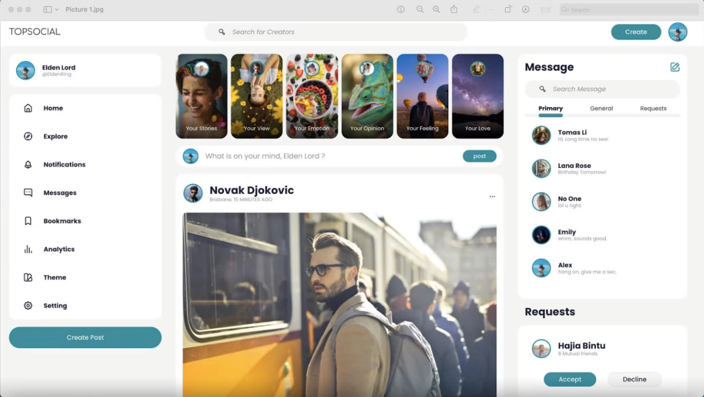

- [Note](#Note)
  - [Frontend3 (`20/12/2023`)](#Frontend3-20122023)
    - [Resource](#Resource)
    - [media.css](#mediacss)
    - [Main-middle](#Main-middle)
    - [middle.css](#middlecss)
    - [在js文件夹内建立main文件夹以设置dom操作](#在js文件夹内建立main文件夹以设置dom操作)
      - [main-left.js](#main-leftjs)
      - [main-middle.js](#main-middlejs)

<hr>

<p align='center'></p>

<hr>


# Note
- 注意：老师提醒本期三节课程并不足以完全让我们完成整个项目的所有前端code
- 希望同学们能课后自己根据老师提供的example继续完成
  
## Frontend3 (`20/12/2023`)

### Resource
[Class Code](https://github.com/HAIXIN-ZHANG/WEB-17)

<hr>
<br>

### media.css
- 调整media.css以适应不同屏幕尺寸
```css
/* --- Media --- */
@media screen and (width < 1420px) {
    .container .main-left {
        display: none;
    }
}

@media screen and (width <  1245px) {
    .container .main-right {
        display: none;
    }
}
```

<hr>
<br>

### Main-middle
- 修改html中的Main-middle部分
```html
<!-- Main middle -->
      <div class="main-middle">
        <div class="main-middle-card-wrapper">
          <figure class="main-middle-card popup-trigger">
            
            <div class="profile-photo">
              
            </div>
            <p></p>
          </figure>
          <div class="popup">
            <div class="popup-content">
              <h2>Stories</h2>
              <p>
                Walking down the bustling city streets, I noticed a small cafe tucked away in a quiet corner. Curious, I
                stepped inside and was greeted by the aroma of freshly
                brewed coffee. As I sipped my drink, I overheard a group of friends sharing laughter and stories at a
                nearby table. In that moment, I realized that even in the
                fast-paced world, moments of connection and joy are found in the simplest of places.
              </p>
              <button class="popup-close">Close</button>
            </div>
          </div>
          <figure class="main-middle-card popup-trigger">
            
            <div class="profile-photo">
              
            </div>
            <p></p>
          </figure>
          <div class="popup">
            <div class="popup-content">
              <h2>Stories</h2>
              <p>
                In the bustling city, two strangers with diverse backgrounds crossed paths on a rainy day. Mark, a
                passionate photographer, sheltered under a café awning, capturing
                the rain-soaked streets. Mia, a talented painter, was also seeking refuge, her canvas and brushes in
                hand.
              </p>
              <button class="popup-close">Close</button>
            </div>
          </div>
          <figure class="main-middle-card popup-trigger">
            
            <div class="profile-photo">
              
            </div>
            <p></p>
          </figure>
          <div class="popup">
            <div class="popup-content">
              <h2>Stories</h2>
              <p>
                Once upon a time, in a small village, there lived a kind-hearted boy named Alex. Alex always looked out
                for others and was known for his willingness to help anyone
                in need. One sunny morning, Alex saw his elderly neighbor, Mrs. Jenkins, struggling to carry her
                groceries into her house. Without hesitation, he rushed over and
                offered his assistance. Mrs. Jenkins was grateful for his help and smiled warmly at him.
              </p>
              <button class="popup-close">Close</button>
            </div>
          </div>
          <figure class="main-middle-card popup-trigger">
            
            <div class="profile-photo">
              
            </div>
            <p></p>
          </figure>
          <div class="popup">
            <div class="popup-content">
              <h2>Stories</h2>
              <p>
                In this vibrant city, we embark on an exploration of the unknown journey together. From street food to
                shimmering neon lights, every moment is filled with
                surprises. Let's create memories together and leave behind our own story.
              </p>
              <button class="popup-close">Close</button>
            </div>
          </div>
          <figure class="main-middle-card popup-trigger">
            
            <div class="profile-photo">
              
            </div>
            <p></p>
          </figure>
          <div class="popup">
            <div class="popup-content">
              <h2>Stories</h2>
              <p>
                Amidst nature's embrace, we find serenity and beauty at every turn. A tranquil escape from the hustle
                and bustle, where time seems to slow down. Let's cherish these
                moments and connect with the world around us.
              </p>
              <button class="popup-close">Close</button>
            </div>
          </div>
          <figure class="main-middle-card popup-trigger">
            
            <div class="profile-photo">
              
            </div>
            <p></p>
          </figure>
          <div class="popup">
            <div class="popup-content">
              <h2>Stories</h2>
              <p>
                Amidst the tranquil mountains, we found our escape. The crisp air and majestic views filled our souls
                with peace. Cherishing these moments of serenity and
                connection with nature.
              </p>
              <button class="popup-close">Close</button>
            </div>
          </div>
        </div>
        <!-- MAIN middle thought-->
        <div class="main-middle-thought-wrapper">
          <div class="profile-photo">
            
          </div>
          <input type="text" id="postComment" autocomplete="off" />
          <button class="btn btn-primary">Post</button>
        </div>
```

<hr>
<br>

### middle.css
- 修改middle的css
```css
.main-middle > .main-middle-card-wrapper {
    display: flex;
    justify-content: space-between;
    gap: 0.5rem;
    width: 100%;
    height: 30dvh;
    text-align: center;
    margin: 1rem 0;
}

.main-middle > .main-middle-card-wrapper > .main-middle-card {
    position: relative;
    display: inline-block;
    margin: 0;
    padding: 0;
    width: 100%;
    height: inherit;
    text-align: center;
}

.main-middle > .main-middle-card-wrapper > .main-middle-card > img {
    height: inherit;
    width: 100%;
    object-fit: cover;
    border-radius: 1rem;
}

.main-middle-card > p {
    position: absolute;
    left: 50%;
    bottom: 5%;
    color: white;
    transform: translate(-50%, 0);
}

.main-middle-card > .profile-photo {
    position: absolute;
    left: 50%;
    top: 5%;
    transform: translate(-50%, 0);
}

.popup {
    display: none;
    position: fixed;
    top: 0;
    left: 0;
    width: 100%;
    height: 100%;
    background-color: rgba(0, 0, 0, 0.7);
    justify-content: center;
    align-items: center;
    z-index: 999;
}

.popup-content {
    background-color: var(--color-white);
    width: 80dvw;
    padding: 1rem 0;
    border-radius: 10px;
    text-align: center;
}

.popup-content > h2 {
    font-size: 2rem;
    margin-bottom: 10px;
    color: #333;
}

.popup-content > p {
    font-size: 2rem;
    text-align: justify;
    color: #666;
    line-height: 2;
    margin: 0 1rem;
}

.popup-close {
    color: var(--color-white);
    background-color: var(--color-primary);
    padding: var(--btn-padding);
    border-radius: 1rem;
    margin-top: 10px;
    font-size: 0.9rem;
    transition: all 0.3s ease;
    cursor: pointer;
}

.popup-close:hover {
    color: black;
}

.popup-trigger {
    cursor: pointer;
}

.main-middle-thought-wrapper {
    position: relative;
    display: flex;
    justify-content: space-between;
    align-items: center;
}

.main-middle-thought-wrapper > input {
    display: inline-block;
    width: 100%;
    text-align: center;
    padding: 1rem;
    border-radius: 1rem;
    border: none;
}

.main-middle-thought-wrapper > .profile-photo {
    position: absolute;
    left: 1rem;
}

.main-middle-thought-wrapper > :last-child {
    position: absolute;
    right: 0.5rem;
}

.main-middle-post-wrapper {
    margin: 1rem 0;
}

.main-middle-post-wrapper > article {
    background: var(--panel-bgcolor);
    margin-bottom: 1rem;
    padding: 0 1rem;
    border-radius: 1rem;
}

.info-picture img {
    border-radius: 0.5rem;
}

.info-control {
    display: flex;
    justify-content: space-between;
    padding: 0.5rem;
}

.main-control {
    display: flex;
    gap: 0.5rem;
}

.info-control i {
    font-size: 1.5rem;
    color: var(--color-primary);
}

.info-control > i::before {
    color: #e4c300;
}

.info-comment {
    display: flex;
    flex-direction: column;
    gap: 0.2rem;
    font-size: small;
}

.view-btn {
    color: var(--color-gray);
    cursor: pointer;
}

.view-btn:hover {
    color: var(--color-primary);
}
```

<hr>
<br>

### 在js文件夹内建立main文件夹以设置dom操作
- 记得在index.js中载入各个js文件以拿到数据
#### main-left.js
```js
export const setMainLeftProfileImage = (profile) =>
  (document.querySelector(".main-left .profile-photo > img").src =
    profile.img_src);

export const setMainLeftProfileText = (profile) => {
  const h5 = document.querySelectorAll(".main-left .profile-description > h5");
  h5[0].textContent = profile.name;
  h5[1].textContent = profile.at;
};

export function applyStyles(element) {
    if (element.tagName !== "IMG" && element.tagName !== "BUTTON") {
        element.style.backgroundColor = "black";
        element.style.color = "white";
    }
    if (element.tagName === "I") element.style.backgroundColor = "white";
    for (const childElement of element.children) applyStyles(childElement);
}
```

<hr>

#### main-middle.js
```js
export const setMiddleHighlineImg = () =>
    document
        .querySelectorAll(".main-middle-card.popup-trigger > img")
        .forEach(
            (value, index) =>
            (value.src = `//ik.imagekit.io/fangweij/highline/highline_${index + 1
                }.webp`)
        );
export const setMiddleProfileImg = () =>
    document
        .querySelectorAll(".main-middle-card.popup-trigger > .profile-photo > img")
        .forEach(
            (value, index) =>
            (value.src = `//ik.imagekit.io/fangweij/profile/profile_${index + 1
                }.webp`)
        );

export const popupTrigger = document.querySelectorAll(".popup-trigger");
export const popupClose = document.querySelectorAll(".popup-close");
export const popupTriggerLogic = function () {
    this.nextElementSibling.style.display = "flex";
};
export const popupCloseLogic = function () {
    this.closest(".popup").style.display = "none";
};

export function getRandomColor() {
    let color = "#";
    for (let i = 0; i < 6; i++)
        color += "0123456789ABCDEF"[Math.floor(Math.random() * 16)];
    return color;
}
export function setBoarderColor(element) {
    element.style.borderColor = getRandomColor();
}

const postWrapper = document.querySelector(".main-middle-post-wrapper");

export const generateMiddlePostList = (cards) => {
    postWrapper.innerHTML = "";
    cards.forEach((value) => {
        const newArticle = document.createElement("article");
        newArticle.innerHTML = `
            <div class="info-profile">
                <div class="profile">
                    <div class="profile-photo"></div>
                    <div class="profile-description">
                        <h2>${value.profile.name}</h2>
                        <p>${value.profile.position}, ${value.profile.time}</p>
                    </div>
                </div>
                <i class="uil uil-ellipsis-h"></i>
            </div>
            <div class="info-picture"></div>
            <div class="info-control">
                <div class="main-control"><i class="uil uil-heart control_heart"></i><i class="uil uil-comment-dots"></i><i class="uil uil-share-alt"></i></div>
                <i class="uil uil-bookmark"></i>
            </div>
            <div class="info-comment">
                <div class="profile-photo-list">
                    
                    
                    
                    <span class="like-info">Liked by <strong> ${value.comment.first_people_name} </strong> and <strong> ${value.comment.like_peoples_number}</strong> others</span>
                </div>
                <span class="comment-info">${value.comment.comment_info}</span>
                <span class="view-btn">View all ${value.comment.view_number} comments</span>
            </div>
        `;
        setBoarderColor(newArticle.querySelector(".profile-photo"));
        newArticle
            .querySelectorAll(".profile-photo-list > .profile-photo")
            .forEach((value) => setBoarderColor(value));
        postWrapper.appendChild(newArticle);
    });
};

export const mainMiddleInput = (profile) =>
(document.querySelector(
    ".main-middle-thought-wrapper>input"
).placeholder = `What is on your mind, ${profile.name}?`);

export const setMiddlePostPhoto = profile => {
    document.querySelector(".main-middle-thought-wrapper > .profile-photo > img").src = profile.img_src;
};


// random image

const shuffleArray = (array) => {
    const shuffled = [...array];
    for (let i = shuffled.length - 1; i > 0; i--) {
        const j = Math.floor(Math.random() * (i + 1));
        [shuffled[i], shuffled[j]] = [shuffled[j], shuffled[i]];
    }
    return shuffled;
}

export function getRandomImages() {
    const images = [
        "//ik.imagekit.io/fangweij/highline/highline_1.webp",
        "//ik.imagekit.io/fangweij/highline/highline_2.webp",
        "//ik.imagekit.io/fangweij/highline/highline_3.webp",
        "//ik.imagekit.io/fangweij/highline/highline_4.webp",
        "//ik.imagekit.io/fangweij/highline/highline_5.webp",
        "//ik.imagekit.io/fangweij/highline/highline_6.webp",
        "//ik.imagekit.io/fangweij/highline/highline_7.webp",
        "//ik.imagekit.io/fangweij/highline/highline_8.webp",
    ];
    const images2 = [
        "//ik.imagekit.io/fangweij/profile/profile_1.webp",
        "//ik.imagekit.io/fangweij/profile/profile_2.webp",
        "//ik.imagekit.io/fangweij/profile/profile_3.webp",
        "//ik.imagekit.io/fangweij/profile/profile_4.webp",
        "//ik.imagekit.io/fangweij/profile/profile_5.webp",
        "//ik.imagekit.io/fangweij/profile/profile_6.webp",
        "//ik.imagekit.io/fangweij/profile/profile_7.webp",
        "//ik.imagekit.io/fangweij/profile/profile_8.webp",
        "//ik.imagekit.io/fangweij/profile/profile_9.webp",
        "//ik.imagekit.io/fangweij/profile/profile_10.webp",
        "//ik.imagekit.io/fangweij/profile/profile_11.webp",
        "//ik.imagekit.io/fangweij/profile/profile_12.webp",
        "//ik.imagekit.io/fangweij/profile/profile_13.webp",
        "//ik.imagekit.io/fangweij/profile/profile_14.webp",
        "//ik.imagekit.io/fangweij/profile/profile_15.webp",
        "//ik.imagekit.io/fangweij/profile/profile_16.webp",
        "//ik.imagekit.io/fangweij/profile/profile_17.webp",
    ];
    const images3 = [
        "//ik.imagekit.io/fangweij/post/post_1.webp",
        "//ik.imagekit.io/fangweij/post/post_2.webp",
        "//ik.imagekit.io/fangweij/post/post_3.webp",
        "//ik.imagekit.io/fangweij/post/post_4.webp",
        "//ik.imagekit.io/fangweij/post/post_5.webp",
        "//ik.imagekit.io/fangweij/post/post_6.webp",
        "//ik.imagekit.io/fangweij/post/post_7.webp",
        "//ik.imagekit.io/fangweij/post/post_8.webp",
        "//ik.imagekit.io/fangweij/post/post_9.webp",
        "//ik.imagekit.io/fangweij/post/post_10.webp",
        "//ik.imagekit.io/fangweij/post/post_11.webp",
    ];
    const shuffledImages = shuffleArray(images);
    const selectedImages = shuffledImages.slice(0, 6);
    const shuffledImages2 = shuffleArray(images2);
    const selectedImages2 = shuffledImages2.slice(0, 6);
    const shuffledImages3 = shuffleArray(images3);
    const selectedImages3 = shuffledImages3.slice(0, 4);
    const imageContainer = document.querySelectorAll(".main-middle-card > img");
    imageContainer.forEach((img, index) => (img.src = selectedImages[index]));
    const profileContainer = document.querySelectorAll(".main-middle-card > .profile-photo > img");
    profileContainer.forEach((img, index) => (img.src = selectedImages2[index]));
    const postContainer = document.querySelectorAll(".info-picture > img");
    postContainer.forEach((img, index) => (img.src = selectedImages3[index]));
}

export const randomPickImage = () => setInterval(() => getRandomImages(), 6000);
```

