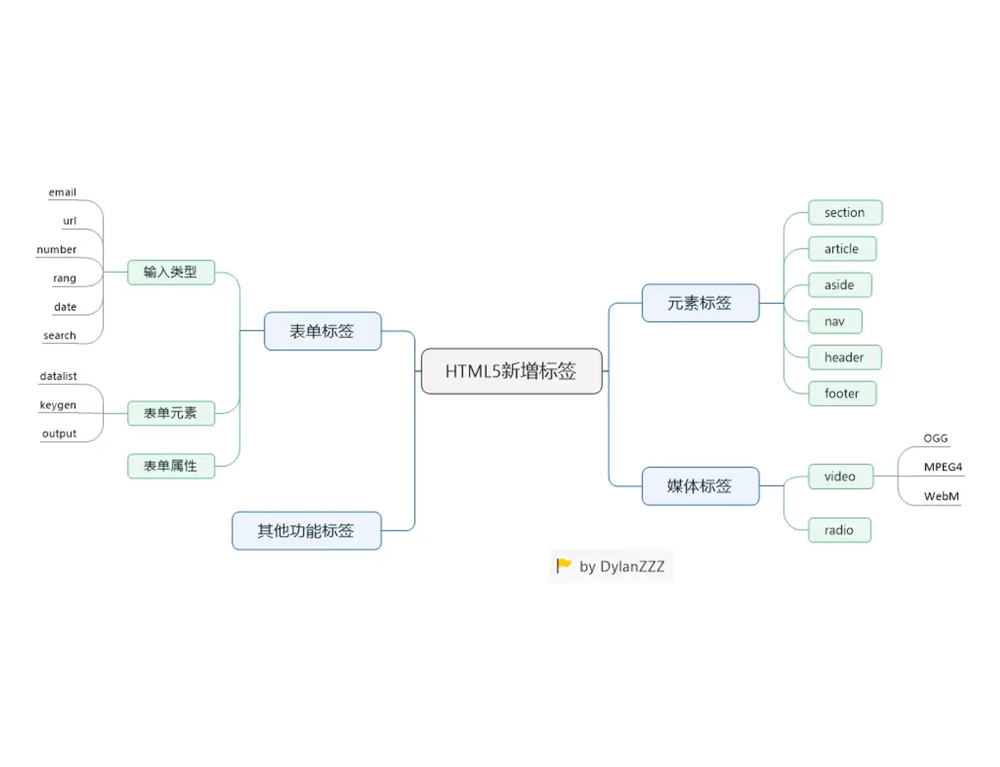

<p align='center'></p>

<p align='center'></p>

<p align='center'></p>

<p align='center'></p>


# Note

## Final_Tutorial (`14/12/2023`)

### git command练习
[git command练习](https://github.com/eficode-academy/git-katas/blob/master/basic-staging/README.md)<br>


### 前端
#### html
##### 标签

<p align='center'></p>

- 网页结构
```html
<html>
  <head></head> //放入外部引用链接，以及媒体流，title，图标等不会显示在网页上的元素
  <body></body> //会显示在页面本身的块
</html>
```

##### dom
- dom tree（html即由无数个dom组成的树结构，一对多，有严格的父子关系）

##### 语义化
- 更容易被搜索引擎收录
- 更容易让屏幕阅读器读出网页内容

#### css
##### 选择器
- #id{}
- .class{}
- 优先级： inline-style > id selector > class selector > tag selector

##### 布局
###### 单位
- block的宽高，字体单位：px rem em, vw, vh, %
- 颜色单位：rgb, rgba, #XXXXXX

###### 元素模式
- 块级元素block: div （默认转行）
- 行内元素inline: p （默认不转行）
- 行内块元素inline-block: img （转行的，但是是行内元素）

#### js
##### dom
###### 方法
```js
dom.appendChild('')
dom.addClassList //涉及样式控制
```

###### 5种选择器
- 注意驼峰式命名
```js
dom.getElementById('') //
dom.querySelector('') // class通过'.'抓取/ id通过'#'抓取 ，意为返回第一个match的dom
dom.querySelector('') // class同样通过'.'抓取，此时返回的是所有match的dom，即一个array[]
dom.getElementByTagName()
dom.getElementByClassName()
```

##### eventListener
```js
dom.eventListener('click', function) //控制网页交互
dom.onClick()
```

##### 数据类型
###### 基础数据类型
- number
- string
- null
- undefined
- boolean
- 特点：一眼能看出数据内容、类型，复制的值的改动不会改变原值

###### 非基础数据类型(object)
- date
- object
- array
- 特点：一个值中包含多个值，复制的值产生改动可能会改变原值

##### function
###### 作用域(let/const var)
```js
function() {
  const a,b,c      // 大括号内的定义，外部是拿不到的
}
if() {
}
```

##### call request
- Promise有状态之分 => Pending(默认)/ success/ reject
```js
async function() {
  const response = await fetch(url)  //通过await不结束一直到success或reject的状态才停止
  const response = await axios.get(url)
}
function() {
  fetch(url).then((RES) =>

  ).catch(error => {})
}
```

### 后端
#### npm
- 包管理工具
- 通过它来进行包管理，依赖管理，执行软件运行，版本安装等等

#### 包版本
- 1.1.1
- 数字越前，版本越大
- '^' 符号代表接受版本更新

#### status code
- 每一个数字开头代表一个方向
- 2**: 成功
- 4**: client error 404 (前端这边操作得到的错误)
- 5**: server error 5 (后端服务器或者网络错误)

#### CRUD
- 通过以下常用方法对数据库进行增、删、改、查的操作
- create
- read
- update
- delete

#### route
- 路由的设计
- 当有多模块的设计时，就需要有route的管理以实现模块化，帮助我们更好的阅读

### git
#### 个人project常用指令
```git
git clone
git init

git remote origin(name) url //链接到远程仓库

git add .
git commit -m 'asdas'
git push

git log //检查所有commit的记录
git reset commitId
git reset --hard commitId //适用于commitId已经push到远程时强制回退
git rebase -i HEAD~n //合并n条message

git diff //比较文件的改变
```

#### 团队project
```git
git branch //log本地repo所有的branch
git branch -d branchA //删除A branch
git branch -m branchB //修改当前branch name为B
git checkout branchB //切换到branch B
git checkout -b newBranch //创建新的branch并切换到此branch
git merge branchB //当前在branch A，合并branch B内容到branch A （--squash）
```
