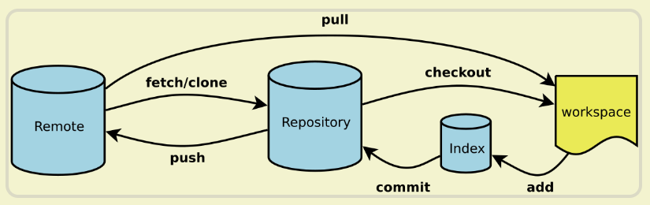

# Note

## Git_Shell (29/11/2023)


### 为什么要使用Git
> Git是一种分布式版本控制工具. 它具备以下几种功能
- 撤销改动和回退版本(snapshot)
- 回溯历史(A complete long-term history of every file that provides traceability)
- 小组合作(via branching strategies)
- 备份

### Git和GitHub
- Git是一个备份工具，通过git传送到gitup上备份
- GitHub是一个平台，用来接收Git传送的备份文件

### 设置Git
```bash
git config --global user.name "<Your-Full-Name>"
git config --global user.email "<your-email-address>"
git config --global color.ui auto
git config --global merge.conflictstyle diff3
git config --global core.editor "code --wait"
```

### 创建版本库
```bash
git init
git clone (remote respository only)
```

### Git的三个分区
<p align='center'></p>

1. 工作区 (working directory)<br>
`操作系统上的文件，所有代码开发编辑都在这个上面完成` 
2. 暂存区 (index or staging area)<br>
`一个暂存区域，会在下一次commit被提交到Git仓库` 
3. Git仓库 (git repository)<br>
`由Git object记录着每一次提交的快照，以及链式结构记录的提交变更历史`

### 注意事项
`commit要有意义, 不要用以下的语句来命名`
- *Add 1.txt 2.txt*
- *Update 1.txt 2.txt*


