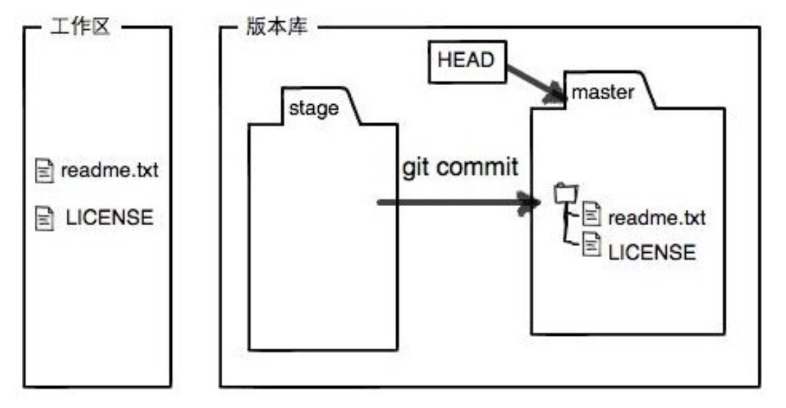

<p align='center'></p>

# Note

## Git_Shell (29/11/2023)

### 为什么要使用Git
> Git是一种分布式版本控制工具. 它具备以下几种功能
- 撤销改动和回退版本(snapshot)
- 回溯历史(A complete long-term history of every file that provides traceability)
- 小组合作(via branching strategies)
- 备份

### Git和GitHub
- Git是一个备份工具，通过git传送到gitup上备份
- GitHub是一个平台，用来接收Git传送的备份文件

### 设置Git
```bash
git config --global user.name "<Your-Full-Name>"
git config --global user.email "<your-email-address>"
git config --global color.ui auto
git config --global merge.conflictstyle diff3
git config --global core.editor "code --wait"
```

### 创建版本库
```bash
git init
git clone (remote respository only)
```

### Git的三个分区
<p align='center'></p>

1. 工作区 (working directory)<br>
`操作系统上的文件，所有代码开发编辑都在这个上面完成`

<p align='center'></p>

3. 暂存区 (index or staging area)<br>
`一个暂存区域，会在下一次commit被提交到Git仓库`

<p align='center'></p>

5. Git仓库 (git repository)<br>
`由Git object记录着每一次提交的快照，以及链式结构记录的提交变更历史`

### 注意事项
`commit要有意义, 不要用以下的语句来命名`
- *Add 1.txt 2.txt*
- *Update 1.txt 2.txt*

### 一些常用的指令
`git init`: 在当前目录新建一个Git代码库<br>
`git status`: 命令可以让我们时刻掌握仓库当前的状态<br>
`git diff`: 显示暂存区和工作区的差异<br>
`git log`: 命令显⽰从最近到最远的提交⽇志<br>
`git add .`: 添加当前目录的所有文件到暂存区<br>
`git commit -m [message]`: 提交暂存区到仓库区<br>
`git log -5 --pretty --oneline`: 显示过去5次提交<br>
`git log --oneling --graph`: 作用与上一条代码类似，但版本左边会有'*'号，多人合作时方便用<br>
`git checkout [file]`: 重置暂存区的所有文件到工作区，但注意如果此时你的文件本来就在工作区，即为丢弃工作区的修改<br>
`git reset HEAD [file]`: 重置暂存区的指定版本文件放回到工作区<br>
`git reset --hard [commit]`: 重置当前分⽀的HEAD为指定commit，同时重置暂存区和⼯作区，与指定commit⼀致<br>
`git reset --hard HEAD^^^ or HEAD~3 or 指定版本号`: 撤销到3个版本之前<br>
`git branch`: 列出所有本地分⽀<br>
`git checkout -b [branch]`: 新建一个分支，并切换到该分支<br>
`git checkout master`: 切换到主分支<br>
`git checkout [branch-name]`: 切换到指定分支，并更新工作区<br>
`git branch -D [branch-name]`: 删除分⽀<br>

### 链接到远程repo
#### 添加远程仓库Create repo
1. Login Github到个人主页
2. Repositories -> New -> 填信息 -> Create repository
3. 将网页提供的command复制粘贴到本地的控制台
4. `git remote -v`: 查看链接状态
5. `git pull`: 注意将本地的代码上传前先打这个代码，以从远程下载最新版代码
6. `git push`: 将本地代码上传


