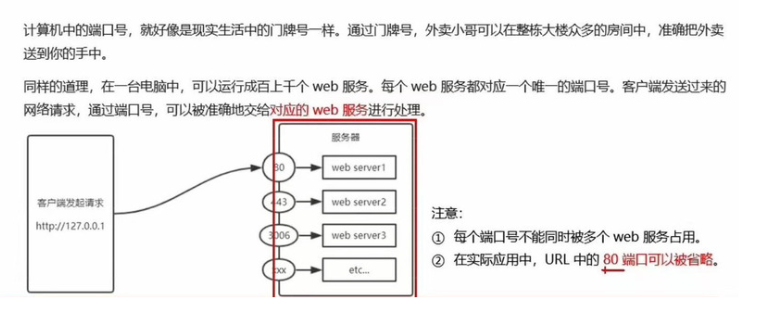

# Note


## Node_2(`12/11/2023`)

### fs模块
#### 什么是fs文件系统模块
- 是Node.js官方提供的、用来操作文件的模块。它提供一系列的方法和属性，满足用户对文件的操作需求
<br>例如
<br>``
```js
// 使用fs方法前, 先要导入fs
const fs = require('fs');
```
#### 读取指定文件中的内容
- fs.readFile() 的语法格式
```js
  fs.readFile(path[, options], callback)
//1. path: 路径
//2. options: 编码格式(可选)
//3. callback: 回调函数
```
- fs.readFile() 的示例代码
```js
//导入fs模块
const fs = require('fs');
//参数1：path，参数2：编码格式， 参数3：callback 拿到读取失败和成功的结果
fs.readFile('./files/1.txt', 'utf8', function(err, data){
    //如果读取成功，err is null，data hello node
    //如果读取失败，err is an object, data is undefined
    console.log('err', err);
    console.log('data', data);
    
})
//注意运行时要打开到js文件所在的那一层文件夹再运行

```
- 判断文件是否读取成功
```js
//导入fs模块
const fs = require('fs');
//参数1：path，参数2：编码格式， 参数3：callback 拿到读取失败和成功的结果
fs.readFile('./files/1.txt', 'utf8', function(err, data){
    if(err){
        console.log('err', err)
    }else{
        console.log('data', data)
    }
    //写法2
    //if(err){
        //console.log('err', err)
    //}
    //console.log('data', data)
})
```
#### 向指定的文件中写入内容
- fs.writeFile() 的语法格式
```js
fs.writeFile(path, data[, options], callback)
//1.必选参数，指定一个文件路径的字符串
//2.必选参数，表示要写入的内容
//3.可选参数，表示什么格式，默认是utf8
//4.必选参数，文件写入完成后回调函数
```
- fs.writeFile() 的示例代码
```js
const fs = require('fs');

fs.writeFile('./files/2.txt', 'Learning node', function(err){
    console.log(err)
})
```
- 判断文件是否写入成功
```js
const fs = require('fs');

fs.writeFile('./files/3.txt', 'I like node', function(err){
    console.log('err', err)//写入成功，err is null
    // if(err){
    //     console.log('err', err)
    // }else{
    //     console.log('write file succeed')
    // }
    if(err){
        return console.log('err', err);
    }//注意这里加个return表示代码进行到这里结束
    console.log('write file succeed')
})
```
#### read和writer_file小练习
- 将一行的内容转化为分行显示，并修改分隔符
```js
// Ben:99 
// Jane:100 
// John:80 
// Chris:66 
// Andrew:88
//1. read score.txt
//2. split to array
//3. replace = with :
//4. convert array to string
//5. write the updated score to updatedScore.txt
//提示：做一步测一步最好
const fs = require('fs');
fs.readFile('./score.txt', 'utf8', function(err, data){
    if(err){
        return console.log('read file failed', err.message)
    }
    console.log('read file succeed', data, typeof data)
    //read file succeed Ben=99 Jane=100 John=80 Chris=66 Andrew=88 string
    //2. split to array
    const arr = data.split(' ')
    console.log('arr',arr)
    //3. replace = with :
    let newArr = [];
    arr.forEach(function(item){
        newArr.push(item.replace('=',':'));
    })
    console.log('newArr', newArr)
    //4. convert array to string
    const str = newArr.join('\r\n');
    console.log('str', str)
    //5. write the updated score to updatedScore.txt
    fs.writeFile('./undatedScore.txt',str ,function(err){
        if(err){
            return console.log('write file filed', err.message)
        }
        console.log('write file succeed')
    })
})
```


### http模块及创建web服务器
#### 什么是http模块
- 客户端：网络节点中负责消费的电脑叫客户端；负责对外提供网络资源的叫服务器
- http模块是Node.js官方提供的，用来创建web服务器的模块
#### http模块的作用
- 服务器和普通电脑不同，安装了web服务器软件，例如IIS、Apache等
- 在Node.js中不需要三方web服务器软件，可以直接运用自带的http模块提供web服务
#### 服务器相关概念
- Ip地址：每台计算机唯一地址，通常用“点分十进制”，例：（192.168.1.1）
  <br>注意：每台web服务器都有自己的IP地址，测试时可输入(127.0.0.1)来访问
- 域名和域名服务器
  <br>IP地址不直观不方便记忆，于是有了域名(Domain Name)地址
  <br>IP地址和域名是一一对应，域名服务器就是提供IP地址和域名之间的转化服务的服务器
  <br>开发测试期间，127.0.0.1对应的域名是localhost，使用效果没有区别
- 端口号
<p align='center'></p>


### npm包管理和使用
- 为了更方便更快的开发
