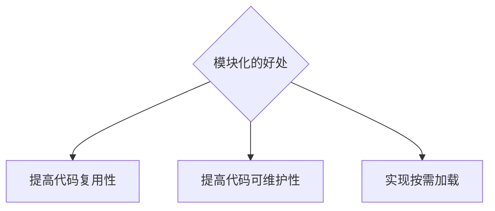
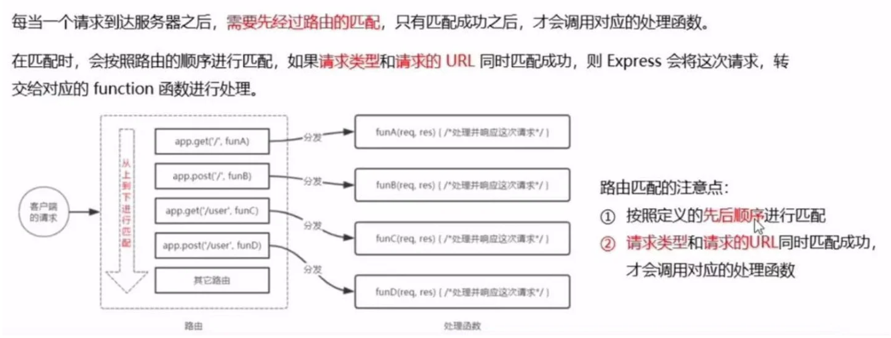

# Note


## Nodejs_3(`15/11/2023`)

### 模块化
#### 什么是模块化
- 编程领域的模块化，就是遵守固定的规则，把大文件拆成独立并互相依赖的小模块
- 代码拆分的好处


<hr>

#### 模块的分类
- 内置模块（由Node.js官方提供，如fs\path\http等）
- 自定义模块
- 第三方模块

<hr>

#### 加载模块
```js
// 1.加载内置的fs模块
const fs = require('fs')

// 2.加载用户自定义模块
const custom = require('./custom.js')

// 3.加载第三方模块
const moment = reqiure('moment')
```

<hr>

#### 什么是模块作用域
> 自定义模块中定义的变量,方法只能在模块内被访问

Node.js -> CommonJS的规范
- 默认用module.exports/require()

<hr>

#### 模块作用域的好处
> 防止全局变量污染的问题
- 'reg.js'和'login.js'是作为独立的模块被引入的
- 这两个文件各自封装了其变量和函数,即使两个模块内部有相同的变量名，它们也不会互相影响
<p align='center'></p>

<hr>

#### module对象
- 每个.js自定义模块中都有一个module对象，它里面存储了和当前模块有关的信息

<hr>

#### module.exports对象
- 自定义模块中，可以使用module.exports对象，将模块内的成员共享出去，供外界使用
- 用require()方法导入自定义模块是，得到的就是module.exports所指向的对象

<hr>

#### 共享成员时的注意点及使用误区
- 使用require()方法导入模块时，导入的结果，永远以module.exports指向的对象为准
- exports和module.exports的使用误区
<p align='center'></p>

<hr>

#### Node.js模块化规范
> Node.js遵循了CommonJS模块化规范，CommonJS规定了模块的特性和各模块之间如何相互依赖<br>
<br>
CommonJS规定：

- 每个模块内部，module变量代表当前模块
- module变量是一个对象，它的exports属性（即module.exports）是对外的接口
- 加载某个模块，其实是加载该模块的module.exports属性，require()方法用于加载该模块


<hr>
<hr>

### Express
#### Express简介
- WEB服务器: http -> createServer
- API服务器: Express (简化了http内置模块, 使用express更方便)

API: Application Programming Interface
> 连接前后端的桥梁
<p align='center'></p>

<hr>

#### 进一步理解Express
- 问：不使用Express能否创建Web服务器？
- 答：能，使用Node.js提供的原生http模块即可

<hr>

- 问：有了http内置模块，为什么还要用Express？
- 答：http内置模块用起来复杂，开发效率低；Express基于http进一步封装出现，能提高开发效率

<hr>

- 问：http内置模块与Express的关系？
- 答：类似Web.API和jQuery的关系。后者是基于前者进一步封装出来的

<hr>


#### 创建基本的web服务器
- json：数据传送格式（key-value格式），优点：兼容性好，解析速度快，语法简单
- package-lock作用：记录，描述文件包数据来源、地址、版本号等等，保证依赖统一兼容
- 版本号：三部分，从右到左由小变大（major）
- devDependencies:开发阶段的包一般安装在这里


```js
//npm init
//npm install express, npm i express
//npm i nodemon -D
const express = require('express');
//create web server
const app = express();
const PORT = 8000;

```

<hr>

#### 监听GET请求
```js
//npm init
//npm install express, npm i express
//npm i nodemon -D
const express = require('express');
//create web server
const app = express();
const PORT = 8000;
app.get('/user', function(req,res){
    res.send({name:'Chris',age:20})
})


app.listen(PORT, function(){
    console.log('Sever is running on http://localhost:8000')
})
```

<hr>

#### 监听POST请求
```js
//npm init
//npm install express, npm i express
//npm i nodemon -D
const express = require('express');
//create web server
const app = express();
const PORT = 8000;


app.post('/user', function(req,res){
    res.send('request succeed')
})

app.listen(PORT, function(){
    console.log('Sever is running on http://localhost:8000')
})
```

<hr>

#### 获取URL中携带的查询参数

<p align='center'></p>

```js
//npm init
//npm install express, npm i express
//npm i nodemon -D
const express = require('express');
//create web server
const app = express();
const PORT = 8000;
app.get('/user', function(req,res){
    res.send({name:'Chris',age:20})
})

app.post('/user', function(req,res){
    res.send('request succeed')
})

app.get('/', function(req,res){
    console.log('query',req.query);
    res.send(`${req.query.name} is ${req.query.age}`)
})
//注意这里的request的指令记得两边的value都要fetch，不然就会出现undefined的情况
//like:http://localhost:8000/?name=Chris  ==>  Chris is undefined
//正确方法是：http://localhost:8000/?name=Chris&age=20

app.listen(PORT, function(){
    console.log('Sever is running on http://localhost:8000')
})
```

<hr>

#### 获取URL中的动态参数
```js
//npm init
//npm install express, npm i express
//npm i nodemon -D
const express = require('express');
//create web server
const app = express();
const PORT = 8000;
app.get('/user', function(req,res){
    res.send({name:'Chris',age:20})
})

app.post('/user', function(req,res){
    res.send('request succeed')
})

app.get('/', function(req,res){
    console.log('query',req.query);
    res.send(`${req.query.name} is ${req.query.age}`)
})

app.get('/profiles/:name', function(req,res){
    //:name 是个动态参数
    console.log('name',req.params.name)
    res.send(req.params)
})

app.get('/users/:id/:room',function(req,res){
    console.log(req.params)
    console.log('id',req.params.id)
    console.log('room',req.params.room)
    res.send(req.params)
})

app.listen(PORT, function(){
    console.log('Sever is running on http://localhost:8000')
})
```


### Express中的路由
#### 路由的概念
- 在Express中，路由是指客户端的请求与服务器处理函数之间的映射关系
- Express中的路由分3个部分：请求的类型、请求的URL地址、处理函数，格式如下
```js
app.METHOD(PATH, HANDLER)
```
- 路由的匹配过程

<p align='center'></p>

<hr>

#### 路由的使用
- 创建API路由模块
```js
const express = require('express');
const router = require('./router');
const userRouter = require('./userRouter');
//create a web server
const app = express();
//配置解析body数据的中间件
app.use(express.json())
//加载路由模块
app.use('/api', router);
app.use('/api', userRouter);

const PORT = 8000;
app.listen(PORT, function(){
    console.log('Server is running on http://localhost:8000')
})
```
- 编写GET/POST接口
```js
const express = require('express');
//create user router
const userRouter = express.Router();

userRouter.post('/user', function(req,res){
    //req.body
    const body = req.body;
    console.log('body', body);
    res.send({
        status:0,
        msg:'Add user successfully',
        data:body
    })
})

module.exports = userRouter;
```
