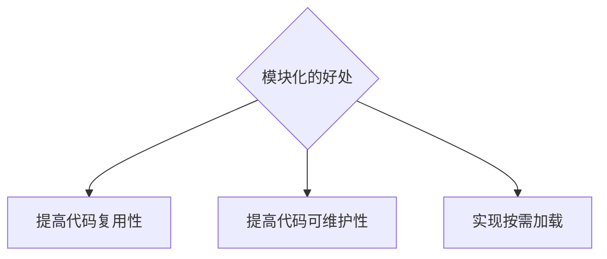

# Note

## Nodejs_3(`15/11/2023`)

### 模块化的概念
#### 什么是模块化
- 编程领域的模块化，就是遵守固定的规则，把大文件拆成独立并互相依赖的小模块
- 代码拆分的好处

### 模块的分类和require的使用

### 模块作用域和module对象

### module.exports的使用

### CommonJS模块化规范

### 认识express
