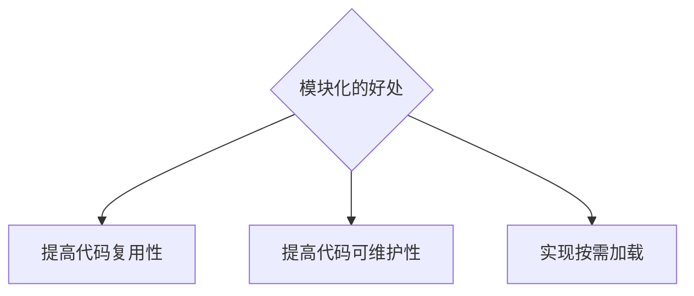

# Note


## Nodejs_3(`15/11/2023`)

### 模块化
#### 什么是模块化
- 编程领域的模块化，就是遵守固定的规则，把大文件拆成独立并互相依赖的小模块
- 代码拆分的好处



#### 模块的分类和require的使用
#### 模块的分类
- 内置模块（由Node.js官方提供，如fs\path\http等）
- 自定义模块
- 第三方模块
#### 加载模块
```js
// 1.加载内置的fs模块
const fs = require('fs')

// 2.加载用户自定义模块
const custom = require('./custom.js')

// 3.加载第三方模块
const moment = reqiure('moment')
```

#### 模块作用域和module对象
##### 什么是模块作用域
##### 模块作用域的好处
##### module对象


### module.exports的使用
#### module.exports对象
#### 共享成员时的注意点
#### 使用误区


### CommonJS模块化规范


### express
#### Express简介
#### 进一步理解Express
#### 创建基本的web服务器
- json：数据传送格式（key-value格式），优点：兼容性好，解析速度快，语法简单
- package-lock作用：记录，描述文件包数据来源、地址、版本号等等，保证依赖统一兼容
- 版本号：三部分，从右到左由小变大（major）
- devDependencies:开发阶段的包一般安装在这里
- API：连接前后端的桥梁

<p align='center'></p>

```js
//npm init
//npm install express, npm i express
//npm i nodemon -D
const express = require('express');
//create web server
const app = express();
const PORT = 8000;

app.listen(PORT, function(){
    console.log('Sever is running on http://localhost:8000')
})
```


#### 监听GET请求
```js
//npm init
//npm install express, npm i express
//npm i nodemon -D
const express = require('express');
//create web server
const app = express();
const PORT = 8000;
app.get('/user', function(req,res){
    res.send({name:'Chris',age:20})
})


app.listen(PORT, function(){
    console.log('Sever is running on http://localhost:8000')
})
```

#### 监听POST请求
```js
//npm init
//npm install express, npm i express
//npm i nodemon -D
const express = require('express');
//create web server
const app = express();
const PORT = 8000;


app.post('/user', function(req,res){
    res.send('request succeed')
})

app.listen(PORT, function(){
    console.log('Sever is running on http://localhost:8000')
})
```

#### 获取URL中携带的查询参数

<p align='center'></p>
