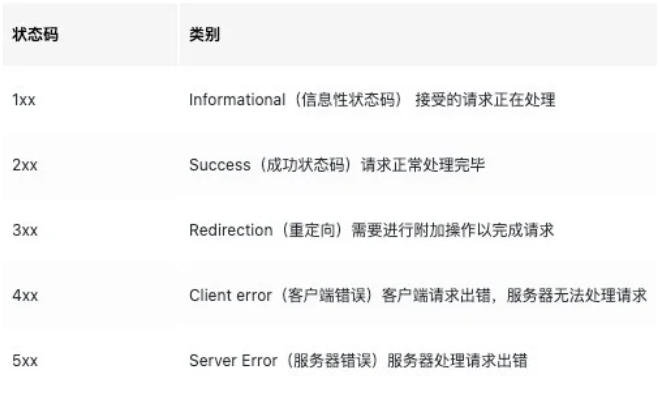
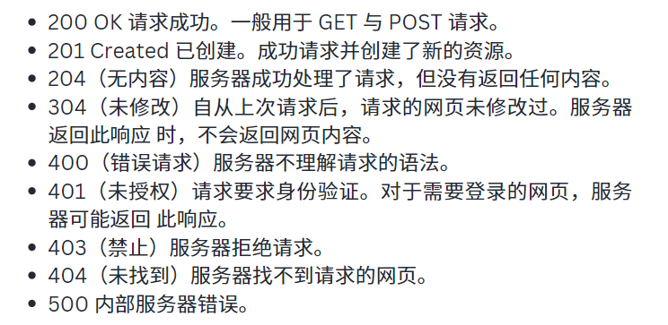
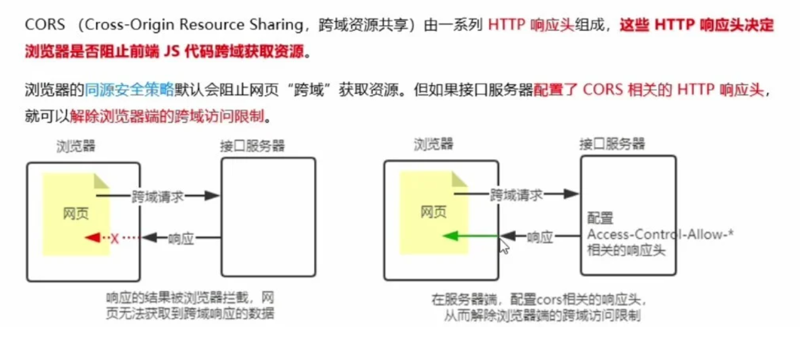
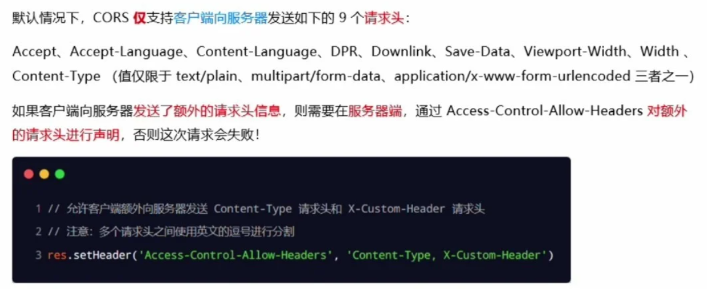
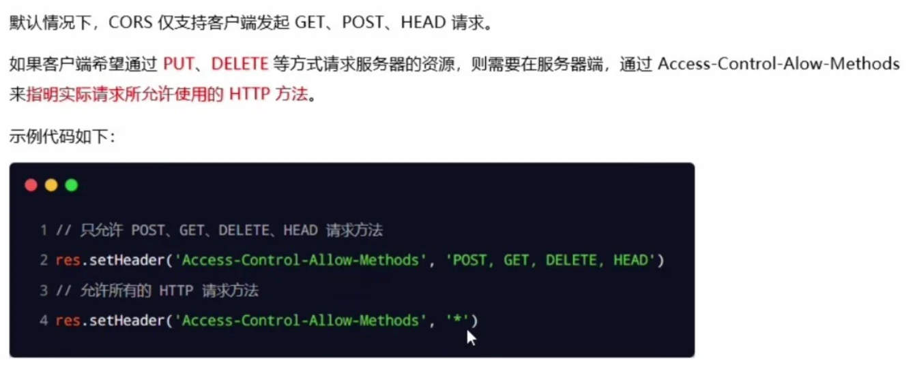
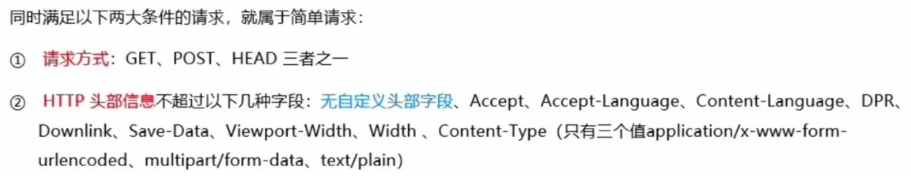

- [Note](#Note)
  - [Nodejs_4 (`19/11/2023`)](#nodejs_4-19112023)
    - [状态码](#状态码)
    - [托管静态资源](#托管静态资源)
      - [express.static()](#express-static)
      - [托管多个静态资源目录](#托管多个静态资源目录)
      - [挂载路径前缀](#挂载路径前缀)
    - [CORS跨域资源共享](#CORS跨域资源共享)
      - [接口的跨域问题](#接口的跨域问题)
      - [使用cors中间件解决跨域问题](#使用cors中间件解决跨域问题)
      - [什么是cors](#什么是cors)
      - [cors注意事项](#cors注意事项)
      - [cors响应头部](#cors响应头部)
        - [Acess-Control-Allow-Origin](#Acess-Control-Allow-Origin)
        - [Acess-Control-Allow-Origin-Headers](#Acess-Control-Allow-Origin-Headers)
        - [Acess-Control-Allow-Origin-Methods](#Acess-Control-Allow-Origin-Methods)
        - [简单请求](#简单请求)
        - [预检请求](#预检请求)
        - [简单请求和预检请求的区别](#简单请求和预检请求的区别)
    - [前后端组合练习](#前后端组合练习)
      - [cors练习](#cors练习)
      - [创建一个带有input内容的box，能添加、删除字段或列表](#创建一个带有input内容的box能添加删除字段或列表)       

# Note

## Nodejs_4 (`19/11/2023`)

### 状态码
- 主要状态码类型
<p align='center'></p>

- 一般常见代码状态
<p align='center'></p>

### 托管静态资源

#### express.static()
- express提供的一个函数，可以方便的创建一个静态资源服务器
```js
app.use(express.static('public'))
```
- 注意：express在指定静态目录中查找文件，存放静态文件的目录名不会出现在URL中
> `http://localhost:3000/images/bg.jpg

#### 托管多个静态资源目录
```js
app.use(express.static('public'))
app.use(express.static('files'))
```

#### 挂载路径前缀
- 可在静态资源访问路径之前，挂载路径前缀
```js
app.use('/public', express.static('public'))
```


### CORS跨域资源共享
#### 接口的跨域问题
- 之前编写的GET和POST接口接口，存在不支持跨域请求的问题
- 解决方案
> 1. CORS（主流解决方案）
> 2. JSONP（有缺陷的解决方案：只支持GET请求）
#### 使用cors中间件解决跨域问题
- cors是Express的一个三方中间件
- 步骤：
> 1. 运行npm install cors 安装中间件
> 2. 使用const cors = require（'cors'）导入中间件
> 3. 在路由之前调用app.use(cors())配置中间件
#### 什么是cors
<p align='center'></p>

#### cors注意事项
- cors主要在服务器端进行配置，客户端浏览器无须做任何额外的配置，即可请求开启了cors的接口
- cors在浏览器中有兼容性，但对浏览器有一定要求，需要支持XMLHttpRequest Level2

#### cors响应头部
##### Acess-Control-Allow-Origin
- 响应头部可以携带 Acess-Control-Allow-Origin 字段
- 其中，origin参数的值指定了允许访问该资源的外域URL
```js
Acess-Control-Allow-Origin: <origin> | *
```
- 如果指定了Acess-Control-Allow-Origin字段的值为通配符'*'，表示允许来自任何域的请求
```js
res.setHeader('Acess-Control-Allow-Origin', '*')
```
##### Acess-Control-Allow-Origin-Headers
<p align='center'></p>

##### Acess-Control-Allow-Origin-Methods
<p align='center'></p>

##### 简单请求
<p align='center'></p>

##### 预检请求
- 只要符合以下任何一个条件的请求，都需要进行预检请求：
> 1. 请求方式为GET、POST、HEAD之外的请求Method类型
> 2. 请求头中包含自定义头部字段
> 3. 向服务器发送了application/json格式的数据

##### 简单请求和预检请求的区别
- 简单请求：客户端与服务器之间只会发生一次请求
- 预检请求：客户端与服务器之间会发生两次请求，OPTION预检请求成功之后，才会发起真正的请求

### 前后端组合练习
#### cors练习
- index.js
```js
//npm init
//npm i express
//npm i nodemon -D
//如果端口被占用,1.先查询：lsof -i tcp:80
//2.再删除：kill -9 PID
const express = require('express');
const router = require('./router');
const cors = require('cors');
//create a new server
const app = express();
//把public目录下所有文件提供为静态资源，public不会出现在url中
//http://localhost:80/1.html
//http://localhost:80/1.html
app.use('/profiles', express.static('./public'));
app.use('/users',express.static('./files'));
//一定要在路由加载之前，配置cors，来解决接口跨域问题
app.use(cors())
app.use(router);

app.listen(80,function(){
    console.log('Server is running on http://127.0.0.1:80')
})
```
- router.js
```js
const express = require('express');
const router = express.Router();

router.get('/users',function(req,res){
    res.send({status:0,message:'get users succeed'})
})

module.exports = router;
```


#### 创建一个带有input内容的box，能添加、删除字段或列表
- server.js
```js
//npm init
//npm i express
//npm i nodemon -D
const express = require('express');
const router = require('./router');
//create a web server
const app = express();
app.use(express.json());

app.use('/api',router);


const PORT = 8080;
app.listen(PORT,function(){
    console.log('Server is running on http://localhost:8080')
})
```
- route.js
```js
const express = require('express');
//create a web server 
const router = express.Router();
let users = [
  { id: 1, name: "Ben", age: 20 },
  { id: 2, name: "John", age: 30 },
  { id: 3, name: "Chris", age: 40 },
  { id: 4, name: "Jane", age: 60 },
];
//calculate the next available user id
function getNextUserId(users){
    [1,2,3,4]
    const userIds = users.map(function(user){
        return user.id;
    })
    return Math.max(...userIds,-1)+1;
}
//GET fetch all users
router.get('/users', function(req,res){
    res.status(200).json({
        status:'success',
        message:'Retrieved users successfully',
        data:users
    })
})
//POST add a new user
router.post('/users',function(req,res){
    const newUser = req.body;
    if(!newUser.name || !newUser.age){
        return res.status(400).json({
            status:'Error',
            message:'Name and age are required'
        })
    }
    const newId = getNextUserId(users);
    let obj = {id:newId, name:newUser.name, age:newUser.age}
    users.push(obj);
    res.status(200).json({
        status:'success',
        message:'User added successfully',
        data:users
    })

})
//DELETE delete all users
router.delete('/users',function(req,res){
    users = [];
    res.status(204).send();
})
//DELETE delete user by id
router.delete('/users/:id', function(req,res){
    const userIdToDelete = parseInt(req.params.id);
    const initialUserCount = users.length;
    users = users.filter(function(user){
        return user.id !== userIdToDelete
    });
    if(users.length === initialUserCount){
        return res.status(404).json({
            status:'error',
            message:'User not found'
        })
    }
    res.status(200).json({
        status:'success',
        message:`User with ID ${userIdToDelete} delete successfully`,
        data:users
    })
})
module.exports = router;
```
