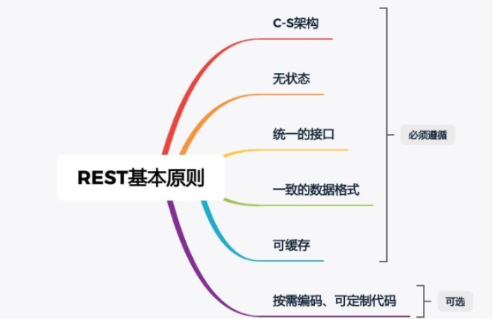
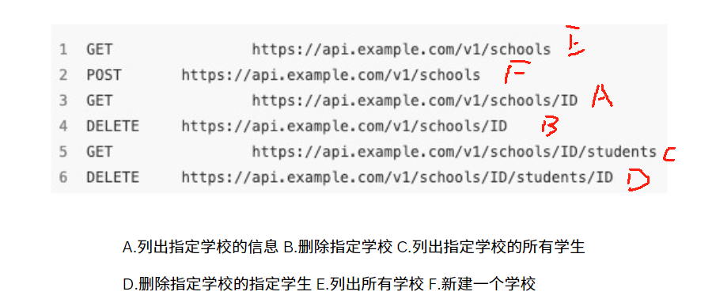
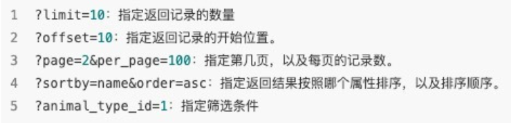
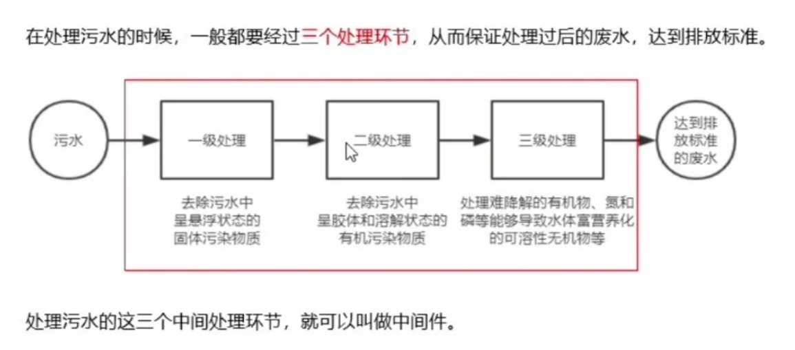
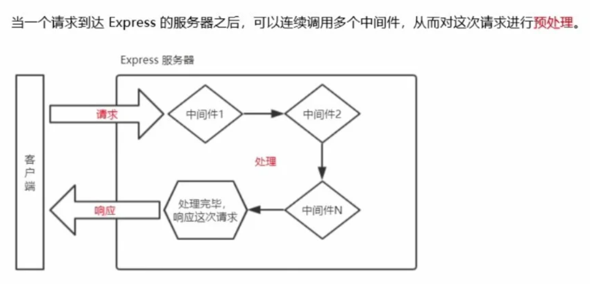
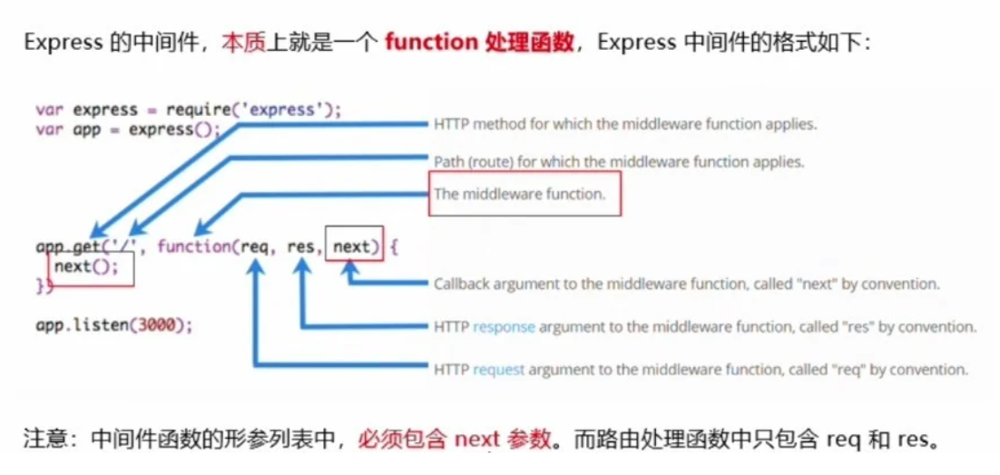
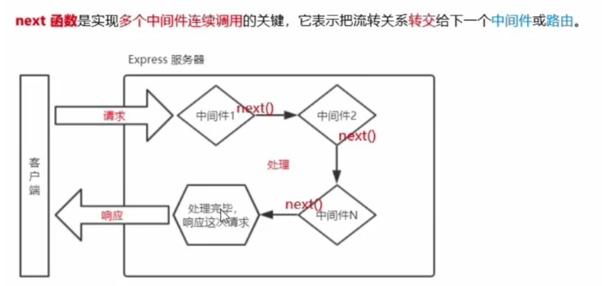
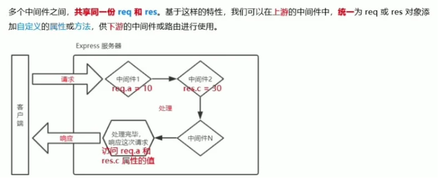

# Note

# Nodejs_5 (`22/11/2023`)

### RESTful API
#### 概念
- RESTful 是一种 API 设计风格，特点是请求、响应清晰简洁，可读性强
- RESTful 的好处：别人使用你的 API 接口时，即使不查看文档，也知道下一步应该做什么
- 大多数互联网公司并没有完全按照其规则设计，但以之为参考

<hr>

#### 基本原则

<p align='center'></p>

<hr>

#### 如何进行RESTful API设计
- 格式规范
  >根据 RFC3986 定义，URL 是大小写敏感的，为避免歧义，尽量使用小写字母
```js
/api/featured-post/                //#GOOD
/api/featured_post/                //#WRONG
```
- 协议
  >提供给用户的API，尽量使用 HTTPs 协议。使用 HTTPs 协议和 RESTfulAPI 并无关系，但是对于提高网站的安全性很重要。

- URL 中名词应该使用复数
  >所用名词往往和数据库的表名对应，数据库的表是一组记录的集合，因此 URL 中的名词表示一组资源的集合，故要使用复数<br>
  >在RESTful架构中，每个 url 代表一种资源，所以 url 中不能有动词，只能有名词
- 正确使用 HTTP 动词
  >GET：从服务器获取资源<br>
  >POST：在服务器新建一个资源<br>
  >PUT：在服务器更新资源（客户端提供改变后的完整资源）<br>
  >PATCH：在服务器更新资源（客户端提供改变的属性）<br>
  >DELETE：从服务器中删除资源

  <p align='center'></p>
- 合理使用查询参数
  <p align='center'></p>
- HTTP请求方式
  >GET：获取指定资源信息，请求参数附加在URL后，一般不超过2048字符<br>
  >POST：提交数据，一般用于表单提交，可以传输大量数据<br>
  >PUT：更新服务器上指定资源，需指定更新后的URL和资源，URL不存在会创建新资源<br>
  >DELETE：删除资源，需指定需要删除的资源的URL
- get和post请求区别
  >功能不同：get是获取数据，post是传送数据<br>
  >数据量不同：get传送数据量较小，不能超过2KB。post传送量大，一般不受限制<br>
  >安全行不同：get安全性低。post安全性高

<hr>
<br>

### 中间件
#### 中间件的概念
##### 现实生活中的例子
  <p align='center'></p>

<hr>
  
##### Express中间件的调用流程
  <p align='center'></p>

<hr>

##### Express中间件的格式
  <p align='center'></p>

<hr>

##### next函数的作用
  <p align='center'></p>

<hr>

#### Express中间件初体验
##### 定义中间件函数
  >可通过如下方式定义一个最简单的中间件函数：
```js
//常量mw所指向的，就是一个中间件函数
const mw = function (req, res, next) {
  console.log('这是一个最简单的中间件函数')
  // 注意：在当前中间件的业务处理完毕以后，必须调用next()函数
  // 表示把流转关系转交给下一个中间件或路由
  next()
}
```

<hr>

##### 全局生效的中间件
  >客户端发起的任何请求达到服务器之后都会触发的中间件，叫全局生效中间件
  >通过调用app.use(中间件函数)，即可定义一个全局生效的中间件，代码如下：
```js
// 常量mw所指向的，就是一个中间件函数
const mw = function(req, res, next)
  console.log('这是一个最简单的中间件函数')
  next()
}

// 全局生效的中间件
app.use(mw)
```

<hr>

##### 定义全局中间件的简化形式
```js
// 全局生效的中间件
app.use(function(req, res, next){
  console.log('这是一个最简单的中间件函数')
  next()
})
```

<hr>

##### 中间件的作用
  
<p align='center'></p>

<hr>

##### 定义多个全局中间件

  >可使用app.use()连续定义多个全局中间件，客户端会按照中间件定义的先后顺序一次进行调用
```js
app.use(function(req, res, next) { //第一个全局中间件
  console.log('调用了第1个全局中间件')
  next()
})
app.use(function(req, res, next) { //第二个全局中间件
  console.log('调用了第2个全局中间件')
  next()
})
app.get('/user', (req, res)=> { //请求这个路由，会依次触发上述两个全局中间件
  res.send('Home page.')
})
```

<hr>

##### 局部生效的中间件
  
  >不使用app.use()定义的中间件，叫做局部生效的中间件，代码如下：
```js
// 定义中间件函数mw1
const mw1 = function(req, res, next) {
  console.log('这是中间件函数')
  next()
}
// mw1这个中间件只在"当前路由中生效"，这种用法属于"局部生效的中间件"
app.get('/', mw1, function(req, res){
  res.send('Home page.')
})
// mw1这个中间件不会影响下面这个路由↓↓↓
app.get('/user', function(req, res){ res.send('User page') })
```

<hr>

##### 定义多个局部中间件

  >可以在路由中，通过等价的方式，使用多个局部中间件：
```js
// 以下两种写法是"完全等价"的，可以根据自己的喜好，任意选择一种方式进行使用
app.get('/', mw1, mw2, (req, res)=> {res.send('Home page.') })
app.get('/', [mw1, mw2], (req, res)=> {res.send('Home page.') })
```

<hr>

##### 了解中间件的5个使用注意事项
  
  >1.一定要在`路由之前`注册中间件<br>
  >2.客户端发送过来的请求，`可以连续调用多个`中间件进行处理<br>
  >3.执行完中间件的业务代码之后，`不要忘记调用next()函数`<br>
  >4.为了`防止代码逻辑混乱`，调用next()函数之后不要再写额外的代码<br>
  >5.连续调用多个中间件时，多个中间件之间，`共享`req和res对象


<hr>

#### 中间件的分类
##### 应用级别的中间件
- 通过app.use()或app.get()或app.post()，绑定到app实例上的中间件：
```js
// 应用级别的中间件（全局中间件）
app.use((req, res, next)=> {
  next()
})

// 应用级别的中间件（局部中间件）
app.get('/', mw1, (req, res)=> {
  res.send('Home page.')
})
```

<hr>

##### 路由级别的中间件
- 是指绑定到express.Router()实例上的中间件，用法和应用级别中间件没有任何区别
- 但是应用级别中间件时绑定到app实例上，路由级别中间件时绑定到router实例上
```js
var app = express()
var router = express.Router()

//路由级别的中间件
router.use(function(req, res next){
  console.log('Time', Date,now())
  next()
})

app.use('/', router)
```

<hr>

##### 错误级别的中间件
- 作用：专门用来捕获项目中发生的异常错误，防止项目异常和崩溃
- 格式：`必须有4个形参`，形参顺序从前到后，分别是（err, req, res, next）
```js
app.get('/', function(req, res){            // 1. 路由
  throw new Error('服务器内部发生了错误！')   // 1.1 抛出一个自定义的错误
  res.send('Home page.')
})
app.use(function(err, req, res, next){      // 2. 错误级别的中间件
  console.log('发生了错误： ' + err.message) // 2.1 在服务器打印错误信息3
  res.send('Error! ' + err.message)         // 2.2 向客户端响应错误相关的内容
})
```

<hr>

##### Express内置的中间件
- 自Express 4.16.0版本开始，Express内置了3个常用的中间件，提高开发效率：
  >`express.static`：快速托管静态资源的内置中间件（HTML文件\图片\CSS样式等）<br>
  >`express.json`：解析JSON格式的请求数据（4.16.0+版本可用）<br>
  >`express.urlencoded`：解析URL-encoded格式的请求数据（4.16.0+版本可用）
```js
// 配置解析application/json格式数据的内置中间件
app.use(express.json())
// 配置解析application/x-www-form-urlencoded格式数据的内置中间件
app.use(express.urlencoded({ extended: false }))
```

<hr>

##### 第三方的中间件
- 非官方内置的第三方开发的中间件
- 运行步骤：
  >1.运行 npm install body-parser 安装中间件<br>
  >2.使用 require 导入中间件<br>
  >3.调用 app.use() 注册并使用中间件
- 注意：Express 内置的 express.urlencoded 中间件，就是基于 body-parser 这个第三方中间件进一步封装出来的

<hr>
<br>

### 课堂练习
#### Node4中前端响应js设计
- 通过list.js的内容，使增、删、清除等指令在前端页面上显示出来
```js

function clearList(){
    const userList = document.getElementById('user_list');
    while(userList.firstChild){
        userList.removeChild(userList.firstChild)
    }
}

function appendUsers(users){
    users.forEach(function(user){
        const li = document.createElement('li');
        li.innerHTML = `${user.name} ${user.age}`;
        li.setAttribute('data-id', user.id);
        //create button
        const deleteButton = document.createElement('button');
        deleteButton.textContent = 'Delete';
        deleteButton.addEventListener('click', function(){
            deleteUserById(user.id)
        })
        li.appendChild(deleteButton);
        document.getElementById('user_list').appendChild(li)
    })
}

function getList(){
    console.log('getList fired')
    const url = 'http://localhost:8080/api/users';
    axios.get(url)
    .then(function(res){
        console.log('res', res)
        const users = res.data.data;
        clearList()
        appendUsers(users)
    })
    .catch(function(err){
        console.error('Error fetching user list:', err)
    })
}

function postUser(){
    console.log('add a user')
    const url = 'http://localhost:8080/api/users';
    const nameInput = document.getElementById('username');
    const nameValue = nameInput.value;
    const ageInput = document.getElementById('age');
    const ageValue = ageInput.value;
    console.log('value', nameValue,ageValue)
    if(!nameValue || !ageValue) return;
    const body = {
        name: nameValue,
        age: ageValue
    };
    axios.post(url,body)
    .then(function(res){
        const updatedUsers = res.data.data;
        console.log('updatedUsers', updatedUsers);
        clearList();
        appendUsers(updatedUsers);
        nameInput.value = '';
        ageInput.value = '';
    })
    .catch(function(err){
        console.error('Error adding user:', err)
    })
}

function deleteList(){
    console.log('list is deleted')
    const url = 'http://localhost:8080/api/users';
    axios.delete(url)
    .then(function(res){
        console.log('user list cleared in backend');
        getList()// retrieve user list in frontend
    })
    .catch(function(err){
        console.error('Error clearing user list:', err)
    })
}

function deleteUserById(userId){
    console.log('deleteUserById fired')
    const url =`http://localhost:8080/api/users/${userId}`;
    axios.delete(url)
    .then(function(res){
        console.log(userId + ' deleted');
        getList()//refresh the list after deletion
    })
    .catch(function(err){
        console.err(`Error deleting user with Id ${userId}`, err)
    })


}
```

<hr>

#### 中间件练习
##### 全局中间件
```js
//npm init
//npm i express
//npm i nodemon -D
const express = require('express');
const app = express();

//define a middleware function
const mw = function(req,res,next){
    console.log('This is a middleware function')
    next()
}
//把mw注册为全局中间件
app.use(mw)


//home page 
app.get('/home', function(req,res){
    console.log('home page');
    res.send('home page')
});

//user page
app.get('/users',function(req,res){
    console.log('user page');
    res.send('user page')
});

const PORT = 8000;
app.listen(PORT, function(){
    console.log('Server is running on http://localhost:8000')
})
```

<hr>

##### 获取request到达server的时间
```js
const express = require('express');
const moment = require('moment');
const app = express();
//获取request到达server的时间
//注册一个全局中间件
const mw = function(req,res,next){
    const time = moment().format();
    req.startTime = time;
    next()
}
app.use(mw);

app.get('/',function(req,res){
    console.log('startTime',req.startTime);
    res.send('request time: ' + req.startTime);
})


const PORT = 8000;
app.listen(PORT, function(){
    console.log('Server is running on http://localhost:8000')
})
```

<hr>

##### 多个中间件的应用以及调用顺序
```js
const express = require('express');
const app = express();

const mw1 = function(req,res,next){
    console.log('first middleware');
    next()
}
const mw2 = function(req,res,next){
    console.log('second middleware');
    next()
}
const mw3 = function(req,res,next){
    console.log('third middleware');
    next()
}
const mw4 = function(req,res,next){
    console.log('fourth middleware');
    next()
}
// second middleware
// first middleware
// book page 
// app.use(mw2);
// app.use(mw1);
app.get('/books',mw3,mw4,function(req,res){
    console.log('book page')
    // third middleware
    // book page
    res.send('book page')
})

app.get('/users',[mw4,mw1],function(req,res){
    // fourth middleware
    // first middleware
    // users page
    console.log('users page')//users page
    res.send('users page')
})
const PORT = 8000;
app.listen(PORT, function(){
    console.log('Server is running on http://localhost:8000')
})
```
