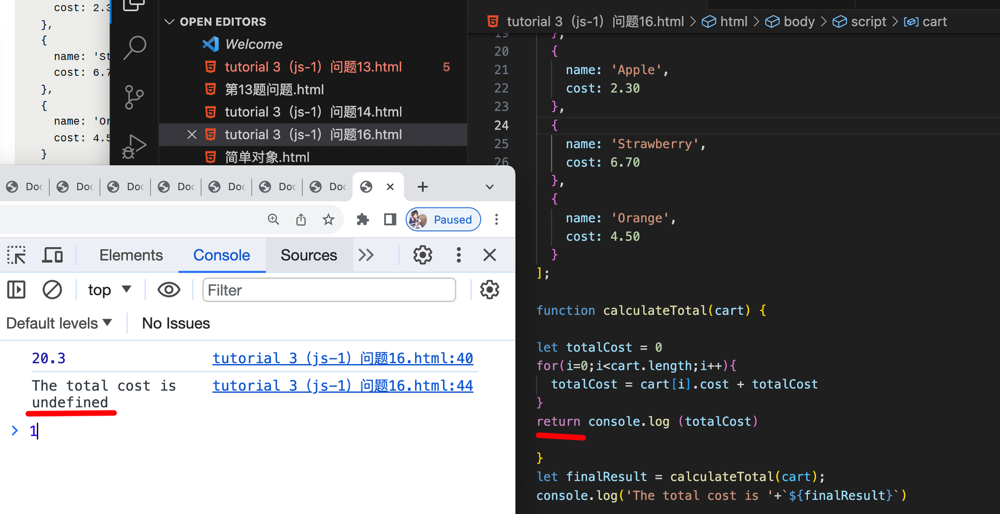
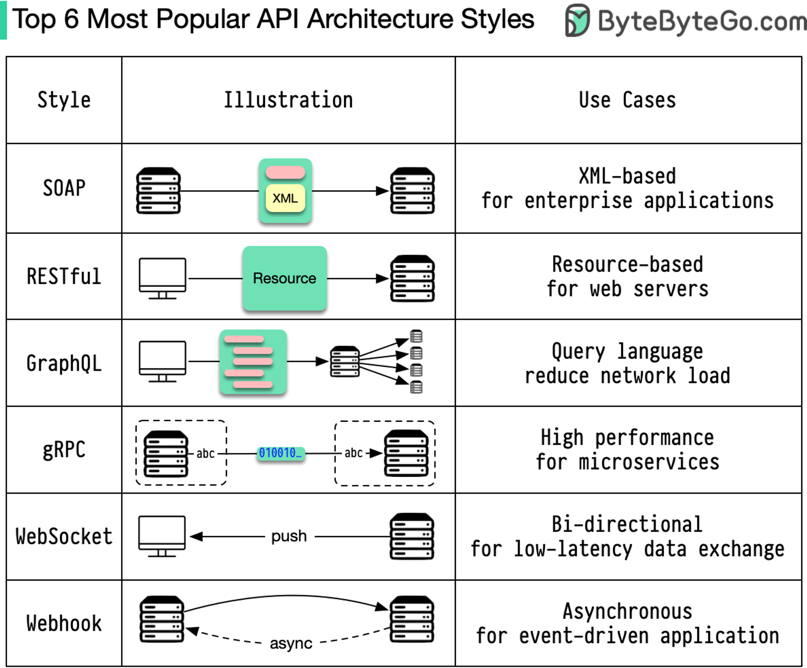
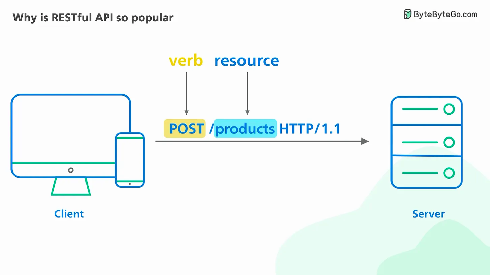
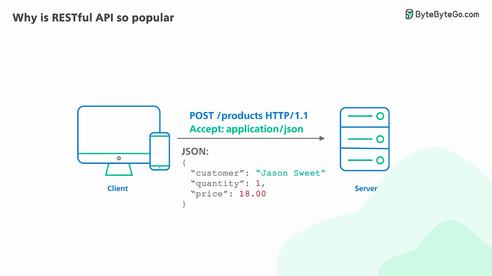
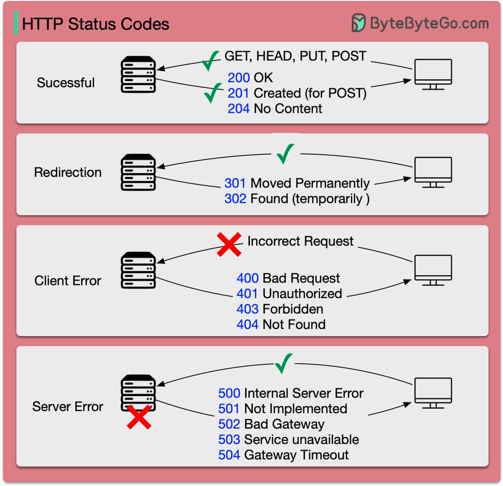
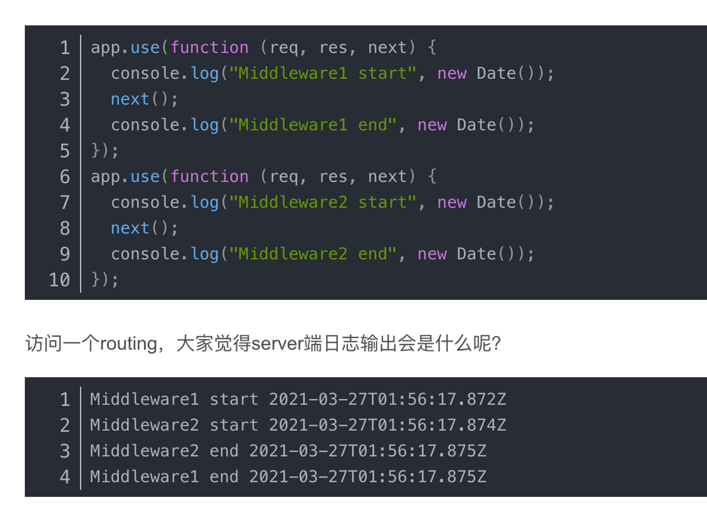
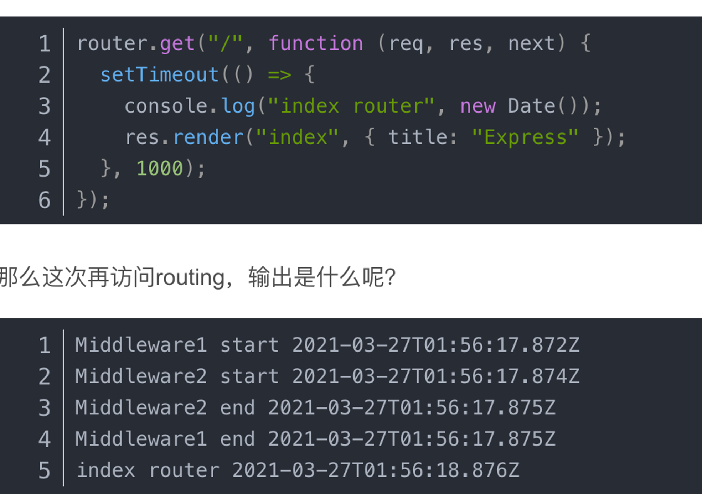

# Note

## Nodejs_tutorial2 (`23/11/2023`)

### 答疑
- why undefined?
<p align='center'></p>

`原因：console.log return的值为undefined，所以return totalCost这个方法时会输出 undefined的结果`

### 复习
#### RESTFul
<p align='center'></p>

##### url
<p align='center'></p>

##### request body
<p align='center'></p>

##### status code
<p align='center'></p>

#### 前端请求数据
##### axios
```js
const response1 = await axios.put(url,{}) //variable
const response2 = await axios.put(url,{
response1.bookingId})
```

##### ajax
##### fetch
```js
const promise = fetch(url,{
  method:'PUT',
  headers:{
    'Authorization':token
  }
  body:{
    ....
  }
}) /// 'pedning' -> 'reject'/'success'
promise.then((response)=>{
  console.log(response)
  response.bookingId
  const promise2 = fetch(url,{
    method:'PUT',
    headers:{
      'Authorization': token
    }
    body:{
      ....
    }
  })
  promise.then((response)=>{
      response.emailList
  })
})

//userId -> bookingId -> emailList
request1:userId->bookingId
request2:bookingId->emailList
```

#### 中间件
##### express:线性中间件
- next函数
```js
class MyExpress {
  private index: number
  public middleWares: ExpressMiddleWare[]
  public req: any
  public res: any
  constructor() {
    this.index = 0
    this.middleWares = []
    this.req = {}
    this.res = {}
  }
  public use(middleWare: ExpressMiddleWare) {
    this.middleWares.push(middleWare)
    return this
  }

  public next() {
    if (this.index < this.middleWares.length) {
      this.middleWares[this.index++](this.req, this.res, this.next.bind(this))
    }
  }

  public async start() {
    this.next()
  }
}
```
- 使用同步函数处理异步请求
<p align='center'></p>

`每个中间件内部都调用了next()函数，即在当前中间件完成执行之前就将控制权传递给了下一个中间件`

<p align='center'></p>

`在这个处理程序内部，有一个setTimeout函数，它通过延迟1000毫秒来推迟其回调函数的执行`<br>
`Middleware1 end出现在index router日志之前。表明事件循环在处理路由处理程序的延迟执行之前执行`


##### 两种中间件
##### cors
    
