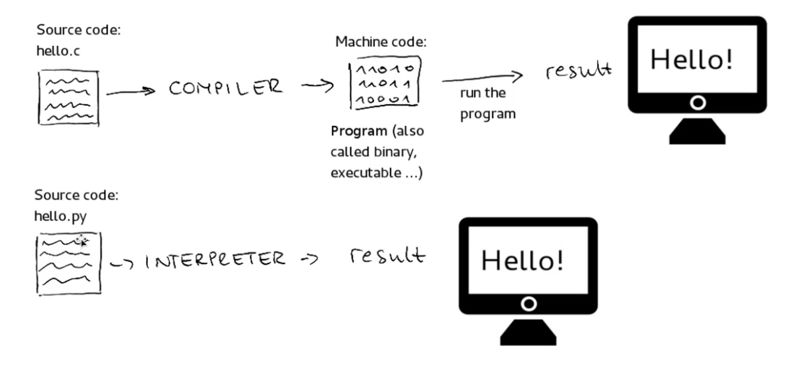
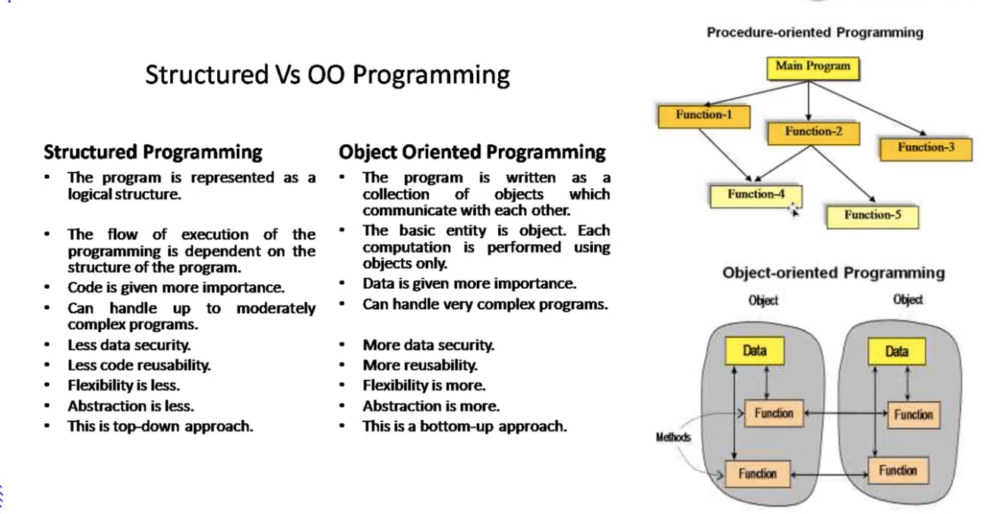

- [Note](#Note)
  - [Python Workshop1 (`06/01/2024`)](#Python-Workshop1-06012024)

# Note

## Python Workshop1 (`06/01/2024`)

### 一些学习资源
[Why Observable](https://observablehq.com) 
[Examtopics](https://examtopics.com/exams/) 
[Udemy](https://www.udemy.com/course/aws-certified-solutions-architect-associate-hands-on/) 
[Hackerrank](https://www.hackerrank.com/domains/sql) 
[Sre-work-book](https://sre.google/sre-book/table-of-contents/)

### Azure云服务及相关概念

| on premise | serverless
| :---: | :---:
| 需要申请机器 | 无需申请机器，只用设定需求

- serverless的function在不同云服务器名字不一样

| AWS | Azure
| :---: | :---:
| lamda | azure functions

- stateless和stateful的区别

| stateless | stateful
| :---: | :---:
| 1+2永远=3 | 买东西放进了购物车，此时需更新购物车状态

- decouple

  `将一个复杂的stateful的结构拆分成很多个serverless的小结构，即microservices`

### AWS certification
- Solutions Architect Associate

`这项认证主要针对那些有能力设计分布式系统的人员，能在AWS平台上构建和部署可扩展、高可用性、容错性强的系统。` 
`取得这项认证的个人可以证明他们具备在AWS上设计和部署有效、高效系统的技能，这对于希望建立或提升在云计算领域的职业生涯的人来说非常有价值。`

- 相关认证考取分类说明图

### Cloud migration
- 云迁移（Cloud migration）是指将数据、应用程序、服务或其他业务元素从一个公司的本地计算机或数据中心迁移到云计算环境的过程。
- 这个过程涉及到将业务的IT资源转移到云服务提供商（如AWS、Microsoft Azure或Google Cloud Platform）提供的远程服务器上。

### 什么是Python
*高级语言 - 高低级体现在和人类语言接近的程度*
- 高级语言的意义：
- readable：服务于让人更好的理解
- reusable：可以重复使用

1. CPU二极管 - 发送信号(1 0)
2. 汇编语言: 最快速度转化成机器语言的语言 - 直接与计算机硬件相关
3. C语言比较低级 (面向过程), 性能优化好
4. C++: 在c语言的基础上加入OOP, 加入C++的生态
5. Java/C#: 高级语言, 企业级平台会用这些
6. golang(Google开发的语言)/kotlin(语法接近Java)
7. Python/JS (TypeScript)

#### 不同语言翻译方式的区别

| Interpreted language | Compiled language
| :---: | :---:
| 边解释边执行 (如Python) | 先编译成机器语言再输出

#### 结构化编程和面向对象编程的区别

| 结构化编程(Structured) | 面向对象编程(Object-Oriented Programming)
| :---: | :---:
| C / Pascal | Java / C++ / Python / Ruby
| 程序被表示为逻辑结构 | 程序被写作一系列相互通信的对象集合
| 执行流程依赖于程序的结构 | 基本实体是对象,每个计算都是使用对象完成的
| 更重视代码 | 更重视数据
| 能处理中等复杂度的程序 | 能处理非常复杂的程序
| 数据安全性较低 | 数据安全性更高
| 代码重用性较低 | 更高的代码重用性
| 灵活性较低 | 灵活性更高
| 抽象程度较低 | 抽象程度更高
| 这是自顶向下的方法 | 这是自底向上的方法

### 为什么学Python
| 职位 | 职责 |
| :---: | :---: |
| Tech consultant | Automation (可能被code interpreter取代) |
| Business Analyst | dashboarding (tableau powerbi) |
| Data Analyst | python scripting, sql, bigquery (data warehouse) |
| Data Scientist | DA + modeling |
| SDE, software Developer(frontend/backend) | google, Django golang |
| Quantitative | c++, python |
| Data Engineer | java,python,scala,spark,hadoop,MapReduce |
| Site Reliability Engineer | 运维 (python + kotlin) |
