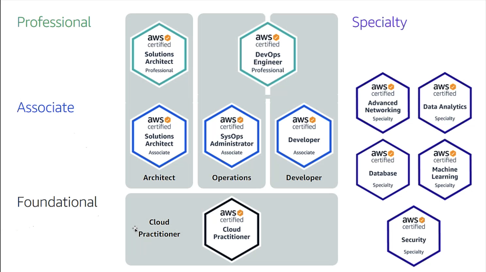
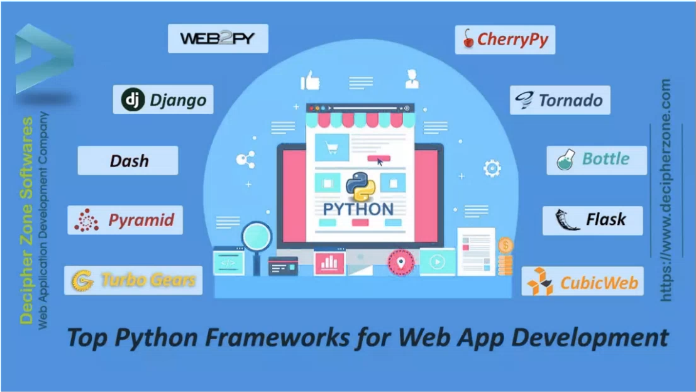
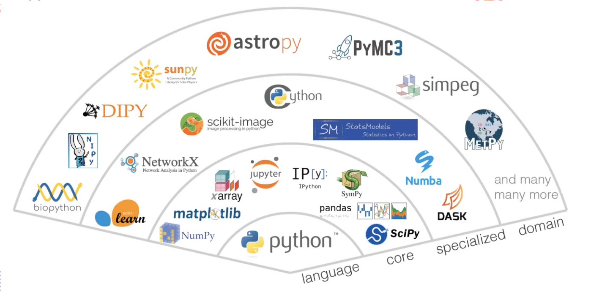

# Note

## Python Workshop1 (`06/01/2024`)

### 一些学习资源
[Why Observable](https://observablehq.com) 
[Examtopics](https://examtopics.com/exams/) 
[Udemy](https://www.udemy.com/course/aws-certified-solutions-architect-associate-hands-on/)

### Azure云服务及相关概念

| on premise | serverless
| :---: | :---:
| 需要申请机器 | 无需申请机器，只用设定需求

- serverless的function在不同云服务器名字不一样

| AWS | Azure
| :---: | :---:
| lamda | azure functions

- stateless和stateful的区别

| stateless | stateful
| :---: | :---:
| 1+2永远=3 | 买东西放进了购物车，此时需更新购物车状态

- decouple

  `将一个复杂的stateful的结构拆分成很多个serverless的小结构，即microservices`

### AWS certification
- Solutions Architect Associate

`这项认证主要针对那些有能力设计分布式系统的人员，能在AWS平台上构建和部署可扩展、高可用性、容错性强的系统。` 
`取得这项认证的个人可以证明他们具备在AWS上设计和部署有效、高效系统的技能，这对于希望建立或提升在云计算领域的职业生涯的人来说非常有价值。`

- 相关认证考取分类说明图

### Cloud migration
- 云迁移（Cloud migration）是指将数据、应用程序、服务或其他业务元素从一个公司的本地计算机或数据中心迁移到云计算环境的过程。
- 这个过程涉及到将业务的IT资源转移到云服务提供商（如AWS、Microsoft Azure或Google Cloud Platform）提供的远程服务器上。

### 什么是Python
*高级语言 - 高低级体现在和人类语言接近的程度*

