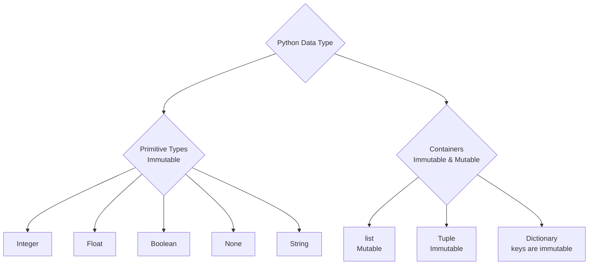

# Note

## Python_2 (`10/01/2024`)

### Python数据类型
> 最底层二进制：0和1(integer 8位 8bit) 可用符号表示(1010 1001)
- Primitive type(不可变):
> 原始类型是最基本的数据类型，它们不是由其他数据类型组成的。这些类型通常是由编程语言直接支持的，不需要通过对象或类来实现 
> 原始类型的值直接存储它们的值。它们通常在内存中占用固定的大小，并且它们的操作效率通常很高
- container type(Python里倾向叫reference,C语言倾向叫pointer):
> 容器类型是由其他数据类型组成的复合类型。这些类型可以存储多个元素，这些元素可能是原始类型，也可能是其他容器类型 
> 容器类型可以动态地存储多个数据，它们的大小通常不是固定的。容器类型不仅存储数据元素，还存储关于这些元素的附加信息（如元素数量、元素的排列顺序等）。

