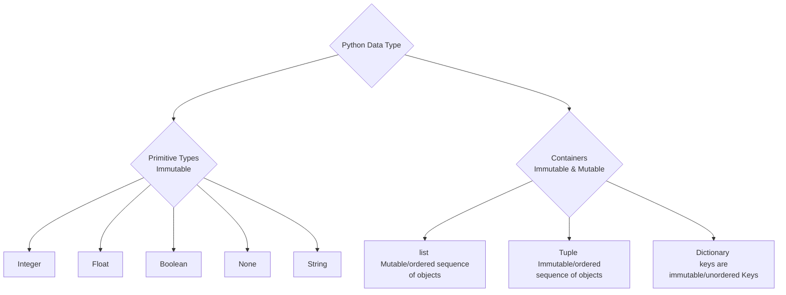
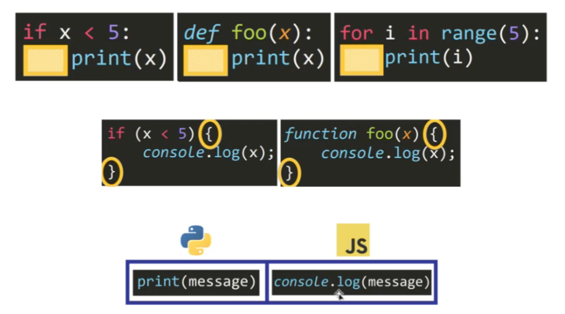

# Note

## Python_2 (`10/01/2024`)

### Python数据类型
> 最底层二进制：0和1(integer 8位 8bit) 可用符号表示(1010 1001)
- Primitive type(不可变):
> 原始类型是最基本的数据类型，它们不是由其他数据类型组成的。这些类型通常是由编程语言直接支持的，不需要通过对象或类来实现 
> 原始类型的值直接存储它们的值。它们通常在内存中占用固定的大小，并且它们的操作效率通常很高
- container type(Python里倾向叫reference,C语言倾向叫pointer):
> 容器类型是由其他数据类型组成的复合类型。这些类型可以存储多个元素，这些元素可能是原始类型，也可能是其他容器类型 
> 容器类型可以动态地存储多个数据，它们的大小通常不是固定的。容器类型不仅存储数据元素，还存储关于这些元素的附加信息（如元素数量、元素的排列顺序等）

#### Integer
- Python对整数的处理方式
> 在Python中，整数（通常在-5到256之间）是预先创建并缓存起来的,这意味着它们将会有相同的内存地址
> 当你改变这些变量的值，使其超出了这个预缓存的范围，Python会创建一个新的整数对象来表示新的值

#### Boolean
> 与integer类似，a、b同时赋予true或者false时地理位置相同

#### None
> 无论赋值给谁，都只有一个地理位置

#### String
> 一开始通过赋值得到的内容会修改地址，而赋值过后任何的修改不会
> 在string后增加字母位数不会修改地址，而增加空格会

#### Immutable Mutable Hashable

| Immutable | Mutable | Hashable
| :---: | :---: | :---: 
| 创建后其状态就不能改变的对象 | 创建后可以改变其状态的对象 | 有一对一的映射并且可以用作字典的键或集合中的元素
| 字符串（str）和整数（int） | 列表（list）和字典（dict） | 不可变的，它们也是可哈希的

- 相互间的联系：
> 不可变的对象是可哈希的，因为它们的内容不会改变
> 可变对象通常是不可哈希的，因为它们的内容可以改变

### Python和JavaScript的命名差异

