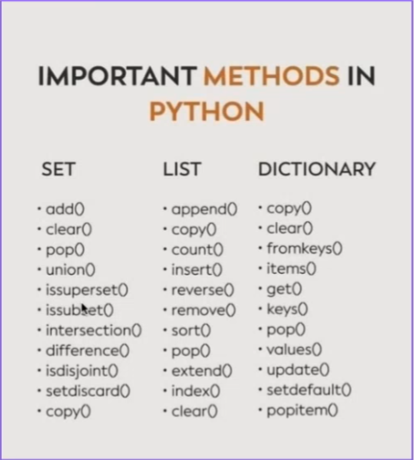
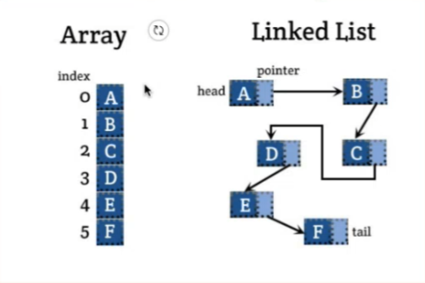
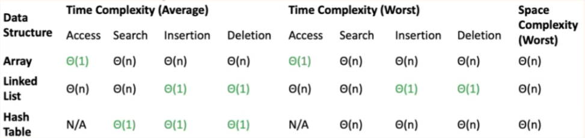

# Note

## Python_3 (`14/01/2024`)

### 学习资料
[labuladong的算法笔记](https://labuladong.github.io/algo/di-ling-zh-bfe1b/xue-xi-sua-01220/#%E4%B8%80%E3%80%81%E6%95%B0%E6%8D%AE%E7%BB%93%E6%9E%84%E7%9A%84%E5%AD%98%E5%82%A8%E6%96%B9%E5%BC%8F)

### 环境安装
- 各个PC情况不一样，建议直接回顾录播复习一下全部流程

### Python-Set/List/Dict的常用方法

<p align='center'></p>

#### Set：唯一、无序、hashable
> 检查存在性可直接 <br>
> a = set() <br>
> a.add(1) <br>
> 1 in a

#### List：有序、不唯一、index
> a = list() <br>
> a.append(1) <br>
> a[0] <br>
> 即可以通过一个具体的位置信息快速access到value或其他信息

##### List: 三种赋值方式的区别
- b = a<br>
> 这种方式是将b直接指向a所引用的对象。这意味着a和b实际上指向的是同一个对象，因此对b的任何修改都会反映在a上，反之亦然<br>
> 在以下这个例子中: 使用b = a，***修改b导致a也发生了变化***
```python
import copy
# 示例数据结构
a = [1, [2, 3], 4]
# 直接赋值
b = a
b[0] = 10
print("After 'b = a':", a)  # 输出: [10, [2, 3], 4]
```

- b = copy(a)<br>
> 这种方式使用copy模块的浅复制（shallow copy）。它创建了一个新对象，然后尽可能地将原对象中的内容复制到新对象中；<br>
> 对于复杂的对象（如包含其他对象的列表），浅复制只复制最外层的容器，容器内部的元素仍然是原始对象的引用。这意味着修改这些内部元素会影响原始对象；<br>
> 在以下这个例子中: 使用b = copy(a)（浅复制），***修改b中的内嵌列表会影响a中对应的列表***
```python
# 浅复制
a = [1, [2, 3], 4]
b = copy.copy(a)
b[1][0] = 20
print("After 'b = copy(a)':", a)  # 输出: [1, [20, 3], 4]
```

- b = deepcopy(a)
> 这种方式使用copy模块的深复制（deep copy）。深复制创建了一个完全独立的新对象，包括其内部嵌套的所有对象。这意味着原始对象和副本之间不会相互影响；<br>
> 在以下这个例子中: 使用b = deepcopy(a)（深复制），***a和b完全独立，对b的任何修改都不会影响a***
```python
# 深复制
a = [1, [2, 3], 4]
b = copy.deepcopy(a)
b[1][0] = 30
print("After 'b = deepcopy(a)':", a)  # 输出: [1, [2, 3], 4]
```

#### Dict
##### copy()
- 仍是shallow copy，只是copy了key和value的值，对于mutable的object来说，它的值就是地址，即地址相同

##### items()
- 用于返回字典中的键值对

##### pop()
- 用于移除字典中指定的元素

##### popitem()
- 用于移除并返回字典中的一个键值对
- 与pop()的区别：
> popitem()不需要键作为参数，它移除并返回最后一个插入的键值对（在Python 3.7及更高版本中）；<br>
> pop()需要指定要移除的键，并且可以返回该键对应的值。如果键不存在，可以设置默认返回值，否则会引发KeyError；<br>
> popitem()通常用于实现类似堆栈或队列的数据结构，其中元素的添加和移除顺序很重要；<br>
> pop()则更适用于当你知道要移除哪个键时的情景


### 底层的数据结构
- 底层只有两种存储方式，即***连续存储***和***链式存储***
- 具体内容参见上方的学习资料

#### Array(数组)
- 数组是一种基础的数据结构，它可以存储一系列的元素，并且这些元素在内存中是连续存放的；
- 每个元素可以通过索引（index）快速访问。在很多编程语言中，数组的长度在创建时需要指定，并且之后不能更改

#### Linked List(链表)
- 链表是由一系列节点（Node）组成的集合，每个节点包含两部分: 数据部分和指向下一个节点的指针；
- 链表的第一个节点称为头节点（head），最后一个节点称为尾节点（tail），尾节点的指针指向空（NULL或None）

<p align='center'></p>

#### Dynamic Array(动态数组)
- 这是一种特殊类型的数组，可以在运行时动态调整大小；
- 在Python中，列表（list）就是动态数组的一种实现。它在内部使用数组来存储元素，并在需要时自动增加存储容量；
- 通常是通过倍增策略，如:
> array size<br>
> a = list()<br>
> 能存1个element<br>
> a.append(1)<br>
> 能存2个，4个，8个，16个……

#### 数据结构对比
<p align='center'></p>

- 时间复杂度

|   | 访问(Access) | 搜索(Search) | 插入(Insertion) | 删除(Deletion) | 
| :---: | :---: | :---: | :---: | :---:
| **数组(Array)** | 因为数组是连续存储的，可以直接通过索引快速访问任何元素 | 在没有排序的情况下，可能需要遍历整个数组来找到一个元素 | 插入元素通常需要移动插入点之后的所有元素 | 删除元素也需要移动删除点之后的所有元素
| **链表(Linked List)** | 访问链表中的元素需要从头开始遍历，不能像数组那样直接访问 | 与访问类似，搜索也需要从头遍历链表 | 如果已经到达了要插入的位置（例如在遍历过程中），则插入操作可以快速进行，只需更改指针 | 与插入类似，如果已知要删除的元素，只需更改指针即可
| **哈希表(Hash Table)**| 哈希表通常不是按索引顺序访问的，而是通过键 | 在理想情况下，通过键可以直接定位到值，但在最坏的情况下可能会退化到O(n)| 哈希表插入通常很快，但是可能需要处理哈希冲突 | 删除操作通常也很快，除非需要处理哈希冲突

- 空间复杂度
> 所有这三种数据结构在最坏情况下的空间复杂度都是O(n)，这是因为它们都需要为存储的每个元素分配空间；<br>
> 对于数组和链表，这是直观的；对于哈希表，虽然理想情况下是 O(n), 但是哈希表为了减少冲突和保持操作的效率，通常会预留更多的空间，这也被称为装载因子（load factor）的管理

- 关系
> ***数组(Array)*** 是最基本的数据结构，提供了快速的随机访问能力，但在动态大小调整方面不够灵活；<br>
> ***链表(Linked List)*** 提供了在动态数据集上的高效插入和删除操作，但牺牲了随机访问的性能；<br>
> ***哈希表(Hash Table)*** 是建立在数组之上的抽象数据类型，通过计算元素的哈希值来决定元素存储的位置。哈希表的性能很大程度上取决于哈希函数的质量和冲突解决机制

- Tips
> ***哈希表(Hash Table)*** 是一种数据结构, 尽管基本原理相同，但在不同的编程语言中，这个数据结构可能会有不同的名称和实现细节<br>
> 不同编程语言中对应哈希表的实现可能被称为：<br>
> Python: dict - Python中的字典是一个内置的哈希表实现<br>
> Java: HashMap - Java中的HashMap类提供了哈希表的实现<br>
> C#: Dictionary - 在C#中，Dictionary<TKey,TValue>类提供了这种功能<br>
> JavaScript: Object - 传统上，JavaScript使用对象来作为键值映射的集合<br>
> Ruby: Hash - 在Ruby中，它简单地被称为Hash

- 实际应用
> 如果需要高效的索引访问，且数据量固定，***数组(Array)***是好的选择；<br>
> 如果数据集在运行时会动态变化，且插入和删除操作频繁，***链表(Linked List)***可能更合适；<br>
> 如果需要快速查找、插入和删除操作，且可以接受额外的空间开销，***哈希表(Hash Table)***是非常好的选择；<br>
> 在实际应用中，这些数据结构可能会相互结合使用，以适应不同的需求和场景

