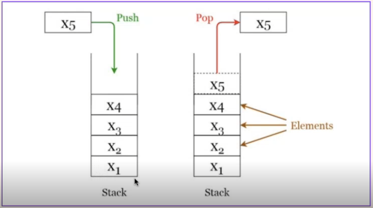
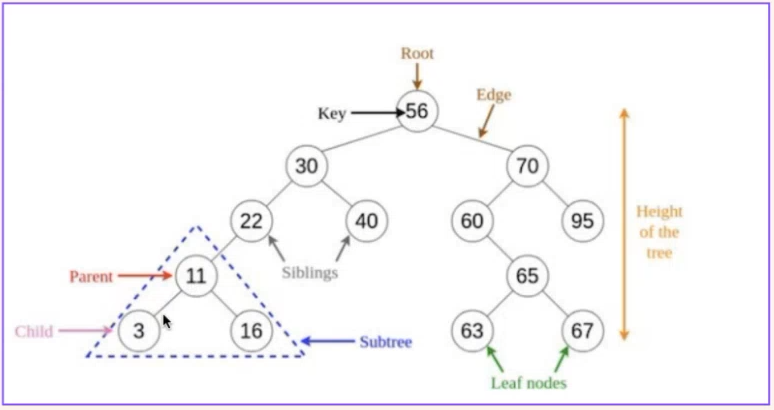
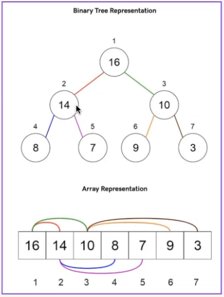

# Note

## Python_4 (17/01/2024)

### 数据结构
- Abstract Data Structure  
`interface：干什么用和怎么用` 
`即通过更加复杂的存储方式来使数据产生不同特性，见上节课的对比表`

#### 栈 - Stack
- First In Last Out(特性)
- Interface(干什么和怎么用 or 提供的接口): 
  往里放 or 往外拿 
  def push(x: Object) 
  def pop() -> Object 
  def len() -> int 
  def empty() -> boolean
- Depth First Search(深度优先搜索)

#### 队列 - Queue
- First In First Out(特性)
- 做题是最常用list
- 实际中使用针对双向列表进行优化过的deque更适合 
- Breadth First Search(广度优先搜索)

#### 树 - Tree
- 有各种分类：
- 二叉树(BT)：每个节点最多有两个子节点的树结构
- 二叉搜索树(BST)：二叉树的一种，其中每个节点的左子树中的所有节点的值小于节点的值，右子树中的所有节点值大于节点的值
- 平衡二叉树：左右子树的高度差不超过1，有助于提高检索效率
- B树：平衡的多路搜索树，每个节点可以包含多个键和子节点，能更快的进行query
- 2-3树：一种平衡的搜索树，每个节点可以包含2个或3个键，并相应的有2个或3个子节点，能提高索引性能
- 红黑树：一种自平衡的二叉搜索树，通过在每次加入新的数据之后再进行重新的排列以确保树的平衡

#### 堆 - Heap
- 也叫 priority Queue
- max heap：每次pop出来的都是最大的那个值
- min heap：每次pop出来都必须是最小值
- 图中是max heap
- heapify_up/down功能：即随机加入一个数后会对整个heap进行对比并将其排在正确的位置
- 但做题时最常用heapq(单线程时优先，注重性能) or queue.PriorityQueue(多线程优先，注重安全)
- queue.Queue(队列)  queue.LifoQueue(栈)

#### 图 - Graph
- 表示图的两种方法：
- 1.邻接表表示法：
{
1:[2,4],
2:[1,4],
3:[],
4:[1,2]
}
- 2.邻接矩阵表示法：

| 0 | 1 | 2 | 3 | 4
| :---: | :---: | :---: | :---: | :---:
| 1 | T | T | F | T
| 2 | T | T | F | T
| 3 | T | T | F | T
| 4 | T | T | F | T
