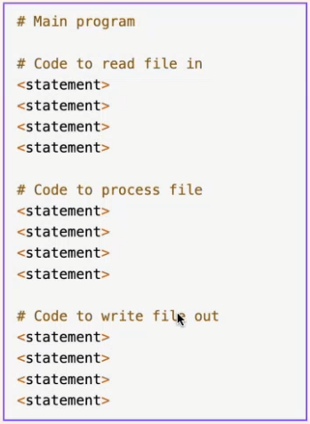
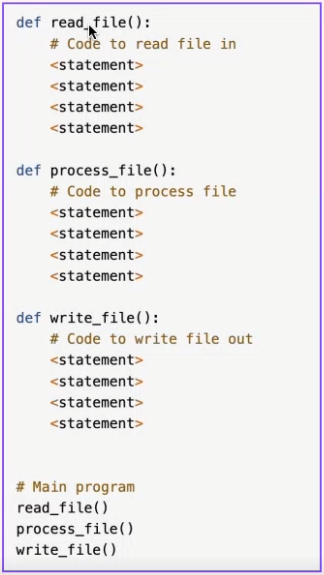

# Note

## Python_5 (`20/01/2024`)

### Functions in Python
#### 封装的概念
- 在编程中，封装是一种将数据（属性）和代码（方法）绑定到一起的机制，以隐藏具体实现的方式
- 这是面向对象编程（OOP）的四大基本原则之一
- 封装的主要目的是保护对象内部的状态和实现细节，只允许通过定义好的接口（即公有方法）来访问对象的状态
- 老师的理解：开发者之间只通过接口进行交流，不需要去管封装里面的内容

#### Function的优势
##### 模块化
- Reusable
- 模块化之前，每个功能都要重新写一遍内容

- 模块化之后，所有的功能只需要在写完一遍之后分别调用就好

#### Function Calls and Definition

#### Positional Arguments
- 即Arguments是按顺序出现的

- input parameters: signature of the function(参数即签名)
- polymorphism(多态：只要符合位置要求，任何类型的参数均可填入)
- 但注意不能超过或少于参数数量范围

#### Keyword Arguments
- 正常情况下，每个keyword对应的参数会按顺序输出

- 修改keyword关键词会导致报错

- 省去一两个keyword不会影响输出，系统会按照Positional Arguments的顺序继续执行

- 注意：当所有arguments中只有一个keyword时，只能出现在最右边，不然会报错

#### Default Parameters
- 当定义了默认值时，少输或者不输入内容时系统会自动用默认值补齐

#### Argument Tuple Packing
- 当不确定parameter的个数时，可以采用packing

#### Argument Dictionary Packing
- 多个value变成一个Dic

